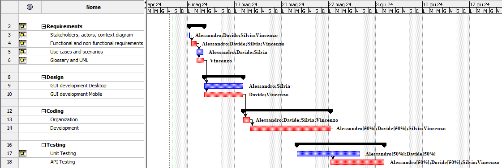

# Project Estimation - FUTURE
Date: 05/05/2024
Version: 2.0

# Estimation approach
Consider the EZElectronics  project in FUTURE version (as proposed by your team in requirements V2), assume that you are going to develop the project INDEPENDENT of the deadlines of the course, and from scratch (not from V1)
# Estimate by size
### 
|                                                                                                         | Estimate |             
|---------------------------------------------------------------------------------------------------------|----------|  
| NC =  Estimated number of classes to be developed                                                       | 4        |             
| A = Estimated average size per class, in LOC                                                            | ~1200    | 
| S = Estimated size of project, in LOC (= NC * A)                                                        | ~4800    |
| E = Estimated effort, in person hours (here use productivity 10 LOC per person hour)                    | ~480     |   
| C = Estimated cost, in euro (here use 1 person hour cost = 30 euro)                                     | 14400    | 
| Estimated calendar time, in calendar weeks (Assume team of 4 people, 8 hours per day, 5 days per week ) | ~3 weeks |               

We considered the 4 classes as '_high-level classes_' meaning that they don't necessarily
correspond to js classes, but they can include many utility classes, such as controllers, DAOs, ...

# Estimate by product decomposition
### 
| component name       | Estimated effort (person hours) |             
|----------------------|---------------------------------| 
| requirement document | 60                              |
| GUI prototype        | 30                              |
| design document      | 20                              |
| code                 | 300                             |
| unit tests           | 100                             |
| api tests            | 100                             |
| management documents | 20                              |

# Estimate by activity decomposition
### 
| Activity name                          | Estimated effort (person hours) |   
|----------------------------------------|---------------------------------|
| REQUIREMENT ENGINEERING                | 69                              |
| -- Stakeholders identification         | 1                               |
| -- Actors identification               | 1                               |
| -- Actors interfaces                   | 1                               |
| -- Context Diagram dev.                | 1                               |
| -- Analysis of different Persona Types | 2                               |
| -- Definition of goal FRs              | 10                              |
| -- Identification of needed NFRs       | 5                               |
| -- Use Cases & Scenarios Analysis      | 25                              |
| -- Use Case Diagram                    | 12                              |
| -- Glossary                            | 4                               |
| -- UML Class Diagram                   | 6                               |
| -- System Deployment                   | 1                               |
| DESIGN                                 | 53                              |
| -- visuals & concepts Definition       | 3                               |
| -- GUI Desktop components              | 10                              |
| -- GUI mobile components               | 10                              |
| -- GUI Desktop development             | 15                              |
| -- GUI Mobile development              | 15                              |
| CODING                                 | 300                             |
| -- Code Organization                   | 40                              |
| -- Code Documentation                  | 20                              |
| -- Development                         | 200                             |
| -- Code Merging                        | 40                              |
| TESTING                                | 240                             |
| -- Unit Testing                        | 100                             |
| -- Integration                         | 40                              |
| -- Api Testing                         | 100                             |

### Gantt Diagram

# Summary

Report here the results of the three estimation approaches. The  estimates may differ. Discuss here the possible reasons for the difference

|                                    | Estimated effort | Estimated duration |          
|------------------------------------|------------------|--------------------|
| estimate by size                   | 480              | 3 weeks            |
| estimate by product decomposition  | 610              | 3.8 weeks          |
| estimate by activity decomposition | 662              | 4.1 weeks          |

The differences between the 3 techniques arise from the depth of the analysis performed:
10 LOC/ph seems to be an overestimated value for the first estimate because requirements
are a huge part of the project and were less considered in that method.
Other 2 techniques provide a more detailed approach so the time estimated turned out to be similar
for both of them. However, differences are present due to the high abstraction of the last method,
that highlighted each activity from the huge ones to the more specific ones.

