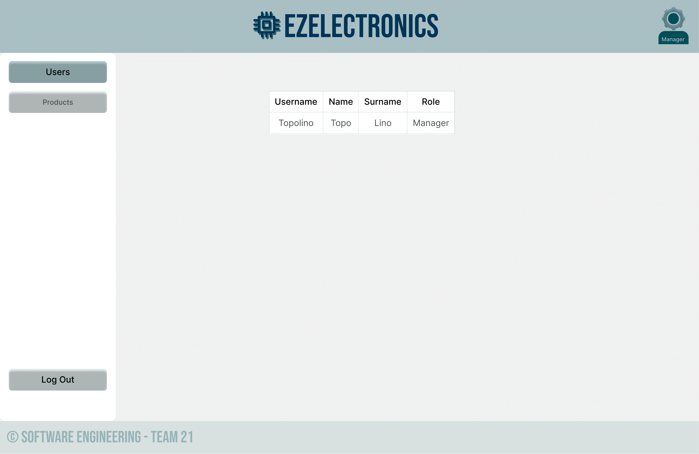
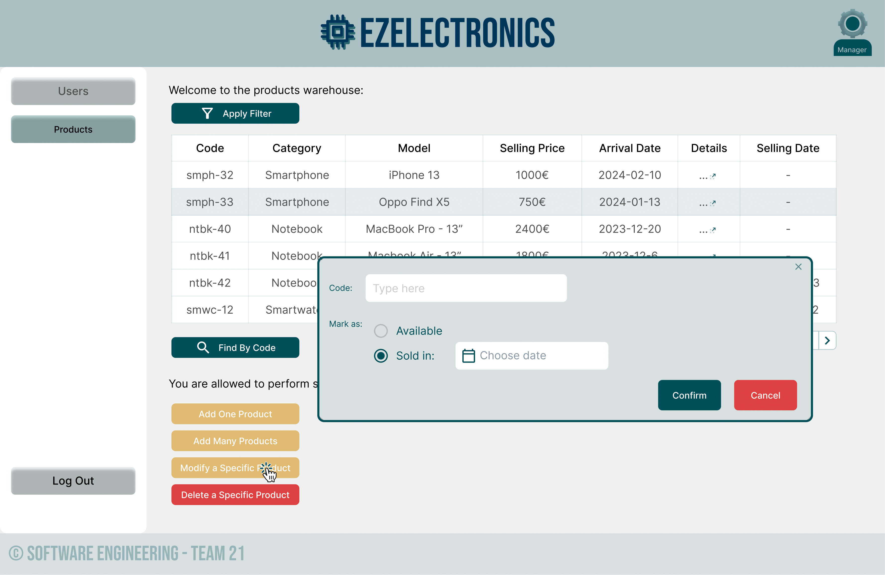

# Graphical User Interface Prototype - CURRENT

Authors: Soft.Eng., Team21 - Alessandro Di Matteo, Silvia, Vincenzo Catalano, Davide Iannussi

Date: 02/05/2024

Version: 1.0

---

### Login Page

_login: initial page_

_login: wrong password_

_login: incorrect username_

_login: create account_

_login: create account - errors_

_login: logged successfully_

---

### "Users" Tab

_users: initial page_

_users: search by username: no username found_

_users: delete by role: no role found_

_users: result (1)_

_users: result (2)_

_users: result (3)_

---

### "Products" Tab

_products: initial page (manager POV)_

_products: filtering (manager POV)_

_products: filtered (manager POV)_

_products: details (manager POV)_

_products: finding single product through button (manager POV)_

_products: adding single product through button (manager POV)_

_products: add single, 409 ERROR (manager POV)_

_products: add single, DATE ERROR (manager POV)_

_products: add many products through button (manager POV)_

_products: modify a specific product: mark as sold (manager POV)_

_products: modify a specific product: mark as sold, ERROR 404 (manager POV)_

_products: delete a specific product through button (manager POV)_

_products: initial page (customer POV)_

---

### "Cart" Tab

_cart: current cart (customer POV)_

_cart: adding products to current cart by productId (customer POV)_

_cart: adding products to current cart by productId: productId not found (customer POV)_

_cart: adding products to current cart by productId: product can't be added (customer POV)_

_cart: deleting products by current cart by productId (customer POV)_

_cart: deleting the whole current cart (customer POV)_

_cart: proceeding to pay the current cart (customer POV)_

_cart: history of carts for current customer (customer POV)_

---
