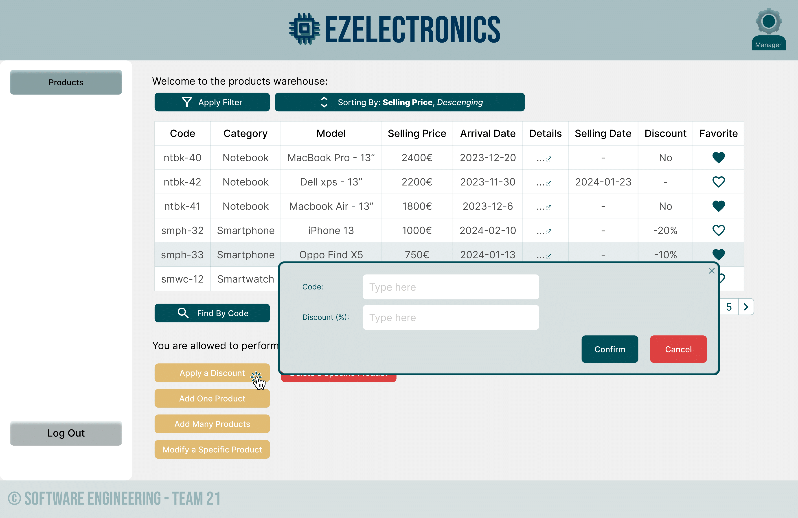

# Graphical User Interface Prototype - CURRENT

Authors: Soft.Eng., Team21 - Alessandro Di Matteo, Silvia, Vincenzo Catalano, Davide Iannussi

Date: 02/05/2024

Version: 2.0

---

## Desktop Version

### Login Page

_login: Initial page_

_login: Wrong password_

_login: Wrong Username_

_login: Restore Password request_

_login: Restore Password_

_login: Create Account_

_login: Username already Taken_

---

### "Users" Tab

_users (admin only): initial page_

_users (admin only): search by username, username not found_

_users (admin only): search by role, role not found_

_users (admin only): results (1)_

_users (admin only): results (2)_

_users (admin only): results (3)_

### "Account" Section

The account section can be accessed by any user just by clicking the upper-right
icon containing the role of the logged-in user.

_account: initial page_

_account: modify_

_account: modify, username taken_

_account: modify, password not valid_

_account: modify, role not valid_

_account: delete_

_account: contact us_

---

### "Products" Tab

_products: initial page (manager POV)_

_products: filtering (manager POV)_

_products: filtering favorites (manager POV)_

_products: filtered (manager POV)_

_products: details (manager POV)_

_products: find single product by code (manager POV)_

_products: add single product through button (manager POV)_

_products: add single product through button, 409 ERROR (manager POV)_

_products: add single product through button, DATE ERROR (manager POV)_

_products: add many products through button (manager POV)_

_products: modify a specific product, mark as sold (manager POV)_

_products: modify a specific product, mark as sold, 404 NOT FOUND ERROR (manager POV)_

_products: delete a specific product (manager POV)_

_products: adding to favorites (manager POV)_

_products: removing from favorites (manager POV)_

_products: sorting results through button (manager POV)_

_products: applying a discount on a specific product through button (manager POV)_

_products: initial page (customer POV)_

---

### "Cart" Tab

_cart: current cart (customer POV)_

_cart: Shipping details page (customer POV)_

_cart: Payment details page (customer POV)_

_cart: No cart page for current customer (customer POV)_

_cart: adding products to current cart by productId (customer POV)_

_cart: adding products to current cart by productId: productId not found (customer POV)_

_cart: adding products to current cart by productId: product can't be added (customer POV)_

_cart: deleting products by current cart (customer POV)_

_cart: deleting the whole current cart (customer POV)_

_cart: history of carts for current customer (customer POV)_

---

## Mobile Version

Mobile version is an ap developed as interface for customers only, so the UI is designed restricted to do
customer-specific operations.

### Access & UI

_access: loading of app_

_access: login / signUp_

_access: create new account_

_access: logged in_

_access: logged in trying dropdown_

---

### "Account" Tab

_account: initial screen_

_account: modifying_

_account: deleting_

_account: contact us_

_account: contact us menu_

---

### "Products" Tab

_Products: initial page_

_Products: error adding product to favorites_

_Products: details_

_Products: opening details_

_Products: filtering items_

_Products: sorting items_

_Products: find by code_

---

### "Cart" Tab

_Cart: Current cart shown_

_Cart: Adding a product to the current cart_

_Cart: Payment and shipping page_

_Cart: History of carts_

---
