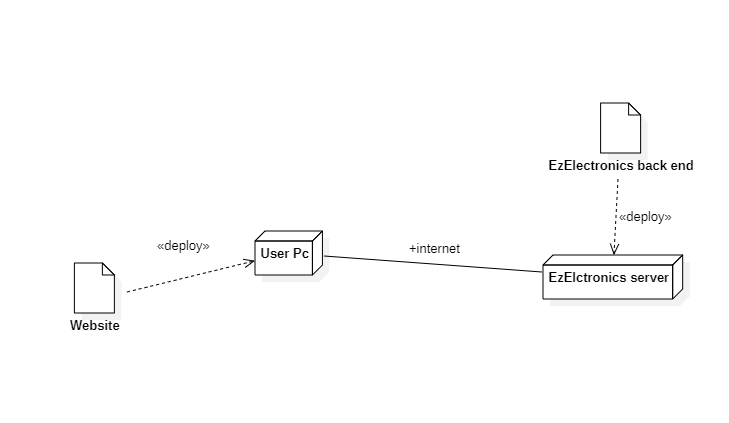

# Requirements Document - current EZElectronics

Date: 03/05/2024

Version: V1 - description of EZElectronics in CURRENT form (as received by teachers)

| Version number | Change |
|:--------------:|:------:|
|      1.0       |   -    |

# Contents

- [Requirements Document - current EZElectronics](#requirements-document---current-ezelectronics)
- [Contents](#contents)
- [Informal description](#informal-description)
- [Stakeholders](#stakeholders)
- [Context Diagram and interfaces](#context-diagram-and-interfaces)
    - [Context Diagram](#context-diagram)
    - [Interfaces](#interfaces)
- [Stories and personas](#stories-and-personas)
- [Functional and non functional requirements](#functional-and-non-functional-requirements)
    - [Functional Requirements](#functional-requirements)
    - [Non Functional Requirements](#non-functional-requirements)
- [Use case diagram and use cases](#use-case-diagram-and-use-cases)
    - [Use case diagram](#use-case-diagram)
        - [Authenticate, UC1](#authenticate-uc1)
        - [Log-out, UC2](#log-out-uc2)
        - [Retrieve information, UC3](#retrieve-information-uc3)
        - [Create account, UC4](#create-account-uc4)
        - [Get users, UC5](#get-users-uc5)
        - [Delete user, UC6](#delete-user-uc6)
        - [Add a single product, UC7](#add-a-single-product-uc7)
        - [Add many Products, UC8](#add-many-products-uc8)
        - [Mark a product as sold, UC9](#mark-a-product-as-sold-uc9)
        - [Get All Products, UC10](#get-all-products-uc10)
        - [Get Product By Code, UC11](#get-product-by-code-uc11)
        - [Get Product By Category, UC12](#get-product-by-category-uc12)
        - [Get Product By Model, UC13](#get-product-by-model-uc13)
        - [Delete a product, UC14](#delete-a-product-uc14)
        - [Get current cart, UC15](#get-current-cart-uc15)
        - [Pay a cart, UC16](#pay-a-cart-uc16)
        - [Add products to cart, UC17](#add-products-to-cart-uc17)
        - [Delete product from the cart, UC18](#delete-product-from-the-cart-uc18)
        - [Get history of carts, UC19](#get-history-of-carts-uc19)
        - [Delete current cart, UC20](#delete-current-cart-uc20)
- [Glossary](#glossary)
- [Deployment Diagram](#deployment-diagram)

# Informal description

EZElectronics (read EaSy Electronics) is a software application designed to help Managers of electronics stores to
manage their products and offer them to customers through a dedicated website. Managers can assess the available
products, record new ones, and confirm purchases. Customers can see available products, add them to a cart and see the
history of their past purchases.

# Stakeholders

| Stakeholder name |                                                    Description                                                    |
|:----------------:|:-----------------------------------------------------------------------------------------------------------------:|
|     Manager      |             Managers of stores that use EZElectronics, they use the website to manage their products              |
|     Customer     | People subscribed to EZElectronics, they use the website to buy or check products of different electronics stores |

# Context Diagram and interfaces

## Context Diagram

## Interfaces

|       Actor       | Logical Interface | Physical Interface |
|:-----------------:|:-----------------:|:------------------:|
| Customer, Manager |        GUI        |         PC         |

# Stories and personas

__Tech Buyers__: Customers who are searching for new tech equipment such as smartphones, televisions, PCs, and other
electronic gadgets.

__Gamers__: Customers who are searching for gaming-related electronics such as gaming consoles, peripherals, and
accessories.

__Home Appliance Buyers__: Customers who are searching for electronic home appliances such as refrigerators, washing
machines, and kitchen appliances.

__Professionals__: Customers who are searching for specific electronic devices or equipment for professional purposes.

__Electronics Store Managers__: Responsible for managing their electronics stores. They use the application to manage
their
products.

# Functional and non functional requirements

## Functional Requirements

|   ID   |                           Description                           |
|:------:|:---------------------------------------------------------------:|
|  FR1   |                Authorization and Authentication                 |
| FR1.1  |                              Login                              |
| FR1.2  |                             Logout                              |
|  FR2   |                    Retrieve user information                    |
|  FR3   |                        Create a new user                        |
|  FR4   |                           Show users                            |
| FR4.1  |                         Show all users                          |
| FR4.2  |                     Show all users by role                      |
| FR4.3  |                      Show user by username                      |
|  FR5   |                           Delete User                           |
| FR5.1  |                    Delete a user by username                    |
|  FR6   |                          Add products                           |
| FR6.1  |                       Add single product                        |
| FR6.2  |                      Add group of products                      |
|  FR7   |                          Sell product                           |
|  FR8   |                        Retrieve products                        |
| FR8.1  |                      Retrieve all products                      |
| FR8.2  |                  Retrieve one specific product                  |
| FR8.3  |             Retrieve all products of a given model              |
|  FR9   |                         Delete products                         |
| FR9.1  |                   Delete one specific product                   |
|  FR10  |                Manage current cart for each user                |
| FR10.1 |       List all products of current cart, with its details       |
| FR10.2 |                Add and delete products from cart                |
| FR10.3 | Compute total price as the sum of selling price of each product |
| FR10.4 |                         Manage payment                          |
| FR10.5 |                       Delete current cart                       |
|  FR11  |                Manage history cart for each user                |
| FR11.1 |                         List paid carts                         |

## Non Functional Requirements

|   ID   | Type (efficiency, reliability, ..) |                                      Description                                       |                 Refers to                 |
|:------:|:----------------------------------:|:--------------------------------------------------------------------------------------:|:-----------------------------------------:|
|  NFR1  |             Usability              |      User should be able to use web app with no training in less than 10 minutes       | Users already familiar with using browser |
|  NFR2  |             Efficiency             | All functions on the web app must be completed in <0.1 sec (excluding network latency) |                 All Users                 |
|  NFR3  |            Reliability             |                       No more than one defect per year per user                        |                 All Users                 |
|  NFR4  |            Portability             |                              Web App should be available                               |                 All Users                 |
| NFR4.1 |            Portability             |                               Multiple browser versions                                |                 All Users                 |
|  NFR5  |              Security              |                                                                                        |                 All Users                 |

# Use case diagram and use cases

## Use case diagram

### Authenticate, UC1

| Actors Involved  |                    Users                    |
|:----------------:|:-------------------------------------------:|
|   Precondition   |         User has to have an account         |
|  Post condition  |                                             |
| Nominal Scenario |           1.1: User authenticated           |
|     Variants     |     1.4: User authenticated as Manager      |
|    Exceptions    | 1.2: Wrong password  1.3: wrong username |

##### Scenario 1.1

| Scenario 1.1        |                              |                                           |
|---------------------|------------------------------|-------------------------------------------|
| Precondition        | User has an account          |
| Post condition      | User is authenticated        |
| Step#               | Description                  |
| __Actors involved__ | __User__                     | __System__                                |
| 1                   | Enters password and username |
| 2                   |                              | Looks for username and password. Match ok |
| 3                   |                              | Authenticate user                         |

##### Scenario 1.2

| Scenario 1.2        |                              |                                                                                |
|---------------------|------------------------------|--------------------------------------------------------------------------------|
| Precondition        | User has an account          |
| Post condition      | User is not authenticated    |
| Step#               | Description                  |
| __Actors involved__ | __User__                     | __System__                                                                     |
| 1                   | Enters password and username |
| 2                   |                              | Looks for account name and password. No match for password, ask again password |

##### Scenario 1.3

| Scenario 1.3        |                              |                                                                                |
|---------------------|------------------------------|--------------------------------------------------------------------------------|
| Precondition        | User has an account          |
| Post condition      | User is not authenticated    |
| Step#               | Description                  |
| __Actors involved__ | __User__                     | __System__                                                                     |
| 1                   | Enters password and username |
| 2                   |                              | Looks for account name and password. No match for username, ask again username |

##### Scenario 1.4

| Scenario 1.4        |                              |                                           |
|---------------------|------------------------------|-------------------------------------------|
| Precondition        | User has a Manager account   |
| Post condition      | User is authenticated        |
| Step#               | Description                  |
| __Actors involved__ | __User__                     | __System__                                |
| 1                   | Enters password and username |
| 2                   |                              | Looks for username and password. Match ok |
| 3                   |                              | User is authenticated as Manager          |

### Log-out, UC2

| Actors Involved  |         Users         |
|:----------------:|:---------------------:|
|   Precondition   | The user is logged in |
|  Post condition  |    User logged out    |
| Nominal Scenario | 2.1: User logged out  |
|     Variants     |                       |
|    Exceptions    |                       |

##### Scenario 2.1

| Scenario 2.1        |                             |                  |
|---------------------|-----------------------------|------------------|
| Precondition        | The user is logged in       |
| Post condition      | User logged out             |
| Step#               | Description                 |
| __Actors involved__ | __User__                    | __System__       |
| 1                   | Press the button to log-out |
| 2                   |                             | Disconnects user |

### Retrieve information, UC3

| Actors Involved  |            Users             |
|:----------------:|:----------------------------:|
|   Precondition   |    The user is logged in     |
|  Post condition  |   Window with information    |
| Nominal Scenario | 3.1: Window with information |
|     Variants     |             None             |
|    Exceptions    |             None             |

##### Scenario 3.1

| Scenario 3.1        |                                                        |                                        |
|---------------------|--------------------------------------------------------|----------------------------------------|
| Precondition        | The user is logged in                                  |
| Post condition      | The application displays a window with the information |
| Step#               | Description                                            |
| __Actors involved__ | __User__                                               | __System__                             |
| 1                   | Press the button to get information about himself      |
| 2                   |                                                        | Displays a window with the information |

### Create account, UC4

| Actors Involved  |                             User                              |
|:----------------:|:-------------------------------------------------------------:|
|   Precondition   |                                                               |
|  Post condition  |                      User get an account                      |
| Nominal Scenario | 4.1: User wants to create an account in order use the web app |
|     Variants     |                             None                              |
|    Exceptions    |                 Username already exists : 4.2                 |

##### Scenario 4.1

| Scenario 4.1        |                                                    |                                    |
|---------------------|----------------------------------------------------|------------------------------------|
| Precondition        |                                                    |
| Post condition      | User get an account                                |
| Step#               | Description                                        |
| __Actors involved__ | __User__                                           | __System__                         |
| 1                   | Click                      __Create account__      |
| 2                   | Enter all the fields in order to create an account |
| 3                   | Click                      __Create account__      |
| 4                   |                                                    | See if the value inserted are fine |
| 5                   |                                                    | Display the user page              |

##### Scenario 4.2

| Scenario 4.2        |                                                    |                                                                      |
|---------------------|----------------------------------------------------|----------------------------------------------------------------------|
| Precondition        |                                                    |
| Post condition      | User cannot get an account                         |
| Step#               | Description                                        |
| __Actors involved__ | __User__                                           | __System__                                                           |
| 1                   | Click             __Create account__               |
| 2                   | Enter all the fields in order to create an account |
| 3                   | Click    __Create account__                        |
| 4                   |                                                    | Send end show error 409 to inform that the username is already taken |

### Get users, UC5

| Actors Involved  |                    User                     |
|:----------------:|:-------------------------------------------:|
|   Precondition   |                                             |
|  Post condition  |           Get the list of user(s)           |
| Nominal Scenario |   5.1: User wants to get a list of users    |
|     Variants     | 5.2: Show by role  5.3: show by username |
|    Exceptions    |           5.4: No username found:           |

##### Scenario 5.1

| Scenario 5.1        |                                      |               |
|---------------------|--------------------------------------|---------------|
| Precondition        |                                      |
| Post condition      | Get the list of user(s)              |
| Step#               | Description                          |
| __Actors involved__ | __User__                             | __System__    |
| 1                   | Click the button  __Show all users__ |
| 2                   |                                      | Show the list |

##### Scenario 5.2

| Scenario 5.2        |                         |                                    |
|---------------------|-------------------------|------------------------------------|
| Precondition        |                         |
| Post condition      | Get the list of user(s) |
| Step#               | Description             |
| __Actors involved__ | __User__                | __System__                         |
| 1                   | Type the role           |
| 2                   |                         | Show the list of users by one role |

##### Scenario 5.3

| Scenario 5.3        |                     |               |
|---------------------|---------------------|---------------|
| Precondition        |                     |
| Post condition      | Get the  user       |
| Step#               | Description         |
| __Actors involved__ | __User__            | __System__    |
| 1                   | Type the   username |
| 2                   |                     | Show the user |

##### Scenario 5.4

| Scenario 5.4        |                      |                                                     |
|---------------------|----------------------|-----------------------------------------------------|
| Precondition        |                      |
| Post condition      | Do not get the  user |
| Step#               | Description          |
| __Actors involved__ | __User__             | __System__                                          |
| 1                   | Type the   username  |
| 2                   |                      | Send error 404: do not found the username in the db |

### Delete user, UC6

| Actors Involved  |                             User                              |
|:----------------:|:-------------------------------------------------------------:|
|   Precondition   |                      User has logged in                       |
|  Post condition  |                        Delete the user                        |
| Nominal Scenario |              6.1: User wants to delete the user               |
|     Variants     |                                                               |
|    Exceptions    | 6.2: username not found  6.3 generic internal server error |

##### Scenario 6.1

| Scenario 6.1        |                             |                         |
|---------------------|-----------------------------|-------------------------|
| Precondition        | User has logged in          |
| Post condition      | Delete the user             |
| Step#               | Description                 |
| __Actors involved__ | __User__                    | __System__              |
| 1                   | Type the username to delete |
| 2                   |                             | Delete the user profile |

##### Scenario 6.2

| Scenario 6.2        |                             |                                                          |
|---------------------|-----------------------------|----------------------------------------------------------|
| Precondition        | User has logged in          |
| Post condition      | Do not delete the user      |
| Step#               | Description                 |
| __Actors involved__ | __User__                    | __System__                                               |
| 1                   | Type the username to delete |
| 2                   |                             | Send error 404 to inform that the username was not found |

##### Scenario 6.3

| Scenario 6.3        |                             |                                                |
|---------------------|-----------------------------|------------------------------------------------|
| Precondition        | User has logged in          |
| Post condition      | Do not delete the user      |
| Step#               | Description                 |
| __Actors involved__ | __User__                    | __System__                                     |
| 1                   | Type the username to delete |
| 2                   |                             | Generic internal server error. Displays error. |

### Add a single product, UC7

| Actors Involved | User: Manager                                                                                          |
|-----------------|--------------------------------------------------------------------------------------------------------|
| Precondition    | User has account and is logged in as Manager.                                                          |
| Post condition  |                                                                                                        |
| Normal Scenario | 7.1: Manager adds one single product to db                                                             |
| Variants        |                                                                                                        |
| Exceptions      | 7.2: (409) product code already exists in the database; 7.3: arrival date is after the current date |

##### Scenario 7.1

| Scenario 7.1        |                                               |                                        |
|---------------------|-----------------------------------------------|----------------------------------------|
| __Precondition__    | User has account and is logged in as Manager. |                                        |
| __Post condition__  | Product added correctly.                      |                                        |
| __Step#__           | __Description__                               |                                        |
| __Actors involved__ | __User__                                      | __System__                             |
| 1                   | Go to warehouse page                          |                                        |
| 2                   | Select 'add product' button                   |                                        |
| 3                   | Provide Product & Code                        |                                        |
| 4                   |                                               | query the DB adding the single product |
| 5                   |                                               | display success message                |

##### Scenario 7.2

| Scenario 7.2        |                                               |                                        |
|---------------------|-----------------------------------------------|----------------------------------------|
| __Precondition__    | User has account and is logged in as Manager. |                                        |
| __Post condition__  | ERROR: 409.                                   |                                        |
| __Step#__           | __Description__                               |                                        |
| __Actors involved__ | __User__                                      | __System__                             |
| 1                   | Go to warehouse page                          |                                        |
| 2                   | Select 'add product' button                   |                                        |
| 3                   | Provide Product & Code                        |                                        |
| 4                   |                                               | query the DB adding the single product |
| 5                   |                                               | display error message (409)            |

##### Scenario 7.3

| Scenario 7.3        |                                               |                                     |
|---------------------|-----------------------------------------------|-------------------------------------|
| __Precondition__    | User has account and is logged in as Manager. |                                     |
| __Post condition__  | ERROR: DATE FORMAT.                           |                                     |
| __Step#__           | __Description__                               |                                     |
| __Actors involved__ | __User__                                      | __System__                          |
| 1                   | Go to warehouse page                          |                                     |
| 2                   | Select 'add product' button                   |                                     |
| 3                   | Provide Product & Code                        |                                     |
| 4                   |                                               | display error message (DATE FORMAT) |

### Add many Products, UC8

| __Actors Involved__ | User: Manager                                 |
|---------------------|-----------------------------------------------|
| Precondition        | User has account and is logged in as Manager. |
| Post condition      |                                               |
| Normal Scenario     | 8.1: Manager adds many products to the db.    |
| Variants            |                                               |
| Exceptions          | 8.2: arrival date is after the current date   |

##### Scenario 8.1

| Scenario 8.1        |                                               |                                          |
|---------------------|-----------------------------------------------|------------------------------------------|
| __Precondition__    | User has account and is logged in as Manager. |                                          |
| __Post condition__  | Products added correctly.                     |                                          |
| __Step#__           | __Description__                               |                                          |
| __Actors involved__ | __User__                                      | __System__                               |
| 1                   | Go to warehouse page                          |                                          |
| 2                   | Select 'Register Arrival' button              |                                          |
| 3                   | Provide Product & Code                        |                                          |
| 4                   |                                               | queries the DB adding the single product |
| 5                   |                                               | display success message                  |

##### Scenario 8.2

| Scenario 8.2        |                                               |                                     |
|---------------------|-----------------------------------------------|-------------------------------------|
| __Precondition__    | User has account and is logged in as Manager. |                                     |
| __Post condition__  | ERROR: DATE FORMAT.                           |                                     |
| __Step#__           | __Description__                               |                                     |
| __Actors involved__ | __User__                                      | __System__                          |
| 1                   | Go to warehouse page                          |                                     |
| 2                   | Select 'add product' button                   |                                     |
| 3                   | Provide Product & Code                        |                                     |
| 4                   |                                               | display error message (DATE FORMAT) |

### Mark a product as sold, UC9

| __Actors Involved__ | User: Manager                                                                                                                                                                 |
|---------------------|-------------------------------------------------------------------------------------------------------------------------------------------------------------------------------|
| Precondition        | User has account and is logged in as Manager.                                                                                                                                 |
| Post condition      |                                                                                                                                                                               |
| Normal Scenario     | 9.1: Product marked as sold;                                                                                                                                                  |
| Variants            |                                                                                                                                                                               |
| Exceptions          | 9.2: (404) code of the product not found in the db; 9.3: selling date is after the current date; 9.4: selling date is before arrival date; 9.5: product already sold |

##### Scenario 9.1

| Scenario 9.1        |                                               |                          |
|---------------------|-----------------------------------------------|--------------------------|
| __Precondition__    | User has account and is logged in as Manager. |
| __Post condition__  | Product is successfully marked as sold.       |
| __Step#__           | __Description__                               |
| __Actors involved__ | __User__                                      | __System__               |
| 1                   | Go to warehouse page                          |                          |
| 2                   | Select (click) a specific product             |                          |
| 3                   | Select the `register sale` button             |                          |
| 4                   | Set the `code` field to the proper value      |
| 5                   | Set the `date` field to the proper value      |
| 6                   | Select the `run` button                       |                          |
| 7                   |                                               | display success message; |

##### Scenario 9.2

| Scenario 9.2        |                                               |                              |
|---------------------|-----------------------------------------------|------------------------------|
| __Precondition__    | User has account and is logged in as Manager. |
| __Post condition__  | ERROR: 404 Not Found                          |
| __Step#__           | __Description__                               |
| __Actors involved__ | __User__                                      | __System__                   |
| 1                   | Go to warehouse page                          |                              |
| 2                   | Select (click) a specific product             |                              |
| 3                   | Select the `register sale` button             |                              |
| 4                   | Set the `code` field to the proper value      |
| 5                   | Set the `date` field to the proper value      |
| 6                   | Select the `run` button                       |                              |
| 7                   |                                               | display ERROR message: #404; |

##### Scenario 9.3

| Scenario 9.3        |                                               |                                                                  |
|---------------------|-----------------------------------------------|------------------------------------------------------------------|
| __Precondition__    | User has account and is logged in as Manager. |
| __Post condition__  | ERROR: INVALID SELLING DATE.                  |
| __Step#__           | __Description__                               |
| __Actors involved__ | __User__                                      | __System__                                                       |
| 1                   | Go to warehouse page                          |                                                                  |
| 2                   | Select (click) a specific product             |                                                                  |
| 3                   | Select the `register sale` button             |                                                                  |
| 4                   | Set the `code` field to the proper value      |
| 5                   | Set the `date` field to the proper value      |
| 6                   | Select the `run` button                       |                                                                  |
| 7                   |                                               | display ERROR message: "_date must be before the current date_"; |

##### Scenario 9.4

| Scenario 9.4        |                                               |                                                                  |
|---------------------|-----------------------------------------------|------------------------------------------------------------------|
| __Precondition__    | User has account and is logged in as Manager. |
| __Post condition__  | ERROR: INVALID SELLING DATE.                  |
| __Step#__           | __Description__                               |
| __Actors involved__ | __User__                                      | __System__                                                       |
| 1                   | Go to warehouse page                          |                                                                  |
| 2                   | Select (click) a specific product             |                                                                  |
| 3                   | Select the `register sale` button             |                                                                  |
| 4                   | Set the `code` field to the proper value      |
| 5                   | Set the `date` field to the proper value      |
| 6                   | Select the `run` button                       |                                                                  |
| 7                   |                                               | display ERROR message: "_date must be before the arrival date_"; |

##### Scenario 9.5

| Scenario 9.5        |                                               |                                                  |
|---------------------|-----------------------------------------------|--------------------------------------------------|
| __Precondition__    | User has account and is logged in as Manager. |
| __Post condition__  | ERROR: DATE FORMAT.                           |
| __Step#__           | __Description__                               |
| __Actors involved__ | __User__                                      | __System__                                       |
| 1                   | Go to warehouse page                          |                                                  |
| 2                   | Select (click) a specific product             |                                                  |
| 3                   | Select the `register sale` button             |                                                  |
| 4                   | Set the `code` field to the proper value      |
| 5                   | Set the `date` field to the proper value      |
| 6                   | Select the `run` button                       |                                                  |
| 7                   |                                               | display ERROR message: "_product already sold_"; |

### Get All Products, UC10

| __Actors Involved__ | User                                                                                                                                                   |
|---------------------|--------------------------------------------------------------------------------------------------------------------------------------------------------|
| Precondition        | User has account and is logged in.                                                                                                                     |
| Post condition      | Products Retrieved                                                                                                                                     |
| Normal Scenario     | 10.1: Retrieve all products                                                                                                                            |
| Variants            | 10.2 (`sold=yes` query): Retrieves all product that are marked as sold;  10.3: (`sold=no` query): Retrieves all product that are marked as not sold |
| Exceptions          |                                                                                                                                                        |

##### Scenario 10.1

| Scenario 10.1       |                                    |                   |
|---------------------|------------------------------------|-------------------|
| __Precondition__    | User has account and is logged in. |
| __Post condition__  | ERROR: DATE FORMAT.                |
| __Step#__           | __Description__                    |
| __Actors involved__ | __User__                           | __System__        |
| 1                   | Go to products page                |                   |
| 2                   |                                    | Retrieve Products |
| 3                   |                                    | Display products  |

##### Scenario 10.2

| Scenario 10.2       |                                                                         |                   |
|---------------------|-------------------------------------------------------------------------|-------------------|
| __Precondition__    | User has account and is logged in.                                      |
| __Post condition__  | ERROR: DATE FORMAT.                                                     |
| __Step#__           | __Description__                                                         |
| __Actors involved__ | __User__                                                                | __System__        |
| 1                   | Go to products page                                                     |                   |
| 2                   | In `filter` sidebar, toggle `sold` selector from `non applied` to `yes` |                   |
| 3                   |                                                                         | Retrieve Products |
| 4                   |                                                                         | Display products  |

##### Scenario 10.3

| Scenario 10.3       |                                                                        |                   |
|---------------------|------------------------------------------------------------------------|-------------------|
| __Precondition__    | User has account and is logged in.                                     |
| __Post condition__  | ERROR: DATE FORMAT.                                                    |
| __Step#__           | __Description__                                                        |
| __Actors involved__ | __User__                                                               | __System__        |
| 1                   | Go to products page                                                    |                   |
| 2                   | In `filter` sidebar, toggle `sold` selector from `non applied` to `no` |                   |
| 3                   |                                                                        | Retrieve Products |
| 4                   |                                                                        | Display products  |

### Get Product By Code, UC11

| __Actors Involved__ | User                                                 |
|---------------------|------------------------------------------------------|
| Precondition        | User has account and is logged in.                   |
| Post condition      |                                                      |
| Normal Scenario     | 11.1: Product marked as sold;                        |
| Variants            |                                                      |
| Exceptions          | 11.2: (404) code of the product not found in the db; |

##### Scenario 11.1

| Scenario 11.1       |                                                 |                            |
|---------------------|-------------------------------------------------|----------------------------|
| __Precondition__    | User has account and is logged in.              |
| __Post condition__  | ERROR: DATE FORMAT.                             |
| __Step#__           | __Description__                                 |
| __Actors involved__ | __User__                                        | __System__                 |
| 1                   | Go to product page                              |                            |
| 2                   | In the searchbar, type `#<code>` and then enter |                            |
| 3                   |                                                 |                            |
| 4                   |                                                 | displays resulting element |

##### Scenario 11.2

| Scenario 11.2       |                                                 |                      |
|---------------------|-------------------------------------------------|----------------------|
| __Precondition__    | User has account and is logged in.              |
| __Post condition__  | ERROR: DATE FORMAT.                             |
| __Step#__           | __Description__                                 |
| __Actors involved__ | __User__                                        | __System__           |
| 1                   | Go to product page                              |                      |
| 2                   | In the searchbar, type `#<code>` and then enter |                      |
| 3                   |                                                 |                      |
| 4                   |                                                 | displays ERROR: #404 |

### Get Product By Category, UC12

| __Actors Involved__ | User                                                                                                                                                                                          |
|---------------------|-----------------------------------------------------------------------------------------------------------------------------------------------------------------------------------------------|
| Precondition        | User has account and is logged in.                                                                                                                                                            |
| Post condition      | Products Retrieved                                                                                                                                                                            |
| Normal Scenario     | 12.1: Retrieve all products of a given category                                                                                                                                               |
| Variants            | 12.2 (`sold=yes` query): Retrieves all product of a given category that are marked as sold; 12.3: (`sold=no` query): Retrieves all product of a given category that are marked as not sold |
| Exceptions          |                                                                                                                                                                                               |

##### Scenario 12.1

| Scenario 12.1       |                                                                                         |                   |
|---------------------|-----------------------------------------------------------------------------------------|-------------------|
| __Precondition__    | User has account and is logged in.                                                      |
| __Post condition__  | ERROR: DATE FORMAT.                                                                     |
| __Step#__           | __Description__                                                                         |
| __Actors involved__ | __User__                                                                                | __System__        |
| 1                   | Go to products page                                                                     |                   |
| 2                   | In `filter` sidebar, toggle `category` selector from `all` to the desired category name |                   |
| 3                   |                                                                                         | Retrieve Products |
| 4                   |                                                                                         | Display products  |

##### Scenario 12.2

| Scenario 12.2       |                                                                                         |                   |
|---------------------|-----------------------------------------------------------------------------------------|-------------------|
| __Precondition__    | User has account and is logged in.                                                      |
| __Post condition__  | ERROR: DATE FORMAT.                                                                     |
| __Step#__           | __Description__                                                                         |
| __Actors involved__ | __User__                                                                                | __System__        |
| 1                   | Go to products page                                                                     |                   |
| 2                   | In `filter` sidebar, toggle `category` selector from `all` to the desired category name |                   |
| 3                   | In `filter` sidebar, toggle `sold` selector from `non applied` to `yes`                 |                   |
| 4                   |                                                                                         | Retrieve Products |
| 5                   |                                                                                         | Display products  |

##### Scenario 12.3

| Scenario 12.3       |                                                                                         |                   |
|---------------------|-----------------------------------------------------------------------------------------|-------------------|
| __Precondition__    | User has account and is logged in.                                                      |
| __Post condition__  | ERROR: DATE FORMAT.                                                                     |
| __Step#__           | __Description__                                                                         |
| __Actors involved__ | __User__                                                                                | __System__        |
| 1                   | Go to products page                                                                     |                   |
| 2                   | In `filter` sidebar, toggle `category` selector from `all` to the desired category name |                   |
| 3                   | In `filter` sidebar, toggle `sold` selector from `non applied` to `no`                  |                   |
| 4                   |                                                                                         | Retrieve Products |
| 5                   |                                                                                         | Display products  |

### Get Product By Model, UC13

| __Actors Involved__ | User                                                                                                                                                                                    |
|---------------------|-----------------------------------------------------------------------------------------------------------------------------------------------------------------------------------------|
| Precondition        | User has account and is logged in.                                                                                                                                                      |
| Post condition      | Products Retrieved                                                                                                                                                                      |
| Normal Scenario     | 13.1: Retrieve all products of a given model                                                                                                                                            |
| Variants            | 13.2 (`sold=yes` query): Retrieves all product of a given model that are marked as sold; 13.3: (`sold=no` query): Retrieves all product of a given model that are marked as not sold |
| Exceptions          |                                                                                                                                                                                         |

##### Scenario 13.1

| Scenario 13.1       |                                                                                   |                   |
|---------------------|-----------------------------------------------------------------------------------|-------------------|
| __Precondition__    | User has account and is logged in.                                                |
| __Post condition__  | ERROR: DATE FORMAT.                                                               |
| __Step#__           | __Description__                                                                   |
| __Actors involved__ | __User__                                                                          | __System__        |
| 1                   | Go to products page                                                               |                   |
| 2                   | In `filter` sidebar, toggle `model` selector from `all` to the desired model name |                   |
| 3                   |                                                                                   | Retrieve Products |
| 4                   |                                                                                   | Display products  |

##### Scenario 13.2

| Scenario 13.2       |                                                                                   |                   |
|---------------------|-----------------------------------------------------------------------------------|-------------------|
| __Precondition__    | User has account and is logged in.                                                |
| __Post condition__  | ERROR: DATE FORMAT.                                                               |
| __Step#__           | __Description__                                                                   |
| __Actors involved__ | __User__                                                                          | __System__        |
| 1                   | Go to products page                                                               |                   |
| 2                   | In `filter` sidebar, toggle `model` selector from `all` to the desired model name |                   |
| 3                   | In `filter` sidebar, toggle `sold` selector from `non applied` to `yes`           |                   |
| 4                   |                                                                                   | Retrieve Products |
| 5                   |                                                                                   | Display products  |

##### Scenario 13.3

| Scenario 13.3       |                                                                                   |                   |
|---------------------|-----------------------------------------------------------------------------------|-------------------|
| __Precondition__    | User has account and is logged in.                                                |
| __Post condition__  | ERROR: DATE FORMAT.                                                               |
| __Step#__           | __Description__                                                                   |
| __Actors involved__ | __User__                                                                          | __System__        |
| 1                   | Go to products page                                                               |                   |
| 2                   | In `filter` sidebar, toggle `model` selector from `all` to the desired model name |                   |
| 3                   | In `filter` sidebar, toggle `sold` selector from `non applied` to `no`            |                   |
| 4                   |                                                                                   | Retrieve Products |
| 5                   |                                                                                   | Display products  |

### Delete a product, UC14

| Actors Involved |                    Manager                    |
|:---------------:|:---------------------------------------------:|
|  Precondition   | User has account and is logged in as Manager. |
| Post condition  |                                               |
| Normal Scenario |      14.1: user checks his current cart       |
|    Variants     |                                               |
|   Exceptions    |      14.2: ERROR (404) product not found      |

##### Scenario 14.1

| Scenario 14.1       |                                                 |                                  |
|---------------------|-------------------------------------------------|----------------------------------|
| __Precondition__    | User has account and is logged in as Manager.   |
| __Post condition__  | Product successfully deleted from the database. |
| __Step#__           | __Description__                                 |
| __Actors involved__ | __User__                                        | __System__                       |
| 1                   | Goes to products page                           |                                  |
| 2                   | Click the '_delete_' button                     |                                  |
| 3                   | Insert Product Code and click '_confirm_'       |                                  |
| 4                   |                                                 | delete product from the database |
| 5                   |                                                 | display success message          |

##### Scenario 14.2

| Scenario 14.2       |                                                 |                                    |
|---------------------|-------------------------------------------------|------------------------------------|
| __Precondition__    | User has account and is logged in as Manager.   |
| __Post condition__  | Product successfully deleted from the database. |
| __Step#__           | __Description__                                 |
| __Actors involved__ | __User__                                        | __System__                         |
| 1                   | Goes to products page                           |                                    |
| 2                   | Click the '_delete_' button                     |                                    |
| 3                   | Insert Product Code and click '_confirm_'       |                                    |
| 4                   |                                                 | can't find product in the database |
| 5                   |                                                 | display ERROR 404 message          |

### Get current cart, UC15

| Actors Involved |                    Customer                    |
|:---------------:|:----------------------------------------------:|
|  Precondition   | User has account and is logged in as Customer. |
| Post condition  |                                                |
| Normal Scenario |       15.1: user checks his current cart       |
|    Variants     |                                                |
|   Exceptions    |                                                |

##### Scenario 15.1

| Scenario 15.1       |                                     |                               |
|---------------------|-------------------------------------|-------------------------------|
| __Precondition__    | User has account and is logged in.  |
| __Post condition__  | All products of current cart shown. |
| __Step#__           | __Description__                     |
| __Actors involved__ | __User__                            | __System__                    |
| 1                   | Goes to cart page                   |                               |
| 2                   |                                     | Retrieves users current cart |
| 3                   |                                     | Computes total price          |

### Pay a cart, UC16

| __Actors Involved__ | Customer                                       |
|---------------------|------------------------------------------------|
| Precondition        | User has account and is logged in as Customer. |
| Post condition      |                                                |
| Normal Scenario     | 16.1: user proceed to pay the current cart     |
| Variants            |                                                |
| Exceptions          | 16.2: current cart empty                       |

##### Scenario 16.1

| __Scenario 16.1__   |                                                      |                                       |
|---------------------|------------------------------------------------------|---------------------------------------|
| Precondition        | User has account and is logged in as Customer.       |
| Post condition      | Current cart added to cart history. Success message. |
| __Step#__           | __Description__                                      |                                       |
| __Actors involved__ | __User__                                             | __System__                            |
| 1                   | Goes to cart page                                    |                                       |
| 2                   |                                                      | Retrieves users current cart         |
| 3                   |                                                      | Computes total price                  |
| 4                   | Clicks button `pay` to pay the cart                  |
| 5                   |                                                      | Payment succeeds                      |
| 6                   |                                                      | Added date of payment as current date |
| 7                   |                                                      | Current cart marked as paid           |
| 8                   |                                                      | Display success message               |

##### Scenario 16.2

| __Scenario 16.2__   |                                                |                               |
|---------------------|------------------------------------------------|-------------------------------|
| Precondition        | User has account and is logged in as Customer. |
| Post condition      | Return 404 error                               |
| __Step#__           | __Description__                                |                               |
| __Actors involved__ | __User__                                       | __System__                    |
| 1                   | Goes to cart page                              |                               |
| 2                   |                                                | Retrieves users current cart |
| 3                   |                                                | No current cart available     |

### Add products to cart, UC17

| __Actors Involved__ | User: Customer                                                                                               |
|---------------------|--------------------------------------------------------------------------------------------------------------|
| Precondition        | User has account and is logged in as Customer.                                                               |
| Post condition      |                                                                                                              |
| Normal Scenario     | 17.1: user adds a product to the current cart                                                                |
| Variants            |                                                                                                              |
| Exceptions          | 17.2: product doesnt exist.  17.3: product already in another cart.  17.4: product already been sold. |

##### Scenario 17.1

| __Scenario 17.1__   |                                                                   |                                                                            |
|---------------------|-------------------------------------------------------------------|----------------------------------------------------------------------------|
| Precondition        | User has account and is logged in as Customer.                    |
| Post condition      | Product added to current cart                                     |
| __Step#__           | __Description__                                                   |                                                                            |
| __Actors involved__ | __User__                                                          | __System__                                                                 |
| 1                   | Goes to cart page                                                 |                                                                            |
| 2                   |                                                                   | Retrieves users current cart                                              |
| 3                   |                                                                   | Computes total price                                                       |
| 4                   | Clicks the button `add products` to add a product to current cart |                                                                            |
| 5                   | Inserts the productId of the wanted product                       |                                                                            |
| 6                   |                                                                   | Looks for productId.                                                       |
| 7                   |                                                                   | ProductId found, product added to the list of products in the current cart |

##### Scenario 17.2

| __Scenario 17.2__   |                                                                   |                                                                           |
|---------------------|-------------------------------------------------------------------|---------------------------------------------------------------------------|
| Precondition        | User has account and is logged in as Customer.                    |
| Post condition      | Return a 404 error.                                               |
| __Step#__           | __Description__                                                   |                                                                           |
| __Actors involved__ | __User__                                                          | __System__                                                                |
| 1                   | Goes to cart page                                                 |                                                                           |
| 2                   |                                                                   | Retrieves users current cart                                             |
| 3                   |                                                                   | Computes total price                                                      |
| 4                   | Clicks the button `add products` to add a product to current cart |                                                                           |
| 5                   | Inserts the productId of the wanted product                       |                                                                           |
| 6                   |                                                                   | Looks for productId.                                                      |
| 7                   |                                                                   | Not found, product doesnt exist, cant be added. Displays error message. |

##### Scenario 17.3

| __Scenario 17.3__   |                                                                   |                                                                             |
|---------------------|-------------------------------------------------------------------|-----------------------------------------------------------------------------|
| Precondition        | User has account and is logged in as Customer.                    |
| Post condition      | Return a 409 error.                                               |
| __Step#__           | __Description__                                                   |                                                                             |
| __Actors involved__ | __User__                                                          | __System__                                                                  |
| 1                   | Goes to cart page                                                 |                                                                             |
| 2                   |                                                                   | Retrieves users current cart                                               |
| 3                   |                                                                   | Computes total price                                                        |
| 4                   | Clicks the button `add products` to add a product to current cart |                                                                             |
| 5                   | Inserts the productId of the wanted product                       |                                                                             |
| 6                   |                                                                   | Looks for productId.                                                        |
| 7                   |                                                                   | Product is already in another cart. Cant be added. Displays error message. |

##### Scenario 17.4

| __Scenario 17.4__   |                                                                   |                                                       |
|---------------------|-------------------------------------------------------------------|-------------------------------------------------------|
| Precondition        | User has account and is logged in as Customer.                    |
| Post condition      | Return a 409 error.                                               |
| __Step#__           | __Description__                                                   |                                                       |
| __Actors involved__ | __User__                                                          | __System__                                            |
| 1                   | Goes to cart page                                                 |                                                       |
| 2                   |                                                                   | Retrieves users current cart                         |
| 3                   |                                                                   | Computes total price                                  |
| 4                   | Clicks the button `add products` to add a product to current cart |                                                       |
| 5                   | Inserts the productId of the wanted product                       |                                                       |
| 6                   |                                                                   | Looks for productId.                                  |
| 7                   |                                                                   | Product sold. Cant be added. Displays error message. |

### Delete product from the cart, UC18

| __Actors Involved__ | User: Customer                                                                                                                         |
|---------------------|----------------------------------------------------------------------------------------------------------------------------------------|
| Precondition        | User has account and is logged in as Customer.                                                                                         |
| Post condition      |                                                                                                                                        |
| Normal Scenario     | 18.1: user delete a product from the current cart                                                                                      |
| Variants            |                                                                                                                                        |
| Exceptions          | 18.2: product isnt in the cart.  18.3: user doesnt have a cart. 18.4: product doesnt exist.  18.5: product already been sold. |

##### Scenario 18.1

| __Scenario 18.1__   |                                                |                                             |
|---------------------|------------------------------------------------|---------------------------------------------|
| Precondition        | User has account and is logged in as Customer. |
| Post condition      | Product deleted from the current cart          |
| __Step#__           | __Description__                                |                                             |
| __Actors involved__ | __User__                                       | __System__                                  |
| 1                   | Goes to cart page                              |                                             |
| 2                   |                                                | Retrieves users current cart               |
| 3                   |                                                | Computes total price                        |
| 4                   | Inserts the productId of product to delete     |                                             |
| 5                   |                                                | Looks for product Id.                       |
| 6                   |                                                | Found in the current cart. Product deleted. |

##### Scenario 18.2

| __Scenario 18.2__   |                                                |                                                                   |
|---------------------|------------------------------------------------|-------------------------------------------------------------------|
| Precondition        | User has account and is logged in as Customer. |
| Post condition      | Return a 404 error.                            |
| __Step#__           | __Description__                                |                                                                   |
| __Actors involved__ | __User__                                       | __System__                                                        |
| 1                   | Goes to cart page                              |                                                                   |
| 2                   |                                                | Retrieves users current cart                                     |
| 3                   |                                                | Computes total price                                              |
| 4                   | Inserts the productId of product to delete     |                                                                   |
| 5                   |                                                | Looks for product Id.                                             |
| 6                   |                                                | Product Id not found in the current cart. Displays error message. |

##### Scenario 18.3

| __Scenario 18.3__   |                                                |                                                |
|---------------------|------------------------------------------------|------------------------------------------------|
| Precondition        | User has account and is logged in as Customer. |
| Post condition      | Return a 404 error.                            |
| __Step#__           | __Description__                                |                                                |
| __Actors involved__ | __User__                                       | __System__                                     |
| 1                   | Inserts the productId of product to delete     |                                                |
| 2                   |                                                | Looks for product Id.                          |
| 3                   |                                                | No current cart found. Displays error message. |

##### Scenario 18.4

| __Scenario 18.4__   |                                                |                                                                      |
|---------------------|------------------------------------------------|----------------------------------------------------------------------|
| Precondition        | User has account and is logged in as Customer. |
| Post condition      | Return a 404 error.                            |
| __Step#__           | __Description__                                |                                                                      |
| __Actors involved__ | __User__                                       | __System__                                                           |
| 1                   | Inserts the productId of product to delete     |                                                                      |
| 2                   |                                                | Looks for product Id.                                                |
| 3                   |                                                | Product ID not found, product doesnt exist. Displays error message. |

##### Scenario 18.5

| __Scenario 18.5__   |                                                |                                                                     |
|---------------------|------------------------------------------------|---------------------------------------------------------------------|
| Precondition        | User has account and is logged in as Customer. |
| Post condition      | Return a 409 error.                            |
| __Step#__           | __Description__                                |                                                                     |
| __Actors involved__ | __User__                                       | __System__                                                          |
| 1                   | Inserts the productId of product to delete     |                                                                     |
| 2                   |                                                | Looks for product Id.                                               |
| 3                   |                                                | Product ID found but product already sold. Displays error message.. |

### Get history of carts, UC19

| __Actors Involved__ | User: Customer                                 |
|---------------------|------------------------------------------------|
| Precondition        | User has account and is logged in as Customer. |
| Post condition      |                                                |
| Normal Scenario     | 19.1: user retrieves history of the carts paid |
| Variants            |                                                |
| Exceptions          |                                                |

##### Scenario 19.1

| __Scenario 19.1__   |                                                |                             |
|---------------------|------------------------------------------------|-----------------------------|
| Precondition        | User has account and is logged in as Customer. |
| Post condition      | All paid carts shown.                          |
| __Step#__           | __Description__                                |                             |
| __Actors involved__ | __User__                                       | __System__                  |
| 1                   | Goes to history cart page                      |                             |
| 2                   |                                                | Retrieves users paid carts |

### Delete current cart, UC20

| __Actors Involved__ | User: Customer                                 |
|---------------------|------------------------------------------------|
| Precondition        | User has account and is logged in as Customer. |
| Post condition      |                                                |
| Normal Scenario     | 20.1: user deletes his current cart            |
| Variants            |                                                |
| Exceptions          | 20.2: user doesnt have a cart                 |

##### Scenario 20.1

| __Scenario 20.1__   |                                                        |                               |
|---------------------|--------------------------------------------------------|-------------------------------|
| Precondition        | User has account and is logged in as Customer.         |
| Post condition      | Current cart deleted                                   |
| __Step#__           | __Description__                                        |                               |
| __Actors involved__ | __User__                                               | __System__                    |
| 1                   | Goes to cart page                                      |                               |
| 2                   |                                                        | Retrieves users current cart |
| 3                   |                                                        | Computes total price          |
| 4                   | Clicks on `delete current cart` to delete current cart |                               |
| 5                   |                                                        | Current cart deleted          |

##### Scenario 20.2

| __Scenario 20.2__   |                                                |                                                     |
|---------------------|------------------------------------------------|-----------------------------------------------------|
| Precondition        | User has account and is logged in as Customer. |
| Post condition      | Returns error 404                              |
| __Step#__           | __Description__                                |                                                     |
| __Actors involved__ | __User__                                       | __System__                                          |
| 1                   | Goes to cart page                              |                                                     |
| 2                   |                                                | Retrieves users current cart                       |
| 3                   |                                                | Current cart doesnt exist. Displays error message. |

# Glossary

# Deployment Diagram

