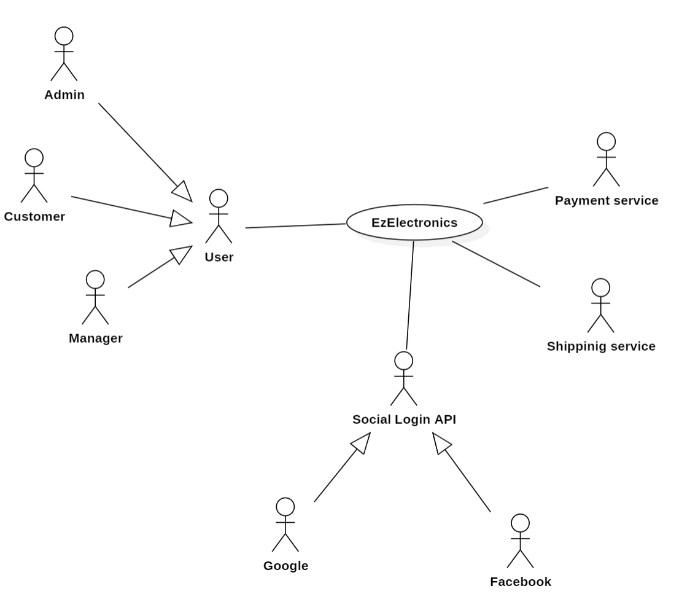
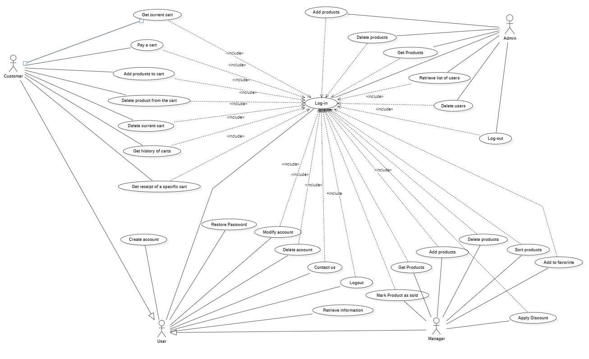
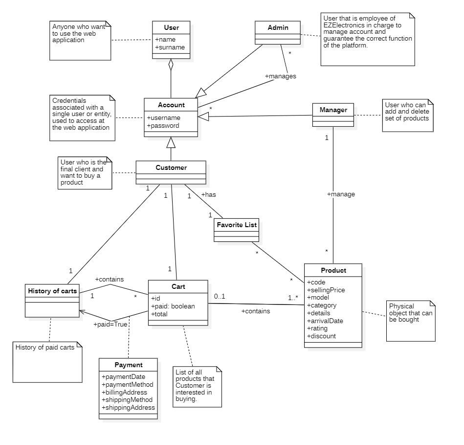
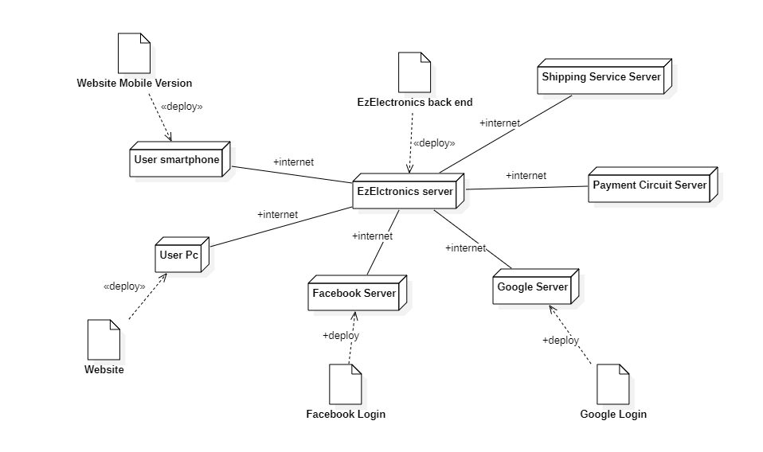

# Requirements Document - future EZElectronics

Date: 05/05/2024

Version: V2 - description of EZElectronics in FUTURE form (customized with alternatives)

| Version number | Change |
|:--------------:|:------:|
|      2.0       |        |

# Contents

- [Requirements Document - current EZElectronics](#requirements-document---future-ezelectronics)
- [Contents](#contents)
- [Informal description](#informal-description)
- [Stakeholders](#stakeholders)
- [Context Diagram and interfaces](#context-diagram-and-interfaces)
    - [Context Diagram](#context-diagram)
    - [Interfaces](#interfaces)
- [Stories and personas](#stories-and-personas)
- [Functional and non functional requirements](#functional-and-non-functional-requirements)
    - [Functional Requirements](#functional-requirements)
    - [Non Functional Requirements](#non-functional-requirements)
- [Use case diagram and use cases](#use-case-diagram-and-use-cases)
    - [Use case diagram](#use-case-diagram)
        - [Authenticate, UC1](#authenticate-uc1)
        - [Log-out, UC2](#log-out-uc2)
        - [Retrieve information, UC3](#retrieve-information-uc3)
        - [Create account, UC4](#create-account-uc4)
        - [Get users, UC5](#get-users-uc5)
        - [Delete user, UC6](#modify-user-uc6)
        - [Delete user, UC7](#delete-user-uc7)
        - [Contact Us, UC8](#contact-us-uc8)
        - [Add a single product, UC9](#add-a-single-product-uc9)
        - [Add many Products, UC10](#add-many-products-uc10)
        - [Mark a product as sold, UC11](#mark-a-product-as-sold-uc11)
        - [Get All Products, UC12](#get-all-products-uc12)
        - [Get Product By Code, UC13](#get-product-by-code-uc13)
        - [Get Product By Category, UC14](#get-product-by-category-uc14)
        - [Get Product By Model, UC15](#get-product-by-model-uc15)
        - [Get current cart, UC16](#delete-a-product-uc16)
        - [Get current cart, UC21](#get-current-cart-uc21)
        - [Pay a cart, UC22](#pay-a-cart-uc22)
        - [Add products to cart, UC23](#add-products-to-cart-uc23)
        - [Delete product from the cart, UC24](#delete-product-from-the-cart-uc24)
        - [Get history of carts, UC25](#get-history-of-carts-uc25)
        - [Delete current cart, UC26](#delete-current-cart-uc26)
- [Glossary](#glossary)
- [Deployment Diagram](#deployment-diagram)

# Informal description

EZElectronics (read EaSy Electronics) is a software application designed to help managers of electronics stores to
manage their products and offer them to customers through a dedicated website. Managers can assess the available
products, record new ones, and confirm purchases. Customers can see available products, add them to a cart and see the
history of their past purchases. Admins can manage users and the related accounts.

# Stakeholders

|    Stakeholder name     |                                                     Description                                                      |
|:-----------------------:|:--------------------------------------------------------------------------------------------------------------------:|
|         Manager         |               Managers of stores that use EZElectronics, they use the website to manage their products               |
|        Customer         |  People subscribed to EZElectronics, they use the website to buy or check products of different electronics stores   |
|          Admin          | Employee of EZElectronics, they use the website to manage accounts and guarantee correct functioning of the platform |
|    Payment Services     |                            APIs used to pay products exploiting common payment circuits.                             |
| Facebook login Services |                          Used for login purposes, avoiding need to create separate account.                          |
|  Google login Services  |                          Used for login purposes, avoiding need to create separate account.                          |
|    Google Play Store    |                 Marketplace used to distribute the mobile version to end users with Android Devices.                 |
|     Apple App Store     |                  Marketplace used to distribute the mobile version to end users with Apple Devices.                  |
|    Shipment Services    |           Third Party shipping companies that provides the transport for products bought on the platform.            |

# Context Diagram and interfaces

## Context Diagram

## Interfaces

|  Actor   | Logical Interface | Physical Interface |
|:--------:|:-----------------:|:------------------:|
| Manager  |        GUI        |         PC         |
| Customer |        GUI        | PC, Smartphone App |
|  Admin   |        GUI        |         PC         |

# Stories and personas

__Tech Buyers__: Customers who are searching for new tech equipment such as smartphones, televisions, PCs, and other
electronic gadgets.

__Gamers__: Customers who are searching for gaming-related electronics such as gaming consoles, peripherals, and
accessories.

__Home Appliance Buyers__: Customers who are searching for electronic home appliances such as refrigerators, washing
machines, and kitchen appliances.

__Professionals__: Customers who are searching for specific electronic devices or equipment for professional purposes.

__Electronics Store Managers__: Responsible for managing their electronics stores. They use the application to manage
their
products.

# Functional and non functional requirements

## Functional Requirements

|   ID    |                           Description                           |
|:-------:|:---------------------------------------------------------------:|
|   FR1   |                Authorization and Authentication                 |
|  FR1.1  |                              Login                              |
| FR1.1.1 |                    Login with Google Account                    |
| FR1.1.2 |                   Login with Facebook Account                   |
|  FR1.2  |                             Logout                              |
|  FR1.3  |                        Restore Password                         |
|   FR2   |                    Retrieve user information                    |
|   FR3   |                        Create a new user                        |
|   FR4   |                           Show users                            |
|  FR4.1  |                         Show all users                          |
|  FR4.2  |                       Show users by role                        |
|  FR4.3  |                      Show user by username                      |
|   FR5   |                      Use Account Settings                       |
|  FR5.1  |                         Modify Account                          |
|  FR5.2  |                         Delete Account                          |
|  FR5.3  |                           Contact Us                            |
|   FR6   |                           Delete User                           |
|  FR6.1  |                    Delete a user by username                    |
|   FR7   |                          Add products                           |
|  FR7.1  |                       Add single product                        |
|  FR7.2  |                      Add group of products                      |
|   FR8   |                          Sell product                           |
|   FR9   |                        Retrieve products                        |
|  FR9.1  |                      Retrieve all products                      |
|  FR9.2  |                  Retrieve one specific product                  |
|  FR9.3  |             Retrieve all products of a given model              |
|  FR9.4  |                 Retrieve all favorite products                  |
|  FR9.5  |                          Sort Products                          |
|  FR10   |                         Delete products                         |
| FR10.1  |                   Delete one specific product                   |
|  FR11   |                    Mark Product As Favorite                     |
|  FR12   |                   Apply Discount on a product                   |
|  FR13   |                Manage current cart for each user                |
| FR13.1  |       List all products of current cart, with its details       |
| FR13.2  |                     Add and delete products                     |
| FR13.3  | Compute total price as the sum of selling price of each product |
| FR13.4  |                    Manage payment of a cart                     |
| FR13.5  |                     Manage payment methods                      |
| FR13.6  |                     Manage shipping methods                     |
| FR13.7  |                       Delete current cart                       |
|  FR14   |                Manage history cart for each user                |
| FR14.1  |                         List paid carts                         |
| FR14.2  |                    Get receipt of a specific                    |

## Non Functional Requirements

|   ID   | Type (efficiency, reliability, ..) |                                      Description                                       |                 Refers to                 |
|:------:|:----------------------------------:|:--------------------------------------------------------------------------------------:|:-----------------------------------------:|
|  NFR1  |             Usability              |      User should be able to use web app with no training in less than 10 minutes       | Users already familiar with using browser |
|  NFR2  |             Efficiency             | All functions on the web app must be completed in <0.1 sec (excluding network latency) |                 All Users                 |
|  NFR3  |            Reliability             |                       No more than one defect per year per user                        |                 All Users                 |
|  NFR4  |            Portability             |                              Web App should be available                               |                 All Users                 |
| NFR4.1 |            Portability             |                               Multiple browser versions                                |                 All Users                 |
| NFR4.2 |            Portability             |                       Android & IOS Compatibility for mobile App                       |                 Customers                 |
|  NFR5  |              Security              |                                                                                        |                 All Users                 |

# Use case diagram and use cases

## Use case diagram

### Authenticate, UC1

| Actors Involved  |                                        Users                                         |
|:----------------:|:------------------------------------------------------------------------------------:|
|   Precondition   |                             User has to have an account                              |
|  Post condition  |                                                                                      |
| Nominal Scenario |                               1.1: User authenticated                                |
|     Variants     | 1.4: User authenticated as manager, 1.5: Login with Facebook, 1.6: Login with Google |
|    Exceptions    |                      1.2: Wrong password,  1.3: wrong username                       |

##### Scenario 1.1

| Scenario 1.1        |                              |                                           |
|---------------------|------------------------------|-------------------------------------------|
| Precondition        | User has an account          |
| Post condition      | User is authenticated        |
| Step#               | Description                  |
| **Actors involved** | **User**                     | **System**                                |
| 1                   | Enters password and username |
| 2                   |                              | Looks for username and password. Match ok |
| 3                   |                              | Authenticate user                         |

##### Scenario 1.2

| Scenario 1.2        |                              |                                                                                |
|---------------------|------------------------------|--------------------------------------------------------------------------------|
| Precondition        | User has an account          |
| Post condition      | User is not authenticated    |
| Step#               | Description                  |
| **Actors involved** | **User**                     | **System**                                                                     |
| 1                   | Enters password and username |
| 2                   |                              | Looks for account name and password. No match for password, ask again password |

##### Scenario 1.3

| Scenario 1.3        |                              |                                                                                |
|---------------------|------------------------------|--------------------------------------------------------------------------------|
| Precondition        | User has an account          |
| Post condition      | User is not authenticated    |
| Step#               | Description                  |
| **Actors involved** | **User**                     | **System**                                                                     |
| 1                   | Enters password and username |
| 2                   |                              | Looks for account name and password. No match for username, ask again username |

##### Scenario 1.4

| Scenario 1.4        |                              |                                           |
|---------------------|------------------------------|-------------------------------------------|
| Precondition        | User has a manager account   |
| Post condition      | User is authenticated        |
| Step#               | Description                  |
| **Actors involved** | **User**                     | **System**                                |
| 1                   | Enters password and username |
| 2                   |                              | Looks for username and password. Match ok |
| 3                   |                              | User is authenticated as manager          |

##### Scenario 1.5

| Scenario 1.5        |                             |                       |
|---------------------|-----------------------------|-----------------------|
| Precondition        | User has a Facebook account |
| Post condition      | User is authenticated       |
| Step#               | Description                 |
| **Actors involved** | **User**                    | **System**            |
| 1                   | Click Facebook login button |
| 2                   |                             | User is authenticated |

##### Scenario 1.6

| Scenario 1.6        |                           |                       |
|---------------------|---------------------------|-----------------------|
| Precondition        | User has a Google account |
| Post condition      | User is authenticated     |
| Step#               | Description               |
| **Actors involved** | **User**                  | **System**            |
| 1                   | Click Google login button |
| 2                   |                           | User is authenticated |

### Log-out, UC2

| Actors Involved  |         Users         |
|:----------------:|:---------------------:|
|   Precondition   | The user is logged in |
|  Post condition  |    User logged out    |
| Nominal Scenario | 2.1: User logged out  |
|     Variants     |                       |
|    Exceptions    |                       |

##### Scenario 2.1

| Scenario 2.1        |                             |                  |
|---------------------|-----------------------------|------------------|
| Precondition        | The user is logged in       |
| Post condition      | User logged out             |
| Step#               | Description                 |
| **Actors involved** | **User**                    | **System**       |
| 1                   | Press the button to log-out |
| 2                   |                             | Disconnects user |

### Restore Password, UC3

| Actors Involved  |           Users           |
|:----------------:|:-------------------------:|
|   Precondition   |    User has an account    |
|  Post condition  | New password for the user |
| Nominal Scenario |   3.1: Restore Password   |
|     Variants     |           None            |
|    Exceptions    |           None            |

##### Scenario 3.1

| Scenario 3.1        |                                     |                                                         |
|---------------------|-------------------------------------|---------------------------------------------------------|
| Precondition        | User has an account                 |
| Post condition      | New password for the user           |
| Step#               | Description                         |
| **Actors involved** | **User**                            | **System**                                              |
| 1                   | Press the button "forget password?" |
| 2                   |                                     | Send an email with a link for the restore password page |
| 3                   | Enter a new password                |
| 4                   |                                     | The new password is registered                          |

### Retrieve information, UC3

| Actors Involved  |            Users             |
|:----------------:|:----------------------------:|
|   Precondition   |    The user is logged in     |
|  Post condition  |   Window with information    |
| Nominal Scenario | 3.1: Window with information |
|     Variants     |             None             |
|    Exceptions    |             None             |

##### Scenario 3.1

| Scenario 3.1        |                                                        |                                        |
|---------------------|--------------------------------------------------------|----------------------------------------|
| Precondition        | The user is logged in                                  |
| Post condition      | The application displays a window with the information |
| Step#               | Description                                            |
| **Actors involved** | **User**                                               | **System**                             |
| 1                   | Press the button to get information about himself      |
| 2                   |                                                        | Displays a window with the information |

### Create account, UC4

| Actors Involved  |                                                    User                                                    |
|:----------------:|:----------------------------------------------------------------------------------------------------------:|
|   Precondition   |                                      User has an internet connection                                       |
|  Post condition  |                                            User get an account                                             |
| Nominal Scenario |                       4.1: User wants to create an account in order use the web app                        |
|     Variants     |                                                    None                                                    |
|    Exceptions    | Username already exists : 4.2,password not valid : 4.3, Role not valid : 4.4, Generic internal error : 4.5 |

##### Scenario 4.1

| Scenario 4.1        |                                                    |                                    |
|---------------------|----------------------------------------------------|------------------------------------|
| Precondition        | User has an internet connection                    |
| Post condition      | User get an account                                |
| Step#               | Description                                        |
| **Actors involved** | **User**                                           | **System**                         |
| 1                   | Click                      **Create account**      |
| 2                   | Enter all the fields in order to create an account |
| 3                   | Click                      **Create account**      |
| 4                   |                                                    | See if the value inserted are fine |
| 5                   |                                                    | Display the user page              |

##### Scenario 4.2

| Scenario 4.2        |                                                    |                                                                      |
|---------------------|----------------------------------------------------|----------------------------------------------------------------------|
| Precondition        | User has an internet connection                    |
| Post condition      | User cannot get an account                         |
| Step#               | Description                                        |
| **Actors involved** | **User**                                           | **System**                                                           |
| 1                   | Click                      **Create account**      |
| 2                   | Enter all the fields in order to create an account |
| 3                   | Click    **Create account**                        |
| 4                   |                                                    | Send end show error 409 to inform that the username is already taken |

##### Scenario 4.3

| Scenario 4.2        |                                                    |                                                                  |
|---------------------|----------------------------------------------------|------------------------------------------------------------------|
| Precondition        | User has an internet connection                    |
| Post condition      | User cannot get an account                         |
| Step#               | Description                                        |
| **Actors involved** | **User**                                           | **System**                                                       |
| 1                   | Click                      **Create account**      |
| 2                   | Enter all the fields in order to create an account |
| 3                   | Click    **Create account**                        |
| 4                   |                                                    | Send and show error 409 to inform that the password is not valid |

##### Scenario 4.4

| Scenario 4.2        |                                                    |                                                              |
|---------------------|----------------------------------------------------|--------------------------------------------------------------|
| Precondition        | User has an internet connection                    |
| Post condition      | User cannot get an account                         |
| Step#               | Description                                        |
| **Actors involved** | **User**                                           | **System**                                                   |
| 1                   | Click                      **CCreate account**     |
| 2                   | Enter all the fields in order to create an account |
| 3                   | Click    **Create account**                        |
| 4                   |                                                    | Send and show error 409 to inform that the role is not valid |

##### Scenario 4.5

| Scenario 4.2        |                                                    |                                                                          |
|---------------------|----------------------------------------------------|--------------------------------------------------------------------------|
| Precondition        | User has an internet connection                    |
| Post condition      | User cannot get an account                         |
| Step#               | Description                                        |
| **Actors involved** | **User**                                           | **System**                                                               |
| 1                   | Click                      **Create account**      |
| 2                   | Enter all the fields in order to create an account |
| 3                   |                                                    | Send and show error 500 to inform that there is an internal server error |

### Get users, UC5

| Actors Involved  |                    User                     |
|:----------------:|:-------------------------------------------:|
|   Precondition   |           User has the role Admin           |
|  Post condition  |           Get the list of user(s)           |
| Nominal Scenario |   5.1: User wants to get a list of users    |
|     Variants     |  5.2: Show by role, 5.3: show by username   |
|    Exceptions    | 5.4: No username found,  5.5: No role found |

##### Scenario 5.1

| Scenario 5.1        |                                      |               |
|---------------------|--------------------------------------|---------------|
| Precondition        | User has the role Admin              |
| Post condition      | Get the list of user(s)              |
| Step#               | Description                          |
| **Actors involved** | **User**                             | **System**    |
| 1                   | Click the button  **Search users**   |
| 2                   | Click the button  **Show all users** |
| 3                   |                                      | Show the list |

##### Scenario 5.2

| Scenario 5.2        |                                    |                                    |
|---------------------|------------------------------------|------------------------------------|
| Precondition        | User has the role Admin            |
| Post condition      | get the list of user(s)            |
| Step#               | Description                        |
| **Actors involved** | **User**                           | **System**                         |
| 1                   | Click the button  **Search users** |
| 2                   | Type the role                      |
| 3                   |                                    | Show the list of users by one role |

##### Scenario 5.3

| Scenario 5.3        |                                    |               |
|---------------------|------------------------------------|---------------|
| Precondition        | User has the role Admin            |
| Post condition      | get the  user                      |
| Step#               | Description                        |
| **Actors involved** | **User**                           | **System**    |
| 1                   | Click the button  **Search users** |
| 2                   | Type the   username                |
| 3                   |                                    | Show the user |

##### Scenario 5.4

| Scenario 5.4        |                                    |                                                     |
|---------------------|------------------------------------|-----------------------------------------------------|
| Precondition        | User has the role Admin            |
| Post condition      | do not get the  user               |
| Step#               | Description                        |
| **Actors involved** | **User**                           | **System**                                          |
| 1                   | Click the button  **Search users** |
| 2                   | Type the   username                |
| 3                   |                                    | Send error 404: do not found the username in the db |

##### Scenario 5.5

| Scenario 5.5        |                                    |                                                 |
|---------------------|------------------------------------|-------------------------------------------------|
| Precondition        | User has the role Admin            |
| Post condition      | do not get the  user               |
| Step#               | Description                        |
| **Actors involved** | **User**                           | **System**                                      |
| 1                   | Click the button  **Search users** |
| 2                   | Type the   role                    |
| 3                   |                                    | Send error 404: do not found the role in the db |

### Modify user, UC6

| Actors Involved  |                                                                     User                                                                     |
|:----------------:|:--------------------------------------------------------------------------------------------------------------------------------------------:|
|   Precondition   |                                                              User has logged in                                                              |
|  Post condition  |                                                           User account is modified                                                           |
| Nominal Scenario |                                                    6.1: User wants to modify his account                                                     |
|     Variants     |                                                                                                                                              |
|    Exceptions    | 6.2: username already taken, 6.3 password does not meet requirements, 6.4 role does not meet requirements, 6.5 generic internal server error |

##### Scenario 6.1

| Scenario 6.1        |                             |                         |
|---------------------|-----------------------------|-------------------------|
| Precondition        | User has logged in          |
| Post condition      | User account is modified    |
| Step#               | Description                 |
| **Actors involved** | **User**                    | **System**              |
| 1                   | Click    **Account Icon**   |
| 2                   | Click    **Modify account** |
| 3                   | Type what to change         |
| 4                   | Click    **Modify account** |
| 5                   |                             | Modify the user account |

##### Scenario 6.2

| Scenario 6.2        |                              |                                                                      |
|---------------------|------------------------------|----------------------------------------------------------------------|
| Precondition        | User has logged in           |
| Post condition      | User account is not modified |
| Step#               | Description                  |
| **Actors involved** | **User**                     | **System**                                                           |
| 1                   | Click    **Account Icon**    |
| 2                   | Click    **Modify account**  |
| 3                   | Insert username              |
| 4                   | Click    **Modify account**  |
| 5                   |                              | Send and show error 409 to inform that the username is already taken |

##### Scenario 6.3

| Scenario 6.3        |                              |                                                                |
|---------------------|------------------------------|----------------------------------------------------------------|
| Precondition        | User has logged in           |
| Post condition      | User account is not modified |
| Step#               | Description                  |
| **Actors involved** | **User**                     | **System**                                                     |
| 1                   | Click    **Account Icon**    |
| 2                   | Click    **Modify account**  |
| 3                   | Insert password              |
| 4                   | Click    **Modify account**  |
| 5                   |                              | Send and show error 422 to inform that the password is invalid |

##### Scenario 6.4

| Scenario 6.4        |                              |                                                            |
|---------------------|------------------------------|------------------------------------------------------------|
| Precondition        | User has logged in           |
| Post condition      | User account is not modified |
| Step#               | Description                  |
| **Actors involved** | **User**                     | **System**                                                 |
| 1                   | Click    **Account Icon**    |
| 2                   | Click    **Modify account**  |
| 3                   | Insert role                  |
| 4                   | Click    **Modify account**  |
| 5                   |                              | Send and show error 422 to inform that the role is invalid |

##### Scenario 6.5

| Scenario 6.5        |                              |                                                                 |
|---------------------|------------------------------|-----------------------------------------------------------------|
| Precondition        | User has logged in           |
| Post condition      | User account is not modified |
| Step#               | Description                  |
| **Actors involved** | **User**                     | **System**                                                      |
| 1                   | Click    **Account Icon**    |
| 2                   | Click    **Modify account**  |
| 3                   | Type what to change          |
| 4                   | Click    **Modify account**  |
| 5                   |                              | Send error 500 to inform that there is an internal server error |

### Delete user, UC7

| Actors Involved  |                    User                    |
|:----------------:|:------------------------------------------:|
|   Precondition   |             User has logged in             |
|  Post condition  |          Delete the user  account          |
| Nominal Scenario | 6.1: User wants to delete the user account |
|     Variants     |    6.2: do not delete the user account     |
|    Exceptions    |     6.3 generic internal server error      |

##### Scenario 7.1

| Scenario 7.1        |                             |                         |
|---------------------|-----------------------------|-------------------------|
| Precondition        | User has logged in          |
| Post condition      | Delete the user             |
| Step#               | Description                 |
| **Actors involved** | **User**                    | **System**              |
| 1                   | Click    **Account Icon**   |
| 2                   | Click    **Delete account** |
| 3                   | Click    **YES**            |
| 4                   |                             | Delete the user account |

##### Scenario 7.2

| Scenario 7.2        |                             |                                |
|---------------------|-----------------------------|--------------------------------|
| Precondition        | User has logged in          |
| Post condition      | Delete the user             |
| Step#               | Description                 |
| **Actors involved** | **User**                    | **System**                     |
| 1                   | Click    **Account Icon**   |
| 2                   | Click    **Delete account** |
| 3                   | Click    **NO**             |
| 4                   |                             | Do not delete the user account |

##### Scenario 7.3

| Scenario 7.3        |                             |                                                                 |
|---------------------|-----------------------------|-----------------------------------------------------------------|
| Precondition        | User has logged in          |
| Post condition      | Do not delete the user      |
| Step#               | Description                 |
| **Actors involved** | **User**                    | **System**                                                      |
| 1                   | Click    **Account Icon**   |
| 2                   | Click    **Delete account** |
| 3                   | Click    **YES**            |
| 4                   |                             | Send error 500 to inform that there is an internal server error |

### Contact us, UC8

| Actors Involved  |              User              |
|:----------------:|:------------------------------:|
|   Precondition   |       User has logged in       |
|  Post condition  |   User get the support email   |
| Nominal Scenario | 4.1: User wants to get support |
|     Variants     |   4.2:Do not send the email    |
|    Exceptions    |  Generic internal error : 4.2  |

##### Scenario 8.1

| Scenario 8.1        |                                           |                               |
|---------------------|-------------------------------------------|-------------------------------|
| Precondition        | User has logged in                        |
| Post condition      | User send the email                       |
| Step#               | Description                               |
| **Actors involved** | **User**                                  | **System**                    |
| 1                   | Click    **Account Icon**                 |
| 2                   | Click                      **Contact us** |
| 3                   | Click                      **Send**       |
| 4                   |                                           | Display the support interface |

##### Scenario 8.2

| Scenario 8.2        |                                           |                            |
|---------------------|-------------------------------------------|----------------------------|
| Precondition        | User has logged in                        |
| Post condition      | User do not send the email                |
| Step#               | Description                               |
| **Actors involved** | **User**                                  | **System**                 |
| 1                   | Click    **Account Icon**                 |
| 2                   | Click                      **Contact us** |
| 3                   | Click                      **Cancel**     |
| 4                   |                                           | Display the user interface |

##### Scenario 8.3

| Scenario 8.3        |                                           |                                                                 |
|---------------------|-------------------------------------------|-----------------------------------------------------------------|
| Precondition        | User has logged in                        |
| Post condition      | User do not send the email                |
| Step#               | Description                               |
| **Actors involved** | **User**                                  | **System**                                                      |
| 1                   | Click    **Account Icon**                 |
| 2                   | Click                      **Contact us** |
| 3                   |                                           | Send error 500 to inform that there is an internal server error |

### Add a single product, UC9

| Actors Involved | User: Manager                                                                                          |
|-----------------|--------------------------------------------------------------------------------------------------------|
| Precondition    | User has account and is logged in as Manager.                                                          |
| Post condition  |                                                                                                        |
| Normal Scenario | 9.1: manager adds one single product to db                                                             |
| Variants        |                                                                                                        |
| Exceptions      | 9.2: (409) product code already exists in the database; 9.3: arrival date is after the current date |

##### Scenario 9.1

| Scenario 9.1        |                                               |                                        |
|---------------------|-----------------------------------------------|----------------------------------------|
| **Precondition**    | User has account and is logged in as manager. |                                        |
| **Post condition**  | Product added correctly.                      |                                        |
| **Step#**           | **Description**                               |                                        |
| **Actors involved** | **User**                                      | **System**                             |
| 1                   | Go to products page                           |                                        |
| 2                   | Click the '_Add One Product_' button          |                                        |
| 3                   | Provide Product & Code                        |                                        |
| 4                   |                                               | query the DB adding the single product |
| 5                   |                                               | display success message                |

##### Scenario 9.2

| Scenario 9.2        |                                               |                                        |
|---------------------|-----------------------------------------------|----------------------------------------|
| **Precondition**    | User has account and is logged in as manager. |                                        |
| **Post condition**  | ERROR: 409.                                   |                                        |
| **Step#**           | **Description**                               |                                        |
| **Actors involved** | **User**                                      | **System**                             |
| 1                   | Go to products page                           |                                        |
| 2                   | Click the '_Add One Product_' button          |                                        |
| 3                   | Provide Product & Code                        |                                        |
| 4                   |                                               | query the DB adding the single product |
| 5                   |                                               | display error message (409)            |

##### Scenario 9.3

| Scenario 9.3        |                                               |                                     |
|---------------------|-----------------------------------------------|-------------------------------------|
| **Precondition**    | User has account and is logged in as manager. |                                     |
| **Post condition**  | ERROR: DATE FORMAT.                           |                                     |
| **Step#**           | **Description**                               |                                     |
| **Actors involved** | **User**                                      | **System**                          |
| 1                   | Go to products page                           |                                     |
| 2                   | Click the '_Add One Product_' button          |                                     |
| 3                   | Provide Product & Code                        |                                     |
| 4                   |                                               | display error message (DATE FORMAT) |

### Add many Products, UC10

| **Actors Involved** | User: Manager                                 |
|---------------------|-----------------------------------------------|
| Precondition        | User has account and is logged in as Manager. |
| Post condition      |                                               |
| Normal Scenario     | 10.1: manager adds many products to the db.   |
| Variants            |                                               |
| Exceptions          | 10.2: arrival date is after the current date  |

##### Scenario 10.1

| Scenario 10.1       |                                               |                                          |
|---------------------|-----------------------------------------------|------------------------------------------|
| **Precondition**    | User has account and is logged in as manager. |                                          |
| **Post condition**  | Products added correctly.                     |                                          |
| **Step#**           | **Description**                               |                                          |
| **Actors involved** | **User**                                      | **System**                               |
| 1                   | Go to products page                           |                                          |
| 2                   | Click the '_Add Many Products_' button        |                                          |
| 3                   | Provide Product & Code                        |                                          |
| 4                   |                                               | queries the DB adding the single product |
| 5                   |                                               | display success message                  |

##### Scenario 10.2

| Scenario 10.2       |                                               |                                     |
|---------------------|-----------------------------------------------|-------------------------------------|
| **Precondition**    | User has account and is logged in as manager. |                                     |
| **Post condition**  | ERROR: DATE FORMAT.                           |                                     |
| **Step#**           | **Description**                               |                                     |
| **Actors involved** | **User**                                      | **System**                          |
| 1                   | Go to products page                           |                                     |
| 2                   | Click the '_Add Many Products_' button        |                                     |
| 3                   | Provide Product & Code                        |                                     |
| 4                   |                                               | display error message (DATE FORMAT) |

### Mark a product as sold, UC11

| **Actors Involved** | User: Manager                                                                                                                                                                     |
|---------------------|-----------------------------------------------------------------------------------------------------------------------------------------------------------------------------------|
| Precondition        | User has account and is logged in as Manager.                                                                                                                                     |
| Post condition      |                                                                                                                                                                                   |
| Normal Scenario     | 11.1: Product marked as sold;                                                                                                                                                     |
| Variants            |                                                                                                                                                                                   |
| Exceptions          | 11.2: (404) code of the product not found in the db; 11.3: selling date is after the current date; 11.4: selling date is before arrival date; 11.5: product already sold |

##### Scenario 11.1

| Scenario 11.1       |                                                |                          |
|---------------------|------------------------------------------------|--------------------------|
| **Precondition**    | User has account and is logged in as manager.  |
| **Post condition**  | Product is successfully marked as sold.        |
| **Step#**           | **Description**                                |
| **Actors involved** | **User**                                       | **System**               |
| 1                   | Go to products page                            |                          |
| 2                   | Click the '_Modify a Specific Product_' button |                          |
| 3                   | Select the `register sale` button              |                          |
| 4                   | Set the '_Mark as Sold in_' option             |
| 5                   | Set the `date` field to the proper value       |
| 6                   | Click the `confirm` button                     |                          |
| 7                   |                                                | display success message; |

##### Scenario 11.2

| Scenario 11.2       |                                                  |                              |
|---------------------|--------------------------------------------------|------------------------------|
| **Precondition**    | User has account and is logged in as manager.    |
| **Post condition**  | ERROR: 404 Not Found                             |
| **Step#**           | **Description**                                  |
| **Actors involved** | **User**                                         | **System**                   |
| 1                   | Go to products page                              |                              |
| 2                   | Click the '_Modify a Specific Product_' button   |                              |
| 3                   | Select the `register sale` button                |                              |
| 4                   | Set the '_Mark as Sold in_' option               |
| 5                   | Set the `date` field to the proper value         |
| 6                   | Click the `confirm` button                       |                              |
| 7                   |                                                  | display ERROR message: #404; |

##### Scenario 11.3

| Scenario 11.3       |                                                  |                                                                  |
|---------------------|--------------------------------------------------|------------------------------------------------------------------|
| **Precondition**    | User has account and is logged in as manager.    |
| **Post condition**  | ERROR: INVALID SELLING DATE.                     |
| **Step#**           | **Description**                                  |
| **Actors involved** | **User**                                         | **System**                                                       |
| 1                   | Go to products page                              |                                                                  |
| 2                   | Click the '_Modify a Specific Product_' button   |                                                                  |
| 3                   | Select the `register sale` button                |                                                                  |
| 4                   | Set the '_Mark as Sold in_' option               |
| 5                   | Set the `date` field to the proper value         |
| 6                   | Click the `confirm` button                       |                                                                  |
| 7                   |                                                  | display ERROR message: "_date must be before the current date_"; |

##### Scenario 11.4

| Scenario 11.4       |                                                  |                                                                  |
|---------------------|--------------------------------------------------|------------------------------------------------------------------|
| **Precondition**    | User has account and is logged in as manager.    |
| **Post condition**  | ERROR: INVALID SELLING DATE.                     |
| **Step#**           | **Description**                                  |
| **Actors involved** | **User**                                         | **System**                                                       |
| 1                   | Go to products page                              |                                                                  |
| 2                   | Click the '_Modify a Specific Product_' button   |                                                                  |
| 3                   | Select the `register sale` button                |                                                                  |
| 4                   | Set the '_Mark as Sold in_' option               |
| 5                   | Set the `date` field to the proper value         |
| 6                   | Click the `confirm` button                       |                                                                  |
| 7                   |                                                  | display ERROR message: "_date must be before the arrival date_"; |

##### Scenario 11.5

| Scenario 11.5       |                                                  |                                                  |
|---------------------|--------------------------------------------------|--------------------------------------------------|
| **Precondition**    | User has account and is logged in as manager.    |
| **Post condition**  | ERROR: DATE FORMAT.                              |
| **Step#**           | **Description**                                  |
| **Actors involved** | **User**                                         | **System**                                       |
| 1                   | Go to products page                              |                                                  |
| 2                   | Click the '_Modify a Specific Product_' button   |                                                  |
| 3                   | Select the `register sale` button                |                                                  |
| 4                   | Set the '_Mark as Sold in_' option               |
| 5                   | Set the `date` field to the proper value         |
| 6                   | Click the `confirm` button                       |                                                  |
| 7                   |                                                  | display ERROR message: "_product already sold_"; |

### Get All Products, UC12

| **Actors Involved** | User                                                                                                                                                   |
|---------------------|--------------------------------------------------------------------------------------------------------------------------------------------------------|
| Precondition        | User has account and is logged in.                                                                                                                     |
| Post condition      | Products Retrieved                                                                                                                                     |
| Normal Scenario     | 12.1: Retrieve all products                                                                                                                            |
| Variants            | 12.2 (`sold=yes` query): Retrieves all product that are marked as sold;  12.3: (`sold=no` query): Retrieves all product that are marked as not sold |
| Exceptions          |                                                                                                                                                        |

##### Scenario 12.1

| Scenario 12.1       |                                    |                   |
|---------------------|------------------------------------|-------------------|
| **Precondition**    | User has account and is logged in. |
| **Post condition**  | ERROR: DATE FORMAT.                |
| **Step#**           | **Description**                    |
| **Actors involved** | **User**                           | **System**        |
| 1                   | Go to products page                |                   |
| 2                   |                                    | Retrieve Products |
| 3                   |                                    | Display products  |

##### Scenario 12.2

| Scenario 12.2       |                                                                         |                   |
|---------------------|-------------------------------------------------------------------------|-------------------|
| **Precondition**    | User has account and is logged in.                                      |
| **Post condition**  | ERROR: DATE FORMAT.                                                     |
| **Step#**           | **Description**                                                         |
| **Actors involved** | **User**                                                                | **System**        |
| 1                   | Go to products page                                                     |                   |
| 2                   | In `filter` sidebar, toggle `sold` selector from `non applied` to `yes` |                   |
| 3                   |                                                                         | Retrieve Products |
| 4                   |                                                                         | Display products  |

##### Scenario 12.3

| Scenario 12.3       |                                                                        |                   |
|---------------------|------------------------------------------------------------------------|-------------------|
| **Precondition**    | User has account and is logged in.                                     |
| **Post condition**  | ERROR: DATE FORMAT.                                                    |
| **Step#**           | **Description**                                                        |
| **Actors involved** | **User**                                                               | **System**        |
| 1                   | Go to products page                                                    |                   |
| 2                   | In `filter` sidebar, toggle `sold` selector from `non applied` to `no` |                   |
| 3                   |                                                                        | Retrieve Products |
| 4                   |                                                                        | Display products  |

### Get Product By Code, UC13

| **Actors Involved** | User                                                 |
|---------------------|------------------------------------------------------|
| Precondition        | User has account and is logged in.                   |
| Post condition      |                                                      |
| Normal Scenario     | 13.1: Product retrieved;                             |
| Variants            |                                                      |
| Exceptions          | 13.2: (404) code of the product not found in the db; |

##### Scenario 13.1

| Scenario 13.1       |                                                                |                            |
|---------------------|----------------------------------------------------------------|----------------------------|
| **Precondition**    | User has account and is logged in.                             |
| **Post condition**  | ERROR: DATE FORMAT.                                            |
| **Step#**           | **Description**                                                |
| **Actors involved** | **User**                                                       | **System**                 |
| 1                   | Go to product page                                             |                            |
| 2                   | Click _find by code_ button, type `#<code>` and then confirm   |                            |
| 3                   |                                                                |                            |
| 4                   |                                                                | displays resulting element |

##### Scenario 13.2

| Scenario 13.2       |                                                                  |                      |
|---------------------|------------------------------------------------------------------|----------------------|
| **Precondition**    | User has account and is logged in.                               |
| **Post condition**  | ERROR: DATE FORMAT.                                              |
| **Step#**           | **Description**                                                  |
| **Actors involved** | **User**                                                         | **System**           |
| 1                   | Go to product page                                               |                      |
| 2                   | Click _find by code_ button, type `#<code>` and then confirm     |                      |
| 3                   |                                                                  |                      |
| 4                   |                                                                  | displays ERROR: #404 |

### Get Product By Category, UC14

| **Actors Involved** | User                                                                                                                                                                                          |
|---------------------|-----------------------------------------------------------------------------------------------------------------------------------------------------------------------------------------------|
| Precondition        | User has account and is logged in.                                                                                                                                                            |
| Post condition      | Products Retrieved                                                                                                                                                                            |
| Normal Scenario     | 14.1: Retrieve all products of a given category                                                                                                                                               |
| Variants            | 14.2 (`sold=yes` query): Retrieves all product of a given category that are marked as sold; 14.3: (`sold=no` query): Retrieves all product of a given category that are marked as not sold |
| Exceptions          |                                                                                                                                                                                               |

##### Scenario 14.1

| Scenario 14.1       |                                                                                         |                   |
|---------------------|-----------------------------------------------------------------------------------------|-------------------|
| **Precondition**    | User has account and is logged in.                                                      |
| **Post condition**  | ERROR: DATE FORMAT.                                                                     |
| **Step#**           | **Description**                                                                         |
| **Actors involved** | **User**                                                                                | **System**        |
| 1                   | Go to products page                                                                     |                   |
| 2                   | In `filter` sidebar, toggle `category` selector from `all` to the desired category name |                   |
| 3                   |                                                                                         | Retrieve Products |
| 4                   |                                                                                         | Display products  |

##### Scenario 14.2

| Scenario 14.2       |                                                                                         |                   |
|---------------------|-----------------------------------------------------------------------------------------|-------------------|
| **Precondition**    | User has account and is logged in.                                                      |
| **Post condition**  | ERROR: DATE FORMAT.                                                                     |
| **Step#**           | **Description**                                                                         |
| **Actors involved** | **User**                                                                                | **System**        |
| 1                   | Go to products page                                                                     |                   |
| 2                   | In `filter` sidebar, toggle `category` selector from `all` to the desired category name |                   |
| 3                   | In `filter` sidebar, toggle `sold` selector from `non applied` to `yes`                 |                   |
| 4                   |                                                                                         | Retrieve Products |
| 5                   |                                                                                         | Display products  |

##### Scenario 14.3

| Scenario 14.3       |                                                                                         |                   |
|---------------------|-----------------------------------------------------------------------------------------|-------------------|
| **Precondition**    | User has account and is logged in.                                                      |
| **Post condition**  | ERROR: DATE FORMAT.                                                                     |
| **Step#**           | **Description**                                                                         |
| **Actors involved** | **User**                                                                                | **System**        |
| 1                   | Go to products page                                                                     |                   |
| 2                   | In `filter` sidebar, toggle `category` selector from `all` to the desired category name |                   |
| 3                   | In `filter` sidebar, toggle `sold` selector from `non applied` to `no`                  |                   |
| 4                   |                                                                                         | Retrieve Products |
| 5                   |                                                                                         | Display products  |

### Get Product By Model, UC15

| **Actors Involved** | User                                                                                                                                                                                    |
|---------------------|-----------------------------------------------------------------------------------------------------------------------------------------------------------------------------------------|
| Precondition        | User has account and is logged in.                                                                                                                                                      |
| Post condition      | Products Retrieved                                                                                                                                                                      |
| Normal Scenario     | 15.1: Retrieve all products of a given model                                                                                                                                            |
| Variants            | 15.2 (`sold=yes` query): Retrieves all product of a given model that are marked as sold; 12.3: (`sold=no` query): Retrieves all product of a given model that are marked as not sold |
| Exceptions          |                                                                                                                                                                                         |

##### Scenario 15.1

| Scenario 15.1       |                                                                                   |                   |
|---------------------|-----------------------------------------------------------------------------------|-------------------|
| **Precondition**    | User has account and is logged in.                                                |
| **Post condition**  | ERROR: DATE FORMAT.                                                               |
| **Step#**           | **Description**                                                                   |
| **Actors involved** | **User**                                                                          | **System**        |
| 1                   | Go to products page                                                               |                   |
| 2                   | In `filter` sidebar, toggle `model` selector from `all` to the desired model name |                   |
| 3                   |                                                                                   | Retrieve Products |
| 4                   |                                                                                   | Display products  |

##### Scenario 15.2

| Scenario 15.2       |                                                                                   |                   |
|---------------------|-----------------------------------------------------------------------------------|-------------------|
| **Precondition**    | User has account and is logged in.                                                |
| **Post condition**  | ERROR: DATE FORMAT.                                                               |
| **Step#**           | **Description**                                                                   |
| **Actors involved** | **User**                                                                          | **System**        |
| 1                   | Go to products page                                                               |                   |
| 2                   | In `filter` sidebar, toggle `model` selector from `all` to the desired model name |                   |
| 3                   | In `filter` sidebar, toggle `sold` selector from `non applied` to `yes`           |                   |
| 4                   |                                                                                   | Retrieve Products |
| 5                   |                                                                                   | Display products  |

##### Scenario 15.3

| Scenario 15.3       |                                                                                   |                   |
|---------------------|-----------------------------------------------------------------------------------|-------------------|
| **Precondition**    | User has account and is logged in.                                                |
| **Post condition**  | ERROR: DATE FORMAT.                                                               |
| **Step#**           | **Description**                                                                   |
| **Actors involved** | **User**                                                                          | **System**        |
| 1                   | Go to products page                                                               |                   |
| 2                   | In `filter` sidebar, toggle `model` selector from `all` to the desired model name |                   |
| 3                   | In `filter` sidebar, toggle `sold` selector from `non applied` to `no`            |                   |
| 4                   |                                                                                   | Retrieve Products |
| 5                   |                                                                                   | Display products  |

### Delete a product, UC16

| Actors Involved |                    Manager                    |
|:---------------:|:---------------------------------------------:|
|  Precondition   | User has account and is logged in as Manager. |
| Post condition  |                                               |
| Normal Scenario |        13.1: correct deletion from db         |
|    Variants     |                                               |
|   Exceptions    |      13.2: ERROR (404) product not found      |

##### Scenario 16.1

| Scenario 16.1       |                                                 |                                  |
|---------------------|-------------------------------------------------|----------------------------------|
| **Precondition**    | User has account and is logged in as manager.   |
| **Post condition**  | Product successfully deleted from the database. |
| **Step#**           | **Description**                                 |
| **Actors involved** | **User**                                        | **System**                       |
| 1                   | Goes to products page                           |                                  |
| 2                   | Click the '_delete_' button                     |                                  |
| 3                   | Insert Product Code and click '_confirm_'       |                                  |
| 4                   |                                                 | delete product from the database |
| 5                   |                                                 | display success message          |

##### Scenario 16.2

| Scenario 16.2       |                                                 |                                    |
|---------------------|-------------------------------------------------|------------------------------------|
| **Precondition**    | User has account and is logged in as manager.   |
| **Post condition**  | Product successfully deleted from the database. |
| **Step#**           | **Description**                                 |
| **Actors involved** | **User**                                        | **System**                         |
| 1                   | Goes to products page                           |                                    |
| 2                   | Click the '_delete_' button                     |                                    |
| 3                   | Insert Product Code and click '_confirm_'       |                                    |
| 4                   |                                                 | can't find product in the database |
| 5                   |                                                 | display ERROR 404 message          |

### Sort Products, UC17

| Actors Involved |                User                |
|:---------------:|:----------------------------------:|
|  Precondition   | User has account and is logged in. |
| Post condition  |                                    |
| Normal Scenario | 17.1: correct sorting of products  |
|    Variants     |                                    |
|   Exceptions    |                                    |

##### Scenario 17.1

| Scenario 17.1       |                                                          |                     |
|---------------------|----------------------------------------------------------|---------------------|
| **Precondition**    | User has account and is logged in.                       |
| **Post condition**  | Product successfully deleted from the database.          |
| **Step#**           | **Description**                                          |
| **Actors involved** | **User**                                                 | **System**          |
| 1                   | Goes to products page                                    |                     |
| 2                   | Click the '_sort items_' button                          |                     |
| 3                   | Select the field to be use as sorting key, and the order |                     |
| 4                   |                                                          | compute sorted list |
| 5                   |                                                          | display list        |

### Add/Remove Product to/from Favorites, UC18

| Actors Involved |                         Manager                          |
|:---------------:|:--------------------------------------------------------:|
|  Precondition   |            User has account and is logged in.            |
| Post condition  |                                                          |
| Normal Scenario | 18.1: added to favorite; 18.2: removed from favorites |
|    Variants     |                                                          |
|   Exceptions    |                                                          |

##### Scenario 18.1

| Scenario 18.1       |                                                          |                                         |
|---------------------|----------------------------------------------------------|-----------------------------------------|
| **Precondition**    | User has account and is logged in.                       |
| **Post condition**  | Successfully added to favorites                          |
| **Step#**           | **Description**                                          |
| **Actors involved** | **User**                                                 | **System**                              |
| 1                   | Go to products page                                      |                                         |
| 2                   | Click the '_empty-heart_' icon after the desired element |                                         |
| 3                   |                                                          | Add to favorites                        |
| 4                   |                                                          | Display Success Message and update view |

#### Scenario 18.2

| Scenario 18.2       |                                                         |                                         |
|---------------------|---------------------------------------------------------|-----------------------------------------|
| **Precondition**    | User has account and is logged in.                      |
| **Post condition**  | Successfully added to favorites                         |
| **Step#**           | **Description**                                         |
| **Actors involved** | **User**                                                | **System**                              |
| 1                   | Go to products page                                     |                                         |
| 2                   | Click the '_fill-heart_' icon after the desired element |                                         |
| 3                   |                                                         | Remove from favorites                   |
| 4                   |                                                         | Display Success Message and update view |

### Get Favorite Products, UC19

| **Actors Involved** | User                                                                                                                                                                                          |
|---------------------|-----------------------------------------------------------------------------------------------------------------------------------------------------------------------------------------------|
| Precondition        | User has account and is logged in.                                                                                                                                                            |
| Post condition      | Products Retrieved                                                                                                                                                                            |
| Normal Scenario     | 19.1: Retrieve all favorite products                                                                                                                                                          |
| Variants            | 19.2 (`sold=yes` query): Retrieves all product of a given category that are marked as sold; 19.3: (`sold=no` query): Retrieves all product of a given category that are marked as not sold |
| Exceptions          |                                                                                                                                                                                               |

##### Scenario 19.1

| Scenario 19.1       |                                                          |                   |
|---------------------|----------------------------------------------------------|-------------------|
| **Precondition**    | User has account and is logged in.                       |
| **Post condition**  | ERROR: DATE FORMAT.                                      |
| **Step#**           | **Description**                                          |
| **Actors involved** | **User**                                                 | **System**        |
| 1                   | Go to products page                                      |                   |
| 2                   | In `filter` sidebar, toggle `favorite` and click confirm |                   |
| 3                   |                                                          | Retrieve Products |
| 4                   |                                                          | Display products  |

##### Scenario 19.2

| Scenario 19.2       |                                                                         |                   |
|---------------------|-------------------------------------------------------------------------|-------------------|
| **Precondition**    | User has account and is logged in.                                      |
| **Post condition**  | ERROR: DATE FORMAT.                                                     |
| **Step#**           | **Description**                                                         |
| **Actors involved** | **User**                                                                | **System**        |
| 1                   | Go to products page                                                     |                   |
| 2                   | In `filter` sidebar, toggle `favorite` and click confirm                |                   |
| 3                   | In `filter` sidebar, toggle `sold` selector from `non applied` to `yes` |                   |
| 4                   |                                                                         | Retrieve Products |
| 5                   |                                                                         | Display products  |

##### Scenario 19.3

| Scenario 19.3       |                                                                        |                   |
|---------------------|------------------------------------------------------------------------|-------------------|
| **Precondition**    | User has account and is logged in.                                     |
| **Post condition**  | ERROR: DATE FORMAT.                                                    |
| **Step#**           | **Description**                                                        |
| **Actors involved** | **User**                                                               | **System**        |
| 1                   | Go to products page                                                    |                   |
| 2                   | In `filter` sidebar, toggle `favorite` and click confirm               |                   |
| 3                   | In `filter` sidebar, toggle `sold` selector from `non applied` to `no` |                   |
| 4                   |                                                                        | Retrieve Products |
| 5                   |                                                                        | Display products  |

### Apply Discount, UC20

| Actors Involved |                                           Manager                                            |
|:---------------:|:--------------------------------------------------------------------------------------------:|
|  Precondition   |                        User has account and is logged in as Manager.                         |
| Post condition  |                                                                                              |
| Normal Scenario |                               20.1: discount applied correctly                               |
|    Variants     |                                                                                              |
|   Exceptions    | 20.2: ERROR (404) product not found; 20.3 FORMAT ERROR: value must be in between (0%-99%) |

#### Scenario 20.1

| Scenario 20.1       |                                                                   |                                         |
|---------------------|-------------------------------------------------------------------|-----------------------------------------|
| **Precondition**    | User has account and is logged in.                                |
| **Post condition**  | ERROR: DATE FORMAT.                                               |
| **Step#**           | **Description**                                                   |
| **Actors involved** | **User**                                                          | **System**                              |
| 1                   | Go to products page                                               |                                         |
| 2                   | Click the '_Apply a discount_' button                             |                                         |
| 3                   | Insert Product Code and desired discount in %, then click confirm |                                         |
| 4                   |                                                                   | Apply discount                          |
| 5                   |                                                                   | Display success message and update view |

#### Scenario 20.2

| Scenario 20.2       |                                                                   |                                           |
|---------------------|-------------------------------------------------------------------|-------------------------------------------|
| **Precondition**    | User has account and is logged in.                                |
| **Post condition**  | ERROR: DATE FORMAT.                                               |
| **Step#**           | **Description**                                                   |
| **Actors involved** | **User**                                                          | **System**                                |
| 1                   | Go to products page                                               |                                           |
| 2                   | Click the '_Apply a discount_' button                             |                                           |
| 3                   | Insert Product Code and desired discount in %, then click confirm |                                           |
| 4                   |                                                                   | Display Error Message: 404 code not found |

#### Scenario 20.3

| Scenario 20.3       |                                                                   |                                                                           |
|---------------------|-------------------------------------------------------------------|---------------------------------------------------------------------------|
| **Precondition**    | User has account and is logged in.                                |
| **Post condition**  | ERROR: DATE FORMAT.                                               |
| **Step#**           | **Description**                                                   |
| **Actors involved** | **User**                                                          | **System**                                                                |
| 1                   | Go to products page                                               |                                                                           |
| 2                   | Click the '_Apply a discount_' button                             |                                                                           |
| 3                   | Insert Product Code and desired discount in %, then click confirm |                                                                           |
| 4                   |                                                                   | Display Error Message: invalid format,  value must be in between (0%-99%) |

### Get current cart, UC21

| Actors Involved |                    Customer                    |
|:---------------:|:----------------------------------------------:|
|  Precondition   | User has account and is logged in as Customer. |
| Post condition  |                                                |
| Normal Scenario |       GC1: user checks his current cart        |
|    Variants     |                                                |
|   Exceptions    |              GC2: no current cart              |

##### Scenario 21.1

| Scenario 21.1       |                                     |                               |
|---------------------|-------------------------------------|-------------------------------|
| **Precondition**    | User has account and is logged in.  |
| **Post condition**  | All products of current cart shown. |
| **Step#**           | **Description**                     |
| **Actors involved** | **User**                            | **System**                    |
| 1                   | Goes to cart page                   |                               |
| 2                   |                                     | Retrieves user’s current cart |
| 3                   |                                     | Computes total price          |

##### Scenario 21.2

| Scenario 21.2       |                                    |                                                                    |
|---------------------|------------------------------------|--------------------------------------------------------------------|
| **Precondition**    | User has account and is logged in. |
| **Post condition**  | Error message.                     |
| **Step#**           | **Description**                    |
| **Actors involved** | **User**                           | **System**                                                         |
| 1                   | Goes to cart page                  |                                                                    |
| 2                   |                                    | Retrieves user’s current cart                                      |
| 3                   |                                    | No current cart exists for the current user. Display error message |

### Pay a cart, UC22

| **Actors Involved** | Customer, Payment service                                            |
|---------------------|----------------------------------------------------------------------|
| Precondition        | User has account and is logged in as Customer.                       |
| Post condition      |                                                                      |
| Normal Scenario     | PC1: user proceed to pay the current cart                            |
| Variants            | PC2: Paypal as payment method, PC3: Express shipping method selected |
| Exceptions          | PC4: current cart empty, PC5: refused payment                        |

##### Scenario 22.1

| **Scenario 22.1**   |                                                      |                                         |
|---------------------|------------------------------------------------------|-----------------------------------------|
| Precondition        | User has account and is logged in.                   |
| Post condition      | Current cart added to cart history. Success message. |
| **Step#**           | **Description**                                      |                                         |
| **Actors involved** | **User**                                             | **System**                              |
| 1                   | Goes to cart page                                    |                                         |
| 2                   |                                                      | Retrieves user’s current cart           |
| 3                   |                                                      | Computes total price                    |
| 4                   | Clicks button `pay` to pay the cart                  |                                         |
| 5                   |                                                      | Asks to choose a delivery method        |
| 6                   | Selects standard shipping method                     |                                         |
| 7                   | Inserts delivery address                             |                                         |
| 8                   |                                                      | Asks to choose a payment method         |
| 9                   | Selects credit card                                  |                                         |
| 10                  | Fills payment details                                |                                         |
| 11                  |                                                      | Send payment details to payment service |
| 12                  |                                                      | Payment succeeds                        |
| 13                  |                                                      | Added date of payment as current date   |
| 14                  |                                                      | Current cart marked as paid             |
| 15                  |                                                      | Current cart cleared                    |
| 16                  |                                                      | Display success message                 |

##### Scenario 22.2

| **Scenario 22.2**   |                                                      |                                         |
|---------------------|------------------------------------------------------|-----------------------------------------|
| Precondition        | User has account and is logged in.                   |
| Post condition      | Current cart added to cart history. Success message. |
| **Step#**           | **Description**                                      |                                         |
| **Actors involved** | **User**                                             | **System**                              |
| 1                   | Goes to cart page                                    |                                         |
| 2                   |                                                      | Retrieves user’s current cart           |
| 3                   |                                                      | Computes total price                    |
| 4                   | Clicks button `pay` to pay the cart                  |                                         |
| 5                   |                                                      | Asks to choose a delivery method        |
| 6                   | Selects standard shipping method                     |                                         |
| 7                   | Inserts delivery address                             |                                         |
| 8                   |                                                      | Asks to choose a payment method         |
| 9                   | Selects Paypal as payment method                     |                                         |
| 10                  |                                                      | Redirection to Paypal page              |
| 11                  |                                                      | Send payment details to payment service |
| 12                  |                                                      | Payment succeeds                        |
| 13                  |                                                      | Added date of payment as current date   |
| 14                  |                                                      | Current cart marked as paid             |
| 15                  |                                                      | Current cart cleared                    |
| 16                  |                                                      | Display success message                 |

##### Scenario 22.3

| **Scenario 22.3**   |                                                      |                                              |
|---------------------|------------------------------------------------------|----------------------------------------------|
| Precondition        | User has account and is logged in.                   |
| Post condition      | Current cart added to cart history. Success message. |
| **Step#**           | **Description**                                      |                                              |
| **Actors involved** | **User**                                             | **System**                                   |
| 1                   | Goes to cart page                                    |                                              |
| 2                   |                                                      | Retrieves user’s current cart                |
| 3                   |                                                      | Computes total price                         |
| 4                   | Clicks button `pay` to pay the cart                  |                                              |
| 5                   |                                                      | Asks to choose a delivery method             |
| 6                   | Selects express shipping method                      |                                              |
| 7                   | Inserts delivery address                             |                                              |
| 8                   |                                                      | Computes total to pay including shipment fee |
| 9                   |                                                      | Asks to choose a payment method              |
| 10                  | Selects credit card                                  |                                              |
| 11                  | Fills payment details                                |                                              |
| 12                  |                                                      | Send payment details to payment service      |
| 13                  |                                                      | Payment succeeds                             |
| 14                  |                                                      | Added date of payment as current date        |
| 15                  |                                                      | Current cart marked as paid                  |
| 16                  |                                                      | Current cart cleared                         |
| 17                  |                                                      | Display success message                      |

##### Scenario 22.4

| **Scenario 22.4**   |                                    |                               |
|---------------------|------------------------------------|-------------------------------|
| Precondition        | User has account and is logged in. |
| Post condition      | Returns 404 error                  |
| **Step#**           | **Description**                    |                               |
| **Actors involved** | **User**                           | **System**                    |
| 1                   | Goes to cart page                  |                               |
| 2                   |                                    | Retrieves user’s current cart |
| 3                   |                                    | No current cart available     |

##### Scenario 22.5

| **Scenario 22.5**   |                                                    |                                         |
|---------------------|----------------------------------------------------|-----------------------------------------|
| Precondition        | User has account and is logged in.                 |
| Post condition      | Current cart added to cart history. Error message. |
| **Step#**           | **Description**                                    |                                         |
| **Actors involved** | **User**                                           | **System**                              |
| 1                   | Goes to cart page                                  |                                         |
| 2                   |                                                    | Retrieves user’s current cart           |
| 3                   |                                                    | Computes total price                    |
| 4                   | Clicks button `pay` to pay the cart                |                                         |
| 5                   |                                                    | Asks to choose a delivery method        |
| 6                   | Selects standard shipping method                   |                                         |
| 7                   | Inserts delivery address                           |                                         |
| 8                   |                                                    | Asks to choose a payment method         |
| 9                   | Selects credit card                                |                                         |
| 10                  | Fills payment details                              |                                         |
| 11                  |                                                    | Send payment details to payment service |
| 12                  |                                                    | Payment refused. Display error message  |

### Add products to cart, UC23

| **Actors Involved** | Customer                                                                                          |
|---------------------|---------------------------------------------------------------------------------------------------|
| Precondition        | User has account and is logged in as Customer.                                                    |
| Post condition      |                                                                                                   |
| Normal Scenario     | AP1: user add a product to the current cart                                                       |
| Variants            |                                                                                                   |
| Exceptions          | AP2: product doesn’t exist. AP3: product already in another cart. AP4: product already been sold. |

##### Scenario 23.1

| **Scenario 23.1**   |                                                                   |                                                                            |
|---------------------|-------------------------------------------------------------------|----------------------------------------------------------------------------|
| Precondition        | User has account and is logged in.                                |
| Post condition      | Product added to current cart                                     |
| **Step#**           | **Description**                                                   |                                                                            |
| **Actors involved** | **User**                                                          | **System**                                                                 |
| 1                   | Goes to cart page                                                 |                                                                            |
| 2                   |                                                                   | Retrieves user’s current cart                                              |
| 3                   |                                                                   | Computes total price                                                       |
| 4                   | Clicks the button `add products` to add a product to current cart |                                                                            |
| 5                   | Fills the productId of the wanted product                         |                                                                            |
| 6                   |                                                                   | Looks for productId.                                                       |
| 7                   |                                                                   | ProductId found, product added to the list of products in the current cart |

##### Scenario 23.2

| **Scenario 23.2**   |                                                                   |                                                   |
|---------------------|-------------------------------------------------------------------|---------------------------------------------------|
| Precondition        | User has account and is logged in.                                |
| Post condition      | Return a 404 error.                                               |
| **Step#**           | **Description**                                                   |                                                   |
| **Actors involved** | **User**                                                          | **System**                                        |
| 1                   | Goes to cart page                                                 |                                                   |
| 2                   |                                                                   | Retrieves user’s current cart                     |
| 3                   |                                                                   | Computes total price                              |
| 4                   | Clicks the button `add products` to add a product to current cart |                                                   |
| 5                   | Fills the productId of the wanted product                         |                                                   |
| 6                   |                                                                   | Looks for productId.                              |
| 7                   |                                                                   | Not found, product doesn’t exist, can’t be added. |

##### Scenario 23.3

| **Scenario 23.3**   |                                                                   |                                                     |
|---------------------|-------------------------------------------------------------------|-----------------------------------------------------|
| Precondition        | User has account and is logged in.                                |
| Post condition      | Return a 409 error.                                               |
| **Step#**           | **Description**                                                   |                                                     |
| **Actors involved** | **User**                                                          | **System**                                          |
| 1                   | Goes to cart page                                                 |                                                     |
| 2                   |                                                                   | Retrieves user’s current cart                       |
| 3                   |                                                                   | Computes total price                                |
| 4                   | Clicks the button `add products` to add a product to current cart |                                                     |
| 5                   | Fills the productId of the wanted product                         |                                                     |
| 6                   |                                                                   | Looks for productId.                                |
| 7                   |                                                                   | Product is already in another cart. Can’t be added. |

##### Scenario 23.4

| **Scenario 23.4**   |                                                                   |                               |
|---------------------|-------------------------------------------------------------------|-------------------------------|
| Precondition        | User has account and is logged in.                                |
| Post condition      | Return a 409 error.                                               |
| **Step#**           | **Description**                                                   |                               |
| **Actors involved** | **User**                                                          | **System**                    |
| 1                   | Goes to cart page                                                 |                               |
| 2                   |                                                                   | Retrieves user’s current cart |
| 3                   |                                                                   | Computes total price          |
| 4                   | Clicks the button `add products` to add a product to current cart |                               |
| 5                   | Fills the productId of the wanted product                         |                               |
| 6                   |                                                                   | Looks for productId.          |
| 7                   |                                                                   | Product sold. Can’t be added. |

### Delete product from the cart, UC24

| **Actors Involved** | Customer                                         |
|---------------------|--------------------------------------------------|
| Precondition        | User has account and is logged in as Customer.   |
| Post condition      |                                                  |
| Normal Scenario     | DP1: user delete a product from the current cart |
| Variants            |                                                  |
| Exceptions          |                                                  |

##### Scenario 24.1

| **Scenario 24.1**   |                                                                           |                               |
|---------------------|---------------------------------------------------------------------------|-------------------------------|
| Precondition        | User has account and is logged in.                                        |
| Post condition      | Product deleted from the current cart                                     |
| **Step#**           | **Description**                                                           |                               |
| **Actors involved** | **User**                                                                  | **System**                    |
| 1                   | Goes to cart page                                                         |                               |
| 2                   |                                                                           | Retrieves user’s current cart |
| 3                   |                                                                           | Computes total price          |
| 4                   | Clicks the button `delete` to remove a specific product from current cart |                               |
| 5                   |                                                                           | Product deleted.              |

### Get history of carts, UC25

| **Actors Involved** | Customer                                       |
|---------------------|------------------------------------------------|
| Precondition        | User has account and is logged in as Customer. |
| Post condition      |                                                |
| Normal Scenario     | GH1: user retrieves history of the carts paid  |
| Variants            |                                                |
| Exceptions          | GH2: no carts found                            |

##### Scenario 25.1

| **Scenario 25.1**   |                                    |                             |
|---------------------|------------------------------------|-----------------------------|
| Precondition        | User has account and is logged in. |
| Post condition      | All paid carts shown.              |
| **Step#**           | **Description**                    |                             |
| **Actors involved** | **User**                           | **System**                  |
| 1                   | Goes to history cart page          |                             |
| 2                   |                                    | Retrieves user’s paid carts |

##### Scenario 25.2

| **Scenario 25.2**   |                                    |                                                          |
|---------------------|------------------------------------|----------------------------------------------------------|
| Precondition        | User has account and is logged in. |
| Post condition      | Returns error 404                  |
| **Step#**           | **Description**                    |                                                          |
| **Actors involved** | **User**                           | **System**                                               |
| 1                   | Goes to history cart page          |                                                          |
| 2                   |                                    | Retrieves user’s paid carts                              |
| 3                   |                                    | No carts found in the history. Displays an error message |

### Delete current cart, UC26

| **Actors Involved** | Customer                                       |
|---------------------|------------------------------------------------|
| Precondition        | User has account and is logged in as Customer. |
| Post condition      |                                                |
| Normal Scenario     | DC1: user deletes his current cart             |
| Variants            |                                                |
| Exceptions          | DC2: user current cart empty                   |

##### Scenario 26.1

| **Scenario 26.1**   |                                                        |                               |
|---------------------|--------------------------------------------------------|-------------------------------|
| Precondition        | User has account and is logged in.                     |
| Post condition      | Current cart deleted                                   |
| **Step#**           | **Description**                                        |                               |
| **Actors involved** | **User**                                               | **System**                    |
| 1                   | Goes to cart page                                      |                               |
| 2                   |                                                        | Retrieves user’s current cart |
| 3                   |                                                        | Computes total price          |
| 4                   | Clicks on `delete current cart` to delete current cart |                               |
| 5                   |                                                        | Current cart deleted          |

##### Scenario 26.2

| **Scenario 26.2**   |                                    |                                                           |
|---------------------|------------------------------------|-----------------------------------------------------------|
| Precondition        | User has account and is logged in. |
| Post condition      | Return error 404                   |
| **Step#**           | **Description**                    |                                                           |
| **Actors involved** | **User**                           | **System**                                                |
| 1                   | Goes to cart page                  |                                                           |
| 2                   |                                    | Current cart empty, nothing to delete. Displays error 404 |

### Get receipt of a specific order, UC27

| **Actors Involved** | Customer                                            |
|---------------------|-----------------------------------------------------|
| Precondition        | User has account and is logged in as Customer.      |
| Post condition      |                                                     |
| Normal Scenario     | GR1: user retrieves the receipt of a specific order |
| Variants            |                                                     |
| Exceptions          |                                                     |

##### Scenario 27.1

| **Scenario 27.1**   |                                              |                                         |
|---------------------|----------------------------------------------|-----------------------------------------|
| Precondition        | User has account and is logged in.           |
| Post condition      |                                              |
| **Step#**           | **Description**                              |                                         |
| **Actors involved** | **User**                                     | **System**                              |
| 1                   | Goes to history cart page                    |                                         |
| 2                   |                                              | Retrieves user’s paid carts             |
| 3                   | Clicks button `download` of the wanted order |                                         |
| 4                   |                                              | Retrieves the receipt of specific order |

# Glossary

# Deployment Diagram

