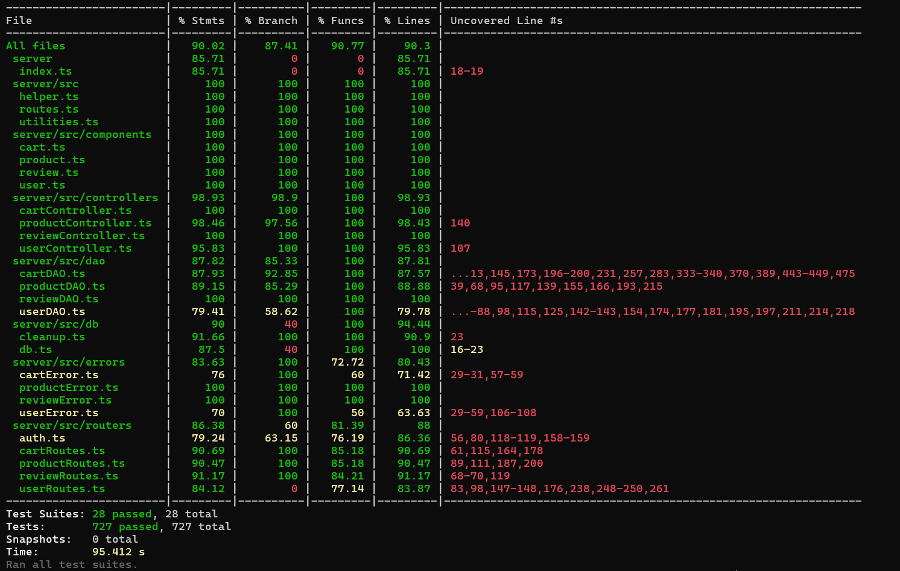

# Test Report

<The goal of this document is to explain how the application was tested, detailing how the test cases were defined and what they cover>

# Contents

- [Test Report](#test-report)
- [Contents](#contents)
- [Dependency graph](#dependency-graph)
- [Integration approach](#integration-approach)
- [Tests](#tests)
- [Coverage](#coverage)
  - [Coverage of FR](#coverage-of-fr)
  - [Coverage white box](#coverage-white-box)

# Dependency graph

# Integration approach

- Integration Testing For Reviews, ***top-down approach***:
  - _Step0_: testing module `"routers/reviewRoutes.ts"` alone (corresponds to unit testing)
  - _Step1_: testing after integration of module `"helper.ts"`
  - _Step2_: testing after integration of module `"routers/auth.ts"`
  - _Step3_: testing after the integration of module `"controllers/reviewControllers.ts"`
  - _Step4_: testing after the integration of modules `"dao/reviewDAO.ts"`
- Integration Testing For Products
  - _Step0_: testing module `"routers/productRoutes.ts"` alone (corresponds to unit testing)
  - _Step1_: testing after integration of module `"helper.ts"`
  - _Step2_: testing after integration of module `"routers/auth.ts"`
  - _Step3_: testing after the integration of module `"controllers/productControllers.ts"`
  - _Step4_: testing after the integration of modules `"dao/productDAO.ts"`
- Integration Testing For Users
  - _Step0_: testing module `"routers/userRoutes.ts"` alone (corresponds to unit testing)
  - _Step1_: testing after integration of module `"helper.ts"`
  - _Step2_: testing after integration of module `"routers/auth.ts"`
  - _Step3_: testing after the integration of module `"controllers/userControllers.ts"`
  - _Step4_: testing after the integration of modules `"dao/userDAO.ts"`
- Integration Testing For Carts
  - _Step0_: testing module `"routers/cartRoutes.ts"` alone (corresponds to unit testing)
  - _Step1_: testing after integration of module `"helper.ts"`
  - _Step2_: testing after integration of module `"routers/auth.ts"`
  - _Step3_: testing after the integration of module `"controllers/cartControllers.ts"`
  - _Step4_: testing after the integration of modules `"dao/cartDAO.ts"`

# Tests

<in the table below list the test cases defined For each test report the object tested, the test level (API, integration, unit) and the technique used to define the test case (BB/ eq partitioning, BB/ boundary, WB/ statement coverage, etc)> <split the table if needed>

|         Test case name         |                                 Object(s) tested                                  |  Test level  |     Technique used     |
|:------------------------------:|:---------------------------------------------------------------------------------:|:------------:|:----------------------:|
|    UD  USER  Dao unit tests    |                                                                                   |     unit     | WB/ statement coverage |
|              UD1               |                                 createUser, true                                  |     unit     | WB/ statement coverage |
|             UD1.1              |                        createUser UserAlreadyExistsError,                         |     unit     | WB/ statement coverage |
|              UD2               |                              getUserByUsername, user                              |     unit     | WB/ statement coverage |
|             UD2.1              |                       getUserByUsername  ,UserNotFoundError                       |     unit     | WB/ statement coverage |
|              UD3               |                                 getAllUsers, list                                 |     unit     | WB/ statement coverage |
|              UD4               |                               getUsersByRole, list                                |     unit     | WB/ statement coverage |
|              UD5               |                            deleteUserByUsername, true                             |     unit     | WB/ statement coverage |
|             UD5.1              |                      deleteUserByUsername, UserNotFoundError                      |     unit     | WB/ statement coverage |
|             UD5.2              |                      deleteUserByUsername, UserIsAdminError                       |     unit     | WB/ statement coverage |
|              UD6               |                               deleteAllUsers, true                                |     unit     | WB/ statement coverage |
|              UD7               |                                  updateUser,user                                  |     unit     | WB/ statement coverage |
|             UD7.1              |                           updateUser,UserNotFoundError                            |     unit     | WB/ statement coverage |
|             UD7.2              |                            updateUser,UserIsAdminError                            |     unit     | WB/ statement coverage |
| UC  USER CONTROLLER unit tests |                                                                                   |     unit     | WB/ statement coverage |
|              UC1               |                                 createUser, true                                  |     unit     | WB/ statement coverage |
|             UC1.1              |                        createUser UserAlreadyExistsError,                         |     unit     | WB/ statement coverage |
|              UC2               |                              getUserByUsername, user                              |     unit     | WB/ statement coverage |
|             UC2.1              |                       getUserByUsername  ,UserNotFoundError                       |     unit     | WB/ statement coverage |
|             UC2.2              |                       getUserByUsername  ,UserNotAdminError                       |     unit     | WB/ statement coverage |
|              UC3               |                                 getAllUsers, list                                 |     unit     | WB/ statement coverage |
|              UC4               |                               getUsersByRole, list                                |     unit     | WB/ statement coverage |
|              UC5               |                            deleteUserByUsername, true                             |     unit     | WB/ statement coverage |
|             UC5.1              |                      deleteUserByUsername, UserNotFoundError                      |     unit     | WB/ statement coverage |
|             UC5.2              |                      deleteUserByUsername, UserIsAdminError                       |     unit     | WB/ statement coverage |
|             UC5.3              |                      deleteUserByUsername, UserNotAdminError                      |     unit     | WB/ statement coverage |
|              UC6               |                               deleteAllUsers, true                                |     unit     | WB/ statement coverage |
|              UC7               |                                  updateUser,user                                  |     unit     | WB/ statement coverage |
|             UC7.1              |                           updateUser,UserNotFoundError                            |     unit     | WB/ statement coverage |
|             UC7.2              |                            updateUser,UserIsAdminError                            |     unit     | WB/ statement coverage |
|             UC7.3              |                           updateUser,UserNotAdminError                            |     unit     | WB/ statement coverage |
|   UR  USER ROUTES unit tests   |                                                                                   |     unit     | WB/ statement coverage |
|              UR1               |                                 createUser, true                                  |     unit     | WB/ statement coverage |
|             UR1.1              |                         createUser validateRequest   422                          |     unit     | WB/ statement coverage |
|              UR2               |                              getUserByUsername, user                              |     unit     | WB/ statement coverage |
|             UR2.1              |                              getUserByUsername  ,401                              |     unit     | WB/ statement coverage |
|              UR3               |                                 getAllUsers, list                                 |     unit     | WB/ statement coverage |
|             UR3.1              |                                 getAllUsers, 401                                  |     unit     | WB/ statement coverage |
|              UR4               |                               getUsersByRole, list                                |     unit     | WB/ statement coverage |
|             UR4.1              |                                getUsersByRole, 422                                |     unit     | WB/ statement coverage |
|             UR4.2              |                                getUsersByRole, 401                                |     unit     | WB/ statement coverage |
|              UR5               |                            deleteUserByUsername, true                             |     unit     | WB/ statement coverage |
|             UR5.1              |                             deleteUserByUsername, 401                             |     unit     | WB/ statement coverage |
|              UR6               |                               deleteAllUsers, true                                |     unit     | WB/ statement coverage |
|             UR6.1              |                                deleteAllUsers, 401                                |     unit     | WB/ statement coverage |
|              UR7               |                                  updateUser,user                                  |     unit     | WB/ statement coverage |
|             UR7.1              |                                  updateUser,422                                   |     unit     | WB/ statement coverage |
|             UR7.2              |                                  updateUser,401                                   |     unit     | WB/ statement coverage |
|     UI   INTEGRATION TEST      |                                                                                   |              |                        |
|              UI1               |                                 createUser, true                                  | integration  |  BB/ eq partitioning   |
|             UI1.1              |                         createUser validateRequest   422                          | integration  |  BB/ eq partitioning   |
|             UI1.2              |                         createUser validateRequest   409                          | integration  |  BB/ eq partitioning   |
|              UI2               |                              getUserByUsername, user                              | integration  |  BB/ eq partitioning   |
|             UI2.1              |                              getUserByUsername  ,401                              | integration  |  BB/ eq partitioning   |
|             UI2.2              |                              getUserByUsername  ,404                              | integration  |  BB/ eq partitioning   |
|             UI2.3              |                              getUserByUsername  ,422                              | integration  |  BB/ eq partitioning   |
|              UI3               |                                 getAllUsers, list                                 | integration  |  BB/ eq partitioning   |
|             UI3.1              |                                 getAllUsers, 401                                  | integration  |  BB/ eq partitioning   |
|             UI3.2              |                                 getAllUsers, 401                                  | integration  |  BB/ eq partitioning   |
|              UI4               |                               getUsersByRole, list                                | integration  |  BB/ eq partitioning   |
|             UI4.1              |                                getUsersByRole, 422                                | integration  |  BB/ eq partitioning   |
|             UI4.2              |                                getUsersByRole, 401                                | integration  |  BB/ eq partitioning   |
|              UI5               |                            deleteUserByUsername, true                             | integration  |  BB/ eq partitioning   |
|             UI5.1              |                             deleteUserByUsername, 401                             | integration  |  BB/ eq partitioning   |
|             UI5.2              |                             deleteUserByUsername, 404                             | integration  |  BB/ eq partitioning   |
|             UI5.3              |                             deleteUserByUsername, 422                             | integration  |  BB/ eq partitioning   |
|              UI6               |                               deleteAllUsers, true                                | integration  |  BB/ eq partitioning   |
|             UI6.1              |                                deleteAllUsers, 401                                | integration  |  BB/ eq partitioning   |
|              UI7               |                                  updateUser,user                                  | integration  |  BB/ eq partitioning   |
|             UI7.1              |                                  updateUser,422                                   | integration  |  BB/ eq partitioning   |
|             UI7.2              |                                  updateUser,401                                   | integration  |  BB/ eq partitioning   |
|             UI7.3              |                                  updateUser,404                                   | integration  |  BB/ eq partitioning   |
|              RDU1              |                               ReviewDAO.addReview()                               |     Unit     | WB/ statement coverage |
|              RDU2              |                               ReviewDAO.addReview()                               |     Unit     | WB/ statement coverage |
|              RDU3              |                               ReviewDAO.addReview()                               |     Unit     | WB/ statement coverage |
|              RDU4              |                           ReviewDAO.getReviewsByModel()                           |     Unit     | WB/ statement coverage |
|              RDU5              |                           ReviewDAO.getReviewsByModel()                           |     Unit     | WB/ statement coverage |
|              RDU6              |                           ReviewDAO.getReviewsByModel()                           |     Unit     | WB/ statement coverage |
|              RDU7              |                         ReviewDAO.getReviewsByModelUser()                         |     Unit     | WB/ statement coverage |
|              RDU8              |                         ReviewDAO.getReviewsByModelUser()                         |     Unit     | WB/ statement coverage |
|              RDU9              |                         ReviewDAO.getReviewsByModelUser()                         |     Unit     | WB/ statement coverage |
|             RDU10              |                          ReviewDAO.deleteReviewByModel()                          |     Unit     | WB/ statement coverage |
|             RDU11              |                          ReviewDAO.deleteReviewByModel()                          |     Unit     | WB/ statement coverage |
|             RDU12              |                          ReviewDAO.deleteReviewByModel()                          |     Unit     | WB/ statement coverage |
|             RDU13              |                          ReviewDAO.deleteReviewByModel()                          |     Unit     | WB/ statement coverage |
|             RDU14              |                        ReviewDAO.deleteAllReviewsByModel()                        |     Unit     | WB/ statement coverage |
|             RDU15              |                        ReviewDAO.deleteAllReviewsByModel()                        |     Unit     | WB/ statement coverage |
|             RDU16              |                        ReviewDAO.deleteAllReviewsByModel()                        |     Unit     | WB/ statement coverage |
|             RDU17              |                        ReviewDAO.deleteAllReviewsByModel()                        |     Unit     | WB/ statement coverage |
|             RDU18              |                           ReviewDAO.deleteAllReviews()                            |     Unit     | WB/ statement coverage |
|             RDU19              |                           ReviewDAO.deleteAllReviews()                            |     Unit     | WB/ statement coverage |
|             RDU20              |                           ReviewDAO.deleteAllReviews()                            |     Unit     | WB/ statement coverage |
|             RDU21              |                           ReviewDAO.deleteAllReviews()                            |     Unit     | WB/ statement coverage |
|              RCU1              |                           ReviewController.addReview()                            |     Unit     | WB/ statement coverage |
|              RCU2              |                           ReviewController.addReview()                            |     Unit     | WB/ statement coverage |
|              RCU3              |                           ReviewController.addReview()                            |     Unit     | WB/ statement coverage |
|              RCU4              |                           ReviewController.addReview()                            |     Unit     | WB/ statement coverage |
|              RCU5              |                       ReviewController.getProductReviews()                        |     Unit     | WB/ statement coverage |
|              RCU6              |                          ReviewController.deleteReview()                          |     Unit     | WB/ statement coverage |
|              RCU7              |                          ReviewController.deleteReview()                          |     Unit     | WB/ statement coverage |
|              RCU8              |                          ReviewController.deleteReview()                          |     Unit     | WB/ statement coverage |
|              RCU9              |                          ReviewController.deleteReview()                          |     Unit     | WB/ statement coverage |
|             RCU10              |                    ReviewController.deleteAllReviewsByModel()                     |     Unit     | WB/ statement coverage |
|             RCU11              |                    ReviewController.deleteAllReviewsByModel()                     |     Unit     | WB/ statement coverage |
|             RCU12              |                    ReviewController.deleteAllReviewsByModel()                     |     Unit     | WB/ statement coverage |
|             RCU13              |                        ReviewController.deleteAllReviews()                        |     Unit     | WB/ statement coverage |
|              RRU1              |                      POST -> 'ezelectronics/reviews/:model'                       |     Unit     | WB/ statement coverage |
|              RRU2              |                      POST -> 'ezelectronics/reviews/:model'                       |     Unit     | WB/ statement coverage |
|              RRU3              |                      POST -> 'ezelectronics/reviews/:model'                       |     Unit     | WB/ statement coverage |
|              RRU4              |                      POST -> 'ezelectronics/reviews/:model'                       |     Unit     | WB/ statement coverage |
|              RRU5              |                      POST -> 'ezelectronics/reviews/:model'                       |     Unit     | WB/ statement coverage |
|              RRU6              |                       GET -> 'ezelectronics/reviews/:model'                       |     Unit     | WB/ statement coverage |
|              RRU7              |                       GET -> 'ezelectronics/reviews/:model'                       |     Unit     | WB/ statement coverage |
|              RRU8              |                       GET -> 'ezelectronics/reviews/:model'                       |     Unit     | WB/ statement coverage |
|              RRU9              |                     DELETE -> 'ezelectronics/reviews/:model'                      |     Unit     | WB/ statement coverage |
|             RRU10              |                     DELETE -> 'ezelectronics/reviews/:model'                      |     Unit     | WB/ statement coverage |
|             RRU11              |                     DELETE -> 'ezelectronics/reviews/:model'                      |     Unit     | WB/ statement coverage |
|             RRU12              |                     DELETE -> 'ezelectronics/reviews/:model'                      |     Unit     | WB/ statement coverage |
|             RRU13              |                   DELETE -> 'ezelectronics/reviews/:model/all'                    |     Unit     | WB/ statement coverage |
|             RRU14              |                   DELETE -> 'ezelectronics/reviews/:model/all'                    |     Unit     | WB/ statement coverage |
|             RRU15              |                   DELETE -> 'ezelectronics/reviews/:model/all'                    |     Unit     | WB/ statement coverage |
|             RRU16              |                   DELETE -> 'ezelectronics/reviews/:model/all'                    |     Unit     | WB/ statement coverage |
|             RRU17              |                        DELETE -> 'ezelectronics/reviews/'                         |     Unit     | WB/ statement coverage |
|             RRU18              |                        DELETE -> 'ezelectronics/reviews/'                         |     Unit     | WB/ statement coverage |
|             RRU19              |                        DELETE -> 'ezelectronics/reviews/'                         |     Unit     | WB/ statement coverage |
|             RRU20              |                        DELETE -> 'ezelectronics/reviews/'                         |     Unit     | WB/ statement coverage |
|             RI1.1              |          POST -> 'ezelectronics/reviews/:model', integrating 'helper.ts'          | Integration  | WB/ statement coverage |
|             RI1.2              |          POST -> 'ezelectronics/reviews/:model', integrating 'helper.ts'          | Integration  | WB/ statement coverage |
|             RI1.3              |          POST -> 'ezelectronics/reviews/:model', integrating 'helper.ts'          | Integration  | WB/ statement coverage |
|             RI1.4              |          POST -> 'ezelectronics/reviews/:model', integrating 'helper.ts'          | Integration  | WB/ statement coverage |
|             RI1.5              |          POST -> 'ezelectronics/reviews/:model', integrating 'helper.ts'          | Integration  | WB/ statement coverage |
|             RI1.6              |          GET -> 'ezelectronics/reviews/:model', integrating 'helper.ts'           | Integration  | WB/ statement coverage |
|             RI1.7              |          GET -> 'ezelectronics/reviews/:model', integrating 'helper.ts'           | Integration  | WB/ statement coverage |
|             RI1.8              |          GET -> 'ezelectronics/reviews/:model', integrating 'helper.ts'           | Integration  | WB/ statement coverage |
|             RI1.9              |         DELETE -> 'ezelectronics/reviews/:model', integrating 'helper.ts'         | Integration  | WB/ statement coverage |
|             RI1.10             |         DELETE -> 'ezelectronics/reviews/:model', integrating 'helper.ts'         | Integration  | WB/ statement coverage |
|             RI1.11             |         DELETE -> 'ezelectronics/reviews/:model', integrating 'helper.ts'         | Integration  | WB/ statement coverage |
|             RI1.12             |         DELETE -> 'ezelectronics/reviews/:model', integrating 'helper.ts'         | Integration  | WB/ statement coverage |
|             RI1.13             |       DELETE -> 'ezelectronics/reviews/:model/all', integrating 'helper.ts'       | Integration  | WB/ statement coverage |
|             RI1.14             |       DELETE -> 'ezelectronics/reviews/:model/all', integrating 'helper.ts'       | Integration  | WB/ statement coverage |
|             RI1.15             |       DELETE -> 'ezelectronics/reviews/:model/all', integrating 'helper.ts'       | Integration  | WB/ statement coverage |
|             RI1.16             |       DELETE -> 'ezelectronics/reviews/:model/all', integrating 'helper.ts'       | Integration  | WB/ statement coverage |
|             RI1.17             |            DELETE -> 'ezelectronics/reviews/', integrating 'helper.ts'            | Integration  | WB/ statement coverage |
|             RI1.18             |            DELETE -> 'ezelectronics/reviews/', integrating 'helper.ts'            | Integration  | WB/ statement coverage |
|             RI1.19             |            DELETE -> 'ezelectronics/reviews/', integrating 'helper.ts'            | Integration  | WB/ statement coverage |
|             RI1.20             |            DELETE -> 'ezelectronics/reviews/', integrating 'helper.ts'            | Integration  | WB/ statement coverage |
|             RI2.1              |           POST -> 'ezelectronics/reviews/:model', integrating 'auth.ts'           | Integration  | WB/ statement coverage |
|             RI2.2              |           POST -> 'ezelectronics/reviews/:model', integrating 'auth.ts'           | Integration  | WB/ statement coverage |
|             RI2.3              |           POST -> 'ezelectronics/reviews/:model', integrating 'auth.ts'           | Integration  | WB/ statement coverage |
|             RI2.4              |           POST -> 'ezelectronics/reviews/:model', integrating 'auth.ts'           | Integration  | WB/ statement coverage |
|             RI2.5              |           POST -> 'ezelectronics/reviews/:model', integrating 'auth.ts'           | Integration  | WB/ statement coverage |
|             RI2.6              |           GET -> 'ezelectronics/reviews/:model', integrating 'auth.ts'            | Integration  | WB/ statement coverage |
|             RI2.7              |           GET -> 'ezelectronics/reviews/:model', integrating 'auth.ts'            | Integration  | WB/ statement coverage |
|             RI2.8              |           GET -> 'ezelectronics/reviews/:model', integrating 'auth.ts'            | Integration  | WB/ statement coverage |
|             RI2.9              |          DELETE -> 'ezelectronics/reviews/:model', integrating 'auth.ts'          | Integration  | WB/ statement coverage |
|             RI2.10             |          DELETE -> 'ezelectronics/reviews/:model', integrating 'auth.ts'          | Integration  | WB/ statement coverage |
|             RI2.11             |          DELETE -> 'ezelectronics/reviews/:model', integrating 'auth.ts'          | Integration  | WB/ statement coverage |
|             RI2.12             |          DELETE -> 'ezelectronics/reviews/:model', integrating 'auth.ts'          | Integration  | WB/ statement coverage |
|             RI2.13             |        DELETE -> 'ezelectronics/reviews/:model/all', integrating 'auth.ts'        | Integration  | WB/ statement coverage |
|             RI2.14             |        DELETE -> 'ezelectronics/reviews/:model/all', integrating 'auth.ts'        | Integration  | WB/ statement coverage |
|             RI2.15             |        DELETE -> 'ezelectronics/reviews/:model/all', integrating 'auth.ts'        | Integration  | WB/ statement coverage |
|             RI2.16             |        DELETE -> 'ezelectronics/reviews/:model/all', integrating 'auth.ts'        | Integration  | WB/ statement coverage |
|             RI2.17             |             DELETE -> 'ezelectronics/reviews/', integrating 'auth.ts'             | Integration  | WB/ statement coverage |
|             RI2.18             |             DELETE -> 'ezelectronics/reviews/', integrating 'auth.ts'             | Integration  | WB/ statement coverage |
|             RI2.19             |             DELETE -> 'ezelectronics/reviews/', integrating 'auth.ts'             | Integration  | WB/ statement coverage |
|             RI2.20             |             DELETE -> 'ezelectronics/reviews/', integrating 'auth.ts'             | Integration  | WB/ statement coverage |
|             RI3.1              |    POST -> 'ezelectronics/reviews/:model', integrating 'reviewControllers.ts'     | Integration  | WB/ statement coverage |
|             RI3.2              |    POST -> 'ezelectronics/reviews/:model', integrating 'reviewControllers.ts'     | Integration  | WB/ statement coverage |
|             RI3.3              |    POST -> 'ezelectronics/reviews/:model', integrating 'reviewControllers.ts'     | Integration  | WB/ statement coverage |
|             RI3.4              |    POST -> 'ezelectronics/reviews/:model', integrating 'reviewControllers.ts'     | Integration  | WB/ statement coverage |
|             RI3.5              |    POST -> 'ezelectronics/reviews/:model', integrating 'reviewControllers.ts'     | Integration  | WB/ statement coverage |
|             RI3.6              |    POST -> 'ezelectronics/reviews/:model', integrating 'reviewControllers.ts'     | Integration  | WB/ statement coverage |
|             RI3.7              |     GET -> 'ezelectronics/reviews/:model', integrating 'reviewControllers.ts'     | Integration  | WB/ statement coverage |
|             RI3.8              |     GET -> 'ezelectronics/reviews/:model', integrating 'reviewControllers.ts'     | Integration  | WB/ statement coverage |
|             RI3.9              |   DELETE -> 'ezelectronics/reviews/:model', integrating 'reviewControllers.ts'    | Integration  | WB/ statement coverage |
|             RI3.10             |   DELETE -> 'ezelectronics/reviews/:model', integrating 'reviewControllers.ts'    | Integration  | WB/ statement coverage |
|             RI3.11             |   DELETE -> 'ezelectronics/reviews/:model', integrating 'reviewControllers.ts'    | Integration  | WB/ statement coverage |
|             RI3.12             |   DELETE -> 'ezelectronics/reviews/:model', integrating 'reviewControllers.ts'    | Integration  | WB/ statement coverage |
|             RI3.13             |   DELETE -> 'ezelectronics/reviews/:model', integrating 'reviewControllers.ts'    | Integration  | WB/ statement coverage |
|             RI3.14             | DELETE -> 'ezelectronics/reviews/:model/all', integrating 'reviewControllers.ts'  | Integration  | WB/ statement coverage |
|             RI3.15             | DELETE -> 'ezelectronics/reviews/:model/all', integrating 'reviewControllers.ts'  | Integration  | WB/ statement coverage |
|             RI3.16             | DELETE -> 'ezelectronics/reviews/:model/all', integrating 'reviewControllers.ts'  | Integration  | WB/ statement coverage |
|             RI3.17             | DELETE -> 'ezelectronics/reviews/:model/all', integrating 'reviewControllers.ts'  | Integration  | WB/ statement coverage |
|             RI3.18             |      DELETE -> 'ezelectronics/reviews/', integrating 'reviewControllers.ts'       | Integration  | WB/ statement coverage |
|             RI3.19             |      DELETE -> 'ezelectronics/reviews/', integrating 'reviewControllers.ts'       | Integration  | WB/ statement coverage |
|             RI3.20             |      DELETE -> 'ezelectronics/reviews/', integrating 'reviewControllers.ts'       | Integration  | WB/ statement coverage |
|             RI4.1              |        POST -> 'ezelectronics/reviews/:model', integrating 'reviewDAO.ts'         | Integration  |    BB/ partitioning    |
|             RI4.2              |        POST -> 'ezelectronics/reviews/:model', integrating 'reviewDAO.ts'         | Integration  |    BB/ partitioning    |
|             RI4.3              |        POST -> 'ezelectronics/reviews/:model', integrating 'reviewDAO.ts'         | Integration  |    BB/ partitioning    |
|             RI4.4              |        POST -> 'ezelectronics/reviews/:model', integrating 'reviewDAO.ts'         | Integration  |    BB/ partitioning    |
|             RI4.5              |        POST -> 'ezelectronics/reviews/:model', integrating 'reviewDAO.ts'         | Integration  |    BB/ partitioning    |
|             RI4.6              |        POST -> 'ezelectronics/reviews/:model', integrating 'reviewDAO.ts'         | Integration  |    BB/ partitioning    |
|             RI4.7              |         GET -> 'ezelectronics/reviews/:model', integrating 'reviewDAO.ts'         | Integration  |    BB/ partitioning    |
|             RI4.8              |         GET -> 'ezelectronics/reviews/:model', integrating 'reviewDAO.ts'         | Integration  |    BB/ partitioning    |
|             RI4.9              |       DELETE -> 'ezelectronics/reviews/:model', integrating 'reviewDAO.ts'        | Integration  |    BB/ partitioning    |
|             RI4.10             |       DELETE -> 'ezelectronics/reviews/:model', integrating 'reviewDAO.ts'        | Integration  |    BB/ partitioning    |
|             RI4.11             |       DELETE -> 'ezelectronics/reviews/:model', integrating 'reviewDAO.ts'        | Integration  |    BB/ partitioning    |
|             RI4.12             |       DELETE -> 'ezelectronics/reviews/:model', integrating 'reviewDAO.ts'        | Integration  |    BB/ partitioning    |
|             RI4.13             |       DELETE -> 'ezelectronics/reviews/:model', integrating 'reviewDAO.ts'        | Integration  |    BB/ partitioning    |
|             RI4.14             |     DELETE -> 'ezelectronics/reviews/:model/all', integrating 'reviewDAO.ts'      | Integration  |    BB/ partitioning    |
|             RI4.15             |     DELETE -> 'ezelectronics/reviews/:model/all', integrating 'reviewDAO.ts'      | Integration  |    BB/ partitioning    |
|             RI4.16             |     DELETE -> 'ezelectronics/reviews/:model/all', integrating 'reviewDAO.ts'      | Integration  |    BB/ partitioning    |
|             RI4.17             |     DELETE -> 'ezelectronics/reviews/:model/all', integrating 'reviewDAO.ts'      | Integration  |    BB/ partitioning    |
|             RI4.18             |          DELETE -> 'ezelectronics/reviews/', integrating 'reviewDAO.ts'           | Integration  |    BB/ partitioning    |
|             RI4.19             |          DELETE -> 'ezelectronics/reviews/', integrating 'reviewDAO.ts'           | Integration  |    BB/ partitioning    |
|             RI4.20             |          DELETE -> 'ezelectronics/reviews/', integrating 'reviewDAO.ts'           | Integration  |    BB/ partitioning    |
|              PDU1              |                            ProductDAO.createProduct()                             |     Unit     | WB/ statement coverage |
|              PDU2              |                            ProductDAO.createProduct()                             |     Unit     | WB/ statement coverage |
|              PDU3              |                              ProductDAO.addModels()                               |     Unit     | WB/ statement coverage |
|              PDU4              |                              ProductDAO.addModels()                               |     Unit     | WB/ statement coverage |
|              PDU5              |                              ProductDAO.addModels()                               |     Unit     | WB/ statement coverage |
|              PDU6              |                              ProductDAO.addModels()                               |     Unit     | WB/ statement coverage |
|              PDU7              |                              ProductDAO.sellModels()                              |     Unit     | WB/ statement coverage |
|              PDU8              |                              ProductDAO.sellModels()                              |     Unit     | WB/ statement coverage |
|              PDU9              |                              ProductDAO.sellModels()                              |     Unit     | WB/ statement coverage |
|             PDU10              |                            ProductDAO.getAllProducts()                            |     Unit     | WB/ statement coverage |
|             PDU11              |                        ProductDAO.getProductsByCategory()                         |     Unit     | WB/ statement coverage |
|             PDU12              |                        ProductDAO.getProductsByCategory()                         |     Unit     | WB/ statement coverage |
|             PDU13              |                        ProductDAO.getProductsByCategory()                         |     Unit     | WB/ statement coverage |
|             PDU14              |                          ProductDAO.getProductByModel()                           |     Unit     | WB/ statement coverage |
|             PDU15              |                          ProductDAO.getProductByModel()                           |     Unit     | WB/ statement coverage |
|             PDU16              |                             ProductDAO.deleteModel()                              |     Unit     | WB/ statement coverage |
|             PDU17              |                             ProductDAO.deleteModel()                              |     Unit     | WB/ statement coverage |
|             PDU18              |                             ProductDAO.deleteModel()                              |     Unit     | WB/ statement coverage |
|             PDU19              |                          ProductDAO.deleteAllProducts()                           |     Unit     | WB/ statement coverage |
|             PDU20              |                          ProductDAO.deleteAllProducts()                           |     Unit     | WB/ statement coverage |
|              PCU1              |                       ProductController.registerProducts()                        |     Unit     | WB/ statement coverage |
|              PCU2              |                       ProductController.registerProducts()                        |     Unit     | WB/ statement coverage |
|              PCU3              |                       ProductController.registerProducts()                        |     Unit     | WB/ statement coverage |
|              PCU4              |                     ProductController.changeProdutQuantity()                      |     Unit     | WB/ statement coverage |
|              PCU5              |                     ProductController.changeProdutQuantity()                      |     Unit     | WB/ statement coverage |
|              PCU6              |                     ProductController.changeProdutQuantity()                      |     Unit     | WB/ statement coverage |
|              PCU7              |                     ProductController.changeProdutQuantity()                      |     Unit     | WB/ statement coverage |
|              PCU8              |                          ProductController.sellProduct()                          |     Unit     | WB/ statement coverage |
|              PCU9              |                          ProductController.sellProduct()                          |     Unit     | WB/ statement coverage |
|             PCU10              |                          ProductController.sellProduct()                          |     Unit     | WB/ statement coverage |
|             PCU11              |                          ProductController.sellProduct()                          |     Unit     | WB/ statement coverage |
|             PCU12              |                          ProductController.sellProduct()                          |     Unit     | WB/ statement coverage |
|             PCU13              |                          ProductController.sellProduct()                          |     Unit     | WB/ statement coverage |
|             PCU14              |                          ProductController.getProducts()                          |     Unit     | WB/ statement coverage |
|             PCU15              |                          ProductController.getProducts()                          |     Unit     | WB/ statement coverage |
|             PCU16              |                          ProductController.getProducts()                          |     Unit     | WB/ statement coverage |
|             PCU17              |                          ProductController.getProducts()                          |     Unit     | WB/ statement coverage |
|             PCU18              |                          ProductController.getProducts()                          |     Unit     | WB/ statement coverage |
|             PCU19              |                          ProductController.getProducts()                          |     Unit     | WB/ statement coverage |
|             PCU20              |                          ProductController.getProducts()                          |     Unit     | WB/ statement coverage |
|             PCU21              |                          ProductController.getProducts()                          |     Unit     | WB/ statement coverage |
|             PCU22              |                          ProductController.getProducts()                          |     Unit     | WB/ statement coverage |
|             PCU23              |                     ProductController.getAvailableProducts()                      |     Unit     | WB/ statement coverage |
|             PCU24              |                     ProductController.getAvailableProducts()                      |     Unit     | WB/ statement coverage |
|             PCU25              |                     ProductController.getAvailableProducts()                      |     Unit     | WB/ statement coverage |
|             PCU26              |                         ProductController.deleteProduct()                         |     Unit     | WB/ statement coverage |
|             PCU27              |                         ProductController.deleteProduct()                         |     Unit     | WB/ statement coverage |
|             PCU28              |                       ProductController.deleteAllProducts()                       |     Unit     | WB/ statement coverage |
|              PRU1              |                          POST -> 'ezelectronics/products                          |     Unit     | WB/ statement coverage |
|              PRU2              |                          POST -> 'ezelectronics/products                          |     Unit     | WB/ statement coverage |
|              PRU3              |                          POST -> 'ezelectronics/products                          |     Unit     | WB/ statement coverage |
|              PRU4              |                      PATCH -> 'ezelectronics/products/:model                      |     Unit     | WB/ statement coverage |
|              PRU5              |                      PATCH -> 'ezelectronics/products/:model                      |     Unit     | WB/ statement coverage |
|              PRU6              |                      PATCH -> 'ezelectronics/products/:model                      |     Unit     | WB/ statement coverage |
|              PRU7              |                   PATCH -> 'ezelectronics/products/:model/sell                    |     Unit     | WB/ statement coverage |
|              PRU8              |                   PATCH -> 'ezelectronics/products/:model/sell                    |     Unit     | WB/ statement coverage |
|              PRU9              |                   PATCH -> 'ezelectronics/products/:model/sell                    |     Unit     | WB/ statement coverage |
|             PRU10              |                   PATCH -> 'ezelectronics/products/:model/sell                    |     Unit     | WB/ statement coverage |
|             PRU11              |                   PATCH -> 'ezelectronics/products/:model/sell                    |     Unit     | WB/ statement coverage |
|             PRU12              |                          GET -> 'ezelectronics/products                           |     Unit     | WB/ statement coverage |
|             PRU13              |                          GET -> 'ezelectronics/products                           |     Unit     | WB/ statement coverage |
|             PRU14              |                          GET -> 'ezelectronics/products                           |     Unit     | WB/ statement coverage |
|             PRU15              |                  GET -> 'ezelectronics/products/:grouping/:value                  |     Unit     | WB/ statement coverage |
|             PRU16              |                  GET -> 'ezelectronics/products/:grouping/:value                  |     Unit     | WB/ statement coverage |
|             PRU17              |                  GET -> 'ezelectronics/products/:grouping/:value                  |     Unit     | WB/ statement coverage |
|             PRU18              |                  GET -> 'ezelectronics/products/:grouping/:value                  |     Unit     | WB/ statement coverage |
|             PRU19              |                  GET -> 'ezelectronics/products/:grouping/:value                  |     Unit     | WB/ statement coverage |
|             PRU20              |                  GET -> 'ezelectronics/products/:grouping/:value                  |     Unit     | WB/ statement coverage |
|             PRU21              |                     GET -> 'ezelectronics/products/available                      |     Unit     | WB/ statement coverage |
|             PRU22              |                     GET -> 'ezelectronics/products/available                      |     Unit     | WB/ statement coverage |
|             PRU23              |            GET -> 'ezelectronics/products/available/category/:category            |     Unit     | WB/ statement coverage |
|             PRU24              |            GET -> 'ezelectronics/products/available/category/:category            |     Unit     | WB/ statement coverage |
|             PRU25              |               GET -> 'ezelectronics/products/available/model/:model               |     Unit     | WB/ statement coverage |
|             PRU26              |               GET -> 'ezelectronics/products/available/model/:model               |     Unit     | WB/ statement coverage |
|             PRU27              |                         DELETE -> 'ezelectronics/products                         |     Unit     | WB/ statement coverage |
|             PRU28              |                         DELETE -> 'ezelectronics/products                         |     Unit     | WB/ statement coverage |
|             PRU29              |                         DELETE -> 'ezelectronics/products                         |     Unit     | WB/ statement coverage |
|             PRU30              |                     DELETE -> 'ezelectronics/products/:model                      |     Unit     | WB/ statement coverage |
|             PRU31              |                     DELETE -> 'ezelectronics/products/:model                      |     Unit     | WB/ statement coverage |
|             PRU32              |                     DELETE -> 'ezelectronics/products/:model                      |     Unit     | WB/ statement coverage |
|             PI1.1              |             POST -> 'ezelectronics/products', integrating 'helper.ts'             | Integration  | WB/ statement coverage |
|             PI1.2              |             POST -> 'ezelectronics/products', integrating 'helper.ts'             | Integration  | WB/ statement coverage |
|             PI1.3              |             POST -> 'ezelectronics/products', integrating 'helper.ts'             | Integration  | WB/ statement coverage |
|             PI1.4              |             POST -> 'ezelectronics/products', integrating 'helper.ts'             | Integration  | WB/ statement coverage |
|             PI1.5              |             POST -> 'ezelectronics/products', integrating 'helper.ts'             | Integration  | WB/ statement coverage |
|             PI1.6              |         PATCH -> 'ezelectronics/products/:model', integrating 'helper.ts'         | Integration  | WB/ statement coverage |
|             PI1.7              |         PATCH -> 'ezelectronics/products/:model', integrating 'helper.ts'         | Integration  | WB/ statement coverage |
|             PI1.8              |         PATCH -> 'ezelectronics/products/:model', integrating 'helper.ts'         | Integration  | WB/ statement coverage |
|             PI1.9              |         PATCH -> 'ezelectronics/products/:model', integrating 'helper.ts'         | Integration  | WB/ statement coverage |
|             PI1.10             |      PATCH -> 'ezelectronics/products/:model', integrating 'helper.ts'/sell       | Integration  | WB/ statement coverage |
|             PI1.11             |      PATCH -> 'ezelectronics/products/:model', integrating 'helper.ts'/sell       | Integration  | WB/ statement coverage |
|             PI1.12             |      PATCH -> 'ezelectronics/products/:model', integrating 'helper.ts'/sell       | Integration  | WB/ statement coverage |
|             PI1.13             |      PATCH -> 'ezelectronics/products/:model', integrating 'helper.ts'/sell       | Integration  | WB/ statement coverage |
|             PI1.14             |             GET -> 'ezelectronics/products', integrating 'helper.ts'              | Integration  | WB/ statement coverage |
|             PI1.15             |             GET -> 'ezelectronics/products', integrating 'helper.ts'              | Integration  | WB/ statement coverage |
|             PI1.16             |             GET -> 'ezelectronics/products', integrating 'helper.ts'              | Integration  | WB/ statement coverage |
|             PI1.17             |     GET -> 'ezelectronics/products/:grouping/:value', integrating 'helper.ts'     | Integration  | WB/ statement coverage |
|             PI1.18             |     GET -> 'ezelectronics/products/:grouping/:value', integrating 'helper.ts'     | Integration  | WB/ statement coverage |
|             PI1.19             |     GET -> 'ezelectronics/products/:grouping/:value', integrating 'helper.ts'     | Integration  | WB/ statement coverage |
|             PI1.20             |     GET -> 'ezelectronics/products/:grouping/:value', integrating 'helper.ts'     | Integration  | WB/ statement coverage |
|             PI1.21             |     GET -> 'ezelectronics/products/:grouping/:value', integrating 'helper.ts'     | Integration  | WB/ statement coverage |
|             PI1.22             |     GET -> 'ezelectronics/products/:grouping/:value', integrating 'helper.ts'     | Integration  | WB/ statement coverage |
|             PI1.23             |        GET -> 'ezelectronics/products/available', integrating 'helper.ts'         | Integration  | WB/ statement coverage |
|             PI1.24             |        GET -> 'ezelectronics/products/available', integrating 'helper.ts'         | Integration  | WB/ statement coverage |
|             PI1.25             |        GET -> 'ezelectronics/products/available', integrating 'helper.ts'         | Integration  | WB/ statement coverage |
|             PI1.26             |        GET -> 'ezelectronics/products/available', integrating 'helper.ts'         | Integration  | WB/ statement coverage |
|             PI1.27             |        GET -> 'ezelectronics/products/available', integrating 'helper.ts'         | Integration  | WB/ statement coverage |
|             PI1.28             |        GET -> 'ezelectronics/products/available', integrating 'helper.ts'         | Integration  | WB/ statement coverage |
|             PI1.29             |        GET -> 'ezelectronics/products/available', integrating 'helper.ts'         | Integration  | WB/ statement coverage |
|             PI1.30             |        GET -> 'ezelectronics/products/available', integrating 'helper.ts'         | Integration  | WB/ statement coverage |
|             PI1.31             |            DELETE -> 'ezelectronics/products', integrating 'helper.ts'            | Integration  | WB/ statement coverage |
|             PI1.32             |            DELETE -> 'ezelectronics/products', integrating 'helper.ts'            | Integration  | WB/ statement coverage |
|             PI1.33             |            DELETE -> 'ezelectronics/products', integrating 'helper.ts'            | Integration  | WB/ statement coverage |
|             PI1.34             |            DELETE -> 'ezelectronics/products', integrating 'helper.ts'            | Integration  | WB/ statement coverage |
|             PI1.35             |        DELETE -> 'ezelectronics/products/:model', integrating 'helper.ts'         | Integration  | WB/ statement coverage |
|             PI1.36             |        DELETE -> 'ezelectronics/products/:model', integrating 'helper.ts'         | Integration  | WB/ statement coverage |
|             PI1.37             |        DELETE -> 'ezelectronics/products/:model', integrating 'helper.ts'         | Integration  | WB/ statement coverage |
|             PI1.38             |        DELETE -> 'ezelectronics/products/:model', integrating 'helper.ts'         | Integration  | WB/ statement coverage |
|             PI2.1              |              POST -> 'ezelectronics/products', integrating 'auth.ts'              | Integration  | WB/ statement coverage |
|             PI2.2              |              POST -> 'ezelectronics/products', integrating 'auth.ts'              | Integration  | WB/ statement coverage |
|             PI2.3              |              POST -> 'ezelectronics/products', integrating 'auth.ts'              | Integration  | WB/ statement coverage |
|             PI2.4              |              POST -> 'ezelectronics/products', integrating 'auth.ts'              | Integration  | WB/ statement coverage |
|             PI2.5              |              POST -> 'ezelectronics/products', integrating 'auth.ts'              | Integration  | WB/ statement coverage |
|             PI2.6              |          PATCH -> 'ezelectronics/products/:model', integrating 'auth.ts'          | Integration  | WB/ statement coverage |
|             PI2.7              |          PATCH -> 'ezelectronics/products/:model', integrating 'auth.ts'          | Integration  | WB/ statement coverage |
|             PI2.8              |          PATCH -> 'ezelectronics/products/:model', integrating 'auth.ts'          | Integration  | WB/ statement coverage |
|             PI2.9              |          PATCH -> 'ezelectronics/products/:model', integrating 'auth.ts'          | Integration  | WB/ statement coverage |
|             PI2.10             |       PATCH -> 'ezelectronics/products/:model/sell', integrating 'auth.ts'        | Integration  | WB/ statement coverage |
|             PI2.11             |       PATCH -> 'ezelectronics/products/:model/sell', integrating 'auth.ts'        | Integration  | WB/ statement coverage |
|             PI2.12             |       PATCH -> 'ezelectronics/products/:model/sell', integrating 'auth.ts'        | Integration  | WB/ statement coverage |
|             PI2.13             |       PATCH -> 'ezelectronics/products/:model/sell', integrating 'auth.ts'        | Integration  | WB/ statement coverage |
|             PI2.14             |       PATCH -> 'ezelectronics/products/:model/sell', integrating 'auth.ts'        | Integration  | WB/ statement coverage |
|             PI2.15             |       PATCH -> 'ezelectronics/products/:model/sell', integrating 'auth.ts'        | Integration  | WB/ statement coverage |
|             PI2.16             |              GET -> 'ezelectronics/products', integrating 'auth.ts'               | Integration  | WB/ statement coverage |
|             PI2.17             |              GET -> 'ezelectronics/products', integrating 'auth.ts'               | Integration  | WB/ statement coverage |
|             PI2.18             |              GET -> 'ezelectronics/products', integrating 'auth.ts'               | Integration  | WB/ statement coverage |
|             PI2.19             |              GET -> 'ezelectronics/products', integrating 'auth.ts'               | Integration  | WB/ statement coverage |
|             PI2.20             |              GET -> 'ezelectronics/products', integrating 'auth.ts'               | Integration  | WB/ statement coverage |
|             PI2.21             |              GET -> 'ezelectronics/products', integrating 'auth.ts'               | Integration  | WB/ statement coverage |
|             PI2.22             |              GET -> 'ezelectronics/products', integrating 'auth.ts'               | Integration  | WB/ statement coverage |
|             PI2.23             |              GET -> 'ezelectronics/products', integrating 'auth.ts'               | Integration  | WB/ statement coverage |
|             PI2.24             |         GET -> 'ezelectronics/products/available', integrating 'auth.ts'          | Integration  | WB/ statement coverage |
|             PI2.25             |         GET -> 'ezelectronics/products/available', integrating 'auth.ts'          | Integration  | WB/ statement coverage |
|             PI2.26             |         GET -> 'ezelectronics/products/available', integrating 'auth.ts'          | Integration  | WB/ statement coverage |
|             PI2.27             |         GET -> 'ezelectronics/products/available', integrating 'auth.ts'          | Integration  | WB/ statement coverage |
|             PI2.28             |         GET -> 'ezelectronics/products/available', integrating 'auth.ts'          | Integration  | WB/ statement coverage |
|             PI2.29             |         GET -> 'ezelectronics/products/available', integrating 'auth.ts'          | Integration  | WB/ statement coverage |
|             PI2.30             |         GET -> 'ezelectronics/products/available', integrating 'auth.ts'          | Integration  | WB/ statement coverage |
|             PI2.31             |         GET -> 'ezelectronics/products/available', integrating 'auth.ts'          | Integration  | WB/ statement coverage |
|             PI2.32             |         DELETE -> 'ezelectronics/products/:model', integrating 'auth.ts'          | Integration  | WB/ statement coverage |
|             PI2.33             |         DELETE -> 'ezelectronics/products/:model', integrating 'auth.ts'          | Integration  | WB/ statement coverage |
|             PI2.34             |         DELETE -> 'ezelectronics/products/:model', integrating 'auth.ts'          | Integration  | WB/ statement coverage |
|             PI2.35             |         DELETE -> 'ezelectronics/products/:model', integrating 'auth.ts'          | Integration  | WB/ statement coverage |
|             PI2.36             |             DELETE -> 'ezelectronics/products', integrating 'auth.ts'             | Integration  | WB/ statement coverage |
|             PI2.37             |             DELETE -> 'ezelectronics/products', integrating 'auth.ts'             | Integration  | WB/ statement coverage |
|             PI2.38             |             DELETE -> 'ezelectronics/products', integrating 'auth.ts'             | Integration  | WB/ statement coverage |
|             PI2.39             |             DELETE -> 'ezelectronics/products', integrating 'auth.ts'             | Integration  | WB/ statement coverage |
|             PI3.1              |       POST -> 'ezelectronics/products,' integrating 'productControllers.ts'       | Integration  | WB/ statement coverage |
|             PI3.2              |       POST -> 'ezelectronics/products,' integrating 'productControllers.ts'       | Integration  | WB/ statement coverage |
|             PI3.3              |       POST -> 'ezelectronics/products,' integrating 'productControllers.ts'       | Integration  | WB/ statement coverage |
|             PI3.4              |       POST -> 'ezelectronics/products,' integrating 'productControllers.ts'       | Integration  | WB/ statement coverage |
|             PI3.5              |       POST -> 'ezelectronics/products,' integrating 'productControllers.ts'       | Integration  | WB/ statement coverage |
|             PI3.6              |       POST -> 'ezelectronics/products,' integrating 'productControllers.ts'       | Integration  | WB/ statement coverage |
|             PI3.7              |   PATCH -> 'ezelectronics/products/:model,' integrating 'productControllers.ts'   | Integration  | WB/ statement coverage |
|             PI3.8              |   PATCH -> 'ezelectronics/products/:model,' integrating 'productControllers.ts'   | Integration  | WB/ statement coverage |
|             PI3.9              |   PATCH -> 'ezelectronics/products/:model,' integrating 'productControllers.ts'   | Integration  | WB/ statement coverage |
|             PI3.10             |   PATCH -> 'ezelectronics/products/:model,' integrating 'productControllers.ts'   | Integration  | WB/ statement coverage |
|             PI3.11             |   PATCH -> 'ezelectronics/products/:model,' integrating 'productControllers.ts'   | Integration  | WB/ statement coverage |
|             PI3.12             |   PATCH -> 'ezelectronics/products/:model,' integrating 'productControllers.ts'   | Integration  | WB/ statement coverage |
|             PI3.13             | PATCH -> 'ezelectronics/products/:model/sell,' integrating 'productControllers.ts | Integration  | WB/ statement coverage |
|             PI3.14             | PATCH -> 'ezelectronics/products/:model/sell,' integrating 'productControllers.ts | Integration  | WB/ statement coverage |
|             PI3.15             | PATCH -> 'ezelectronics/products/:model/sell,' integrating 'productControllers.ts | Integration  | WB/ statement coverage |
|             PI3.16             | PATCH -> 'ezelectronics/products/:model/sell,' integrating 'productControllers.ts | Integration  | WB/ statement coverage |
|             PI3.17             | PATCH -> 'ezelectronics/products/:model/sell,' integrating 'productControllers.ts | Integration  | WB/ statement coverage |
|             PI3.18             | PATCH -> 'ezelectronics/products/:model/sell,' integrating 'productControllers.ts | Integration  | WB/ statement coverage |
|             PI3.19             | PATCH -> 'ezelectronics/products/:model/sell,' integrating 'productControllers.ts | Integration  | WB/ statement coverage |
|             PI3.20             | PATCH -> 'ezelectronics/products/:model/sell,' integrating 'productControllers.ts | Integration  | WB/ statement coverage |
|             PI3.21             |       GET -> 'ezelectronics/products,' integrating 'productControllers.ts'        | Integration  | WB/ statement coverage |
|             PI3.22             |       GET -> 'ezelectronics/products,' integrating 'productControllers.ts'        | Integration  | WB/ statement coverage |
|             PI3.23             |       GET -> 'ezelectronics/products,' integrating 'productControllers.ts'        | Integration  | WB/ statement coverage |
|             PI3.24             |       GET -> 'ezelectronics/products,' integrating 'productControllers.ts'        | Integration  | WB/ statement coverage |
|             PI3.26             |                GET /products,' integrating 'productControllers.ts'                | Integration  | WB/ statement coverage |
|             PI3.27             |                GET /products,' integrating 'productControllers.ts'                | Integration  | WB/ statement coverage |
|             PI3.28             |                GET /products,' integrating 'productControllers.ts'                | Integration  | WB/ statement coverage |
|             PI3.29             |                GET /products,' integrating 'productControllers.ts'                | Integration  | WB/ statement coverage |
|             PI3.30             |           GET /products/available,' integrating 'productControllers.ts'           | Integration  | WB/ statement coverage |
|             PI3.31             |           GET /products/available,' integrating 'productControllers.ts'           | Integration  | WB/ statement coverage |
|             PI3.32             |           GET /products/available,' integrating 'productControllers.ts'           | Integration  | WB/ statement coverage |
|             PI3.33             |           GET /products/available,' integrating 'productControllers.ts'           | Integration  | WB/ statement coverage |
|             PI3.34             |           GET /products/available,' integrating 'productControllers.ts'           | Integration  | WB/ statement coverage |
|             PI3.35             |           GET /products/available,' integrating 'productControllers.ts'           | Integration  | WB/ statement coverage |
|             PI3.36             |           GET /products/available,' integrating 'productControllers.ts'           | Integration  | WB/ statement coverage |
|             PI3.37             |           GET /products/available,' integrating 'productControllers.ts'           | Integration  | WB/ statement coverage |
|             PI3.38             |              DELETE /products,' integrating 'productControllers.ts'               | Integration  | WB/ statement coverage |
|             PI3.39             |              DELETE /products,' integrating 'productControllers.ts'               | Integration  | WB/ statement coverage |
|             PI3.40             |              DELETE /products,' integrating 'productControllers.ts'               | Integration  | WB/ statement coverage |
|             PI3.41             |                              DELETE /products/:model                              | Integration  | WB/ statement coverage |
|             PI3.42             |                              DELETE /products/:model                              | Integration  | WB/ statement coverage |
|             PI3.43             |                              DELETE /products/:model                              | Integration  | WB/ statement coverage |
|             PI3.44             |                              DELETE /products/:model                              | Integration  | WB/ statement coverage |
|             PI4.1              |                   POST /products', integrating 'productDAO.ts'                    | Integration  |    BB/ partitioning    |
|             PI4.2              |                   POST /products', integrating 'productDAO.ts'                    | Integration  |    BB/ partitioning    |
|             PI4.3              |                   POST /products', integrating 'productDAO.ts'                    | Integration  |    BB/ partitioning    |
|             PI4.4              |                   POST /products', integrating 'productDAO.ts'                    | Integration  |    BB/ partitioning    |
|             PI4.5              |                   POST /products', integrating 'productDAO.ts'                    | Integration  |    BB/ partitioning    |
|             PI4.6              |               PATCH /products/:model', integrating 'productDAO.ts'                | Integration  |    BB/ partitioning    |
|             PI4.7              |               PATCH /products/:model', integrating 'productDAO.ts'                | Integration  |    BB/ partitioning    |
|             PI4.8              |               PATCH /products/:model', integrating 'productDAO.ts'                | Integration  |    BB/ partitioning    |
|             PI4.9              |               PATCH /products/:model', integrating 'productDAO.ts'                | Integration  |    BB/ partitioning    |
|             PI4.10             |               PATCH /products/:model', integrating 'productDAO.ts'                | Integration  |    BB/ partitioning    |
|             PI4.11             |             PATCH /products/:model/sell', integrating 'productDAO.ts'             | Integration  |    BB/ partitioning    |
|             PI4.12             |             PATCH /products/:model/sell', integrating 'productDAO.ts'             | Integration  |    BB/ partitioning    |
|             PI4.13             |             PATCH /products/:model/sell', integrating 'productDAO.ts'             | Integration  |    BB/ partitioning    |
|             PI4.14             |             PATCH /products/:model/sell', integrating 'productDAO.ts'             | Integration  |    BB/ partitioning    |
|             PI4.15             |             PATCH /products/:model/sell', integrating 'productDAO.ts'             | Integration  |    BB/ partitioning    |
|             PI4.16             |                    GET /products', integrating 'productDAO.ts'                    | Integration  |    BB/ partitioning    |
|             PI4.17             |                    GET /products', integrating 'productDAO.ts'                    | Integration  |    BB/ partitioning    |
|             PI4.18             |                    GET /products', integrating 'productDAO.ts'                    | Integration  |    BB/ partitioning    |
|             PI4.19             |                    GET /products', integrating 'productDAO.ts'                    | Integration  |    BB/ partitioning    |
|             PI4.20             |                    GET /products', integrating 'productDAO.ts'                    | Integration  |    BB/ partitioning    |
|             PI4.21             |                    GET /products', integrating 'productDAO.ts'                    | Integration  |    BB/ partitioning    |
|             PI4.22             |                    GET /products', integrating 'productDAO.ts'                    | Integration  |    BB/ partitioning    |
|             PI4.23             |                    GET /products', integrating 'productDAO.ts'                    | Integration  |    BB/ partitioning    |
|             PI4.24             |                    GET /products', integrating 'productDAO.ts'                    | Integration  |    BB/ partitioning    |
|             PI4.25             |               GET /products/available', integrating 'productDAO.ts'               | Integration  |    BB/ partitioning    |
|             PI4.26             |               GET /products/available', integrating 'productDAO.ts                | Integration  |    BB/ partitioning    |
|             PI4.27             |               GET /products/available', integrating 'productDAO.ts                | Integration  |    BB/ partitioning    |
|             PI4.28             |               GET /products/available', integrating 'productDAO.ts                | Integration  |    BB/ partitioning    |
|             PI4.29             |               GET /products/available', integrating 'productDAO.ts                | Integration  |    BB/ partitioning    |
|             PI4.30             |               GET /products/available', integrating 'productDAO.ts                | Integration  |    BB/ partitioning    |
|             PI4.31             |               GET /products/available', integrating 'productDAO.ts                | Integration  |    BB/ partitioning    |
|             PI4.32             |               GET /products/available', integrating 'productDAO.ts                | Integration  |    BB/ partitioning    |
|             PI4.33             |                  DELETE /products', integrating 'productDAO.ts'                   | Integration  |    BB/ partitioning    |
|             PI4.34             |                  DELETE /products', integrating 'productDAO.ts'                   | Integration  |    BB/ partitioning    |
|             PI4.35             |                  DELETE /products', integrating 'productDAO.ts'                   | Integration  |    BB/ partitioning    |
|             PI4.36             |               DELETE /products/:model', integrating 'productDAO.ts'               | Integration  |    BB/ partitioning    |
|             PI4.37             |               DELETE /products/:model', integrating 'productDAO.ts'               | Integration  |    BB/ partitioning    |
|             PI4.38             |               DELETE /products/:model', integrating 'productDAO.ts'               | Integration  |    BB/ partitioning    |
|             PI4.39             |               DELETE /products/:model', integrating 'productDAO.ts'               | Integration  |    BB/ partitioning    |
|              CDU1              |                                CartDAO.createCart                                 |     Unit     |  WB/decision coverage  |
|              CDU2              |                             CartDAO.getCurrentCartId                              |     Unit     |  WB/decision coverage  |
|              CDU3              |                             CartDAO.getCurrentCartId                              |     Unit     |  WB/decision coverage  |
|              CDU4              |                              CartDAO.getCurrentCart                               |     Unit     |  WB/decision coverage  |
|              CDU5              |                              CartDAO.getCurrentCart                               |     Unit     |  WB/decision coverage  |
|              CDU6              |                              CartDAO.getCurrentCart                               |     Unit     |  WB/decision coverage  |
|              CDU7              |                              CartDAO.getCurrentCart                               |     Unit     |  WB/decision coverage  |
|              CDU8              |                             CartDAO.getProductInCart                              |     Unit     |  WB/decision coverage  |
|              CDU9              |                             CartDAO.getProductInCart                              |     Unit     |  WB/decision coverage  |
|             CDU10              |                                 CartDAO.addToCart                                 |     Unit     |  WB/decision coverage  |
|             CDU11              |                                 CartDAO.addToCart                                 |     Unit     |  WB/decision coverage  |
|             CDU12              |                                 CartDAO.addToCart                                 |     Unit     |  WB/decision coverage  |
|             CDU13              |                           CartDAO.updateProductQuantity                           |     Unit     |  WB/decision coverage  |
|             CDU14              |                           CartDAO.updateProductQuantity                           |     Unit     |  WB/decision coverage  |
|             CDU15              |                           CartDAO.updateProductQuantity                           |     Unit     |  WB/decision coverage  |
|             CDU16              |                                CartDAO.updateTotal                                |     Unit     |  WB/decision coverage  |
|             CDU17              |                                CartDAO.updateTotal                                |     Unit     |  WB/decision coverage  |
|             CDU18              |                                CartDAO.updateTotal                                |     Unit     |  WB/decision coverage  |
|             CDU19              |                                CartDAO.updateTotal                                |     Unit     |  WB/decision coverage  |
|             CDU20              |                           CartDAO.deleteProductFromCart                           |     Unit     |  WB/decision coverage  |
|             CDU21              |                           CartDAO.deleteProductFromCart                           |     Unit     |  WB/decision coverage  |
|             CDU22              |                           CartDAO.deleteProductFromCart                           |     Unit     |  WB/decision coverage  |
|             CDU23              |                               CartDAO.checkoutCart                                |     Unit     |  WB/decision coverage  |
|             CDU24              |                               CartDAO.checkoutCart                                |     Unit     |  WB/decision coverage  |
|             CDU25              |                               CartDAO.checkoutCart                                |     Unit     |  WB/decision coverage  |
|             CDU26              |                               CartDAO.getPaidCarts                                |     Unit     |  WB/decision coverage  |
|             CDU27              |                               CartDAO.getPaidCarts                                |     Unit     |  WB/decision coverage  |
|             CDU28              |                               CartDAO.getPaidCarts                                |     Unit     |  WB/decision coverage  |
|             CDU29              |                              CartDAO.deleteAllCarts                               |     Unit     |  WB/decision coverage  |
|             CDU30              |                              CartDAO.deleteAllCarts                               |     Unit     |  WB/decision coverage  |
|             CDU31              |                              CartDAO.deleteAllCarts                               |     Unit     |  WB/decision coverage  |
|             CDU32              |                          CartDAO.markAllProductAsDeleted                          |     Unit     |  WB/decision coverage  |
|             CDU33              |                          CartDAO.markAllProductAsDeleted                          |     Unit     |  WB/decision coverage  |
|             CDU34              |                                CartDAO.getAllCarts                                |     Unit     |  WB/decision coverage  |
|             CDU35              |                                CartDAO.getAllCarts                                |     Unit     |  WB/decision coverage  |
|             CDU36              |                                CartDAO.getAllCarts                                |     Unit     |  WB/decision coverage  |
|             CDU37              |                           CartDAO.markProductAsDeleted                            |     Unit     |  WB/decision coverage  |
|             CDU38              |                           CartDAO.markProductAsDeleted                            |     Unit     |  WB/decision coverage  |
|             CDU39              |                           CartDAO.markProductAsDeleted                            |     Unit     |  WB/decision coverage  |
|              CCU1              |                             CartController.addToCart                              |     Unit     |  WB/decision coverage  |
|              CCU2              |                             CartController.addToCart                              |     Unit     |  WB/decision coverage  |
|              CCU3              |                             CartController.addToCart                              |     Unit     |  WB/decision coverage  |
|              CCU4              |                             CartController.addToCart                              |     Unit     |  WB/decision coverage  |
|              CCU5              |                             CartController.addToCart                              |     Unit     |  WB/decision coverage  |
|              CCU6              |                              CartController.getCart                               |     Unit     |  WB/decision coverage  |
|              CCU7              |                              CartController.getCart                               |     Unit     |  WB/decision coverage  |
|              CCU8              |                            CartController.checkoutCart                            |     Unit     |  WB/decision coverage  |
|              CCU9              |                            CartController.checkoutCart                            |     Unit     |  WB/decision coverage  |
|             CCU10              |                            CartController.checkoutCart                            |     Unit     |  WB/decision coverage  |
|             CCU11              |                            CartController.checkoutCart                            |     Unit     |  WB/decision coverage  |
|             CCU12              |                            CartController.checkoutCart                            |     Unit     |  WB/decision coverage  |
|             CCU13              |                          CartController.getCustomerCarts                          |     Unit     |  WB/decision coverage  |
|             CCU14              |                          CartController.getCustomerCarts                          |     Unit     |  WB/decision coverage  |
|             CCU15              |                       CartController.removeProductFromCart                        |     Unit     |  WB/decision coverage  |
|             CCU16              |                       CartController.removeProductFromCart                        |     Unit     |  WB/decision coverage  |
|             CCU17              |                       CartController.removeProductFromCart                        |     Unit     |  WB/decision coverage  |
|             CCU18              |                       CartController.removeProductFromCart                        |     Unit     |  WB/decision coverage  |
|             CCU19              |                       CartController.removeProductFromCart                        |     Unit     |  WB/decision coverage  |
|             CCU20              |                       CartController.removeProductFromCart                        |     Unit     |  WB/decision coverage  |
|             CCU21              |                             CartController.clearCart                              |     Unit     |  WB/decision coverage  |
|             CCU22              |                             CartController.clearCart                              |     Unit     |  WB/decision coverage  |
|             CCU23              |                           CartController.deleteAllCarts                           |     Unit     |  WB/decision coverage  |
|             CCU24              |                           CartController.deleteAllCarts                           |     Unit     |  WB/decision coverage  |
|             CCU25              |                            CartController.getAllCarts                             |     Unit     |  WB/decision coverage  |
|             CCU26              |                            CartController.getAllCarts                             |     Unit     |  WB/decision coverage  |
|             CCU27              |                            CartController.getAllCarts                             |     Unit     |  WB/decision coverage  |
|              CRU1              |                                    Cart Routes                                    |     Unit     |  WB/decision coverage  |
|              CRU2              |                                    Cart Routes                                    |     Unit     |  WB/decision coverage  |
|              CRU3              |                                    Cart Routes                                    |     Unit     |  WB/decision coverage  |
|              CRU4              |                                    Cart Routes                                    |     Unit     |  WB/decision coverage  |
|              CRU5              |                                    Cart Routes                                    |     Unit     |  WB/decision coverage  |
|              CRU6              |                                    Cart Routes                                    |     Unit     |  WB/decision coverage  |
|              CRU7              |                                    Cart Routes                                    |     Unit     |  WB/decision coverage  |
|              CRU8              |                                    Cart Routes                                    |     Unit     |  WB/decision coverage  |
|              CRU9              |                                    Cart Routes                                    |     Unit     |  WB/decision coverage  |
|             CRU10              |                                    Cart Routes                                    |     Unit     |  WB/decision coverage  |
|             CRU11              |                                    Cart Routes                                    |     Unit     |  WB/decision coverage  |
|             CRU12              |                                    Cart Routes                                    |     Unit     |  WB/decision coverage  |
|             CRU13              |                                    Cart Routes                                    |     Unit     |  WB/decision coverage  |
|             CRU14              |                                    Cart Routes                                    |     Unit     |  WB/decision coverage  |
|             CRU15              |                                    Cart Routes                                    |     Unit     |  WB/decision coverage  |
|             CRU16              |                                    Cart Routes                                    |     Unit     |  WB/decision coverage  |
|             CRU17              |                                    Cart Routes                                    |     Unit     |  WB/decision coverage  |
|             CRU18              |                                    Cart Routes                                    |     Unit     |  WB/decision coverage  |
|             CRU19              |                                    Cart Routes                                    |     Unit     |  WB/decision coverage  |
|             CRU20              |                                    Cart Routes                                    |     Unit     |  WB/decision coverage  |
|             CRU21              |                                    Cart Routes                                    |     Unit     |  WB/decision coverage  |
|             CRU22              |                                    Cart Routes                                    |     Unit     |  WB/decision coverage  |
|             CRU23              |                                    Cart Routes                                    |     Unit     |  WB/decision coverage  |
|             CRU24              |                                    Cart Routes                                    |     Unit     |  WB/decision coverage  |
|             CRU25              |                                    Cart Routes                                    |     Unit     |  WB/decision coverage  |
|             CRU26              |                                    Cart Routes                                    |     Unit     |  WB/decision coverage  |
|             CRU27              |                                    Cart Routes                                    |     Unit     |  WB/decision coverage  |
|             CRU28              |                                    Cart Routes                                    |     Unit     |  WB/decision coverage  |
|             CRU29              |                                    Cart Routes                                    |     Unit     |  WB/decision coverage  |
|             CRU30              |                                    Cart Routes                                    |     Unit     |  WB/decision coverage  |
|             CRU31              |                                    Cart Routes                                    |     Unit     |  WB/decision coverage  |
|             CRU32              |                                    Cart Routes                                    |     Unit     |  WB/decision coverage  |
|             CRU33              |                                    Cart Routes                                    |     Unit     |  WB/decision coverage  |
|             CRU34              |                                    Cart Routes                                    |     Unit     |  WB/decision coverage  |
|             CRU35              |                                    Cart Routes                                    |     Unit     |  WB/decision coverage  |
|             CRU36              |                                    Cart Routes                                    |     Unit     |  WB/decision coverage  |
|             CI1.1              |                             GET /ezelectronics/carts                              | Integration  |  WB/decision coverage  |
|             CI1.2              |                             GET /ezelectronics/carts                              | Integration  |  WB/decision coverage  |
|             CI1.3              |                             GET /ezelectronics/carts                              | Integration  |  WB/decision coverage  |
|             CI1.4              |                             POST /ezelectronics/carts                             | Integration  |  WB/decision coverage  |
|             CI1.5              |                             POST /ezelectronics/carts                             | Integration  |  WB/decision coverage  |
|             CI1.6              |                             POST /ezelectronics/carts                             | Integration  |  WB/decision coverage  |
|             CI1.7              |                             POST /ezelectronics/carts                             | Integration  |  WB/decision coverage  |
|             CI1.8              |                             POST /ezelectronics/carts                             | Integration  |  WB/decision coverage  |
|             CI1.9              |                            PATCH /ezelectronics/carts                             | Integration  |  WB/decision coverage  |
|             CI1.10             |                            PATCH /ezelectronics/carts                             | Integration  |  WB/decision coverage  |
|             CI1.11             |                            PATCH /ezelectronics/carts                             | Integration  |  WB/decision coverage  |
|             CI1.12             |                            PATCH /ezelectronics/carts                             | Integration  |  WB/decision coverage  |
|             CI1.13             |                            PATCH /ezelectronics/carts                             | Integration  |  WB/decision coverage  |
|             CI1.14             |                            PATCH /ezelectronics/carts                             | Integration  |  WB/decision coverage  |
|             CI1.15             |                            PATCH /ezelectronics/carts                             | Integration  |  WB/decision coverage  |
|             CI1.16             |                         GET /ezelectronics/carts/history                          | Integration  |  WB/decision coverage  |
|             CI1.17             |                         GET /ezelectronics/carts/history                          | Integration  |  WB/decision coverage  |
|             CI1.18             |                         GET /ezelectronics/carts/history                          | Integration  |  WB/decision coverage  |
|             CI1.19             |                    DELETE /ezelectronics/carts/products/:model                    | Integration  |  WB/decision coverage  |
|             CI1.20             |                    DELETE /ezelectronics/carts/products/:model                    | Integration  |  WB/decision coverage  |
|             CI1.21             |                    DELETE /ezelectronics/carts/products/:model                    | Integration  |  WB/decision coverage  |
|             CI1.22             |                    DELETE /ezelectronics/carts/products/:model                    | Integration  |  WB/decision coverage  |
|             CI1.23             |                    DELETE /ezelectronics/carts/products/:model                    | Integration  |  WB/decision coverage  |
|             CI1.24             |                    DELETE /ezelectronics/carts/products/:model                    | Integration  |  WB/decision coverage  |
|             CI1.25             |                        DELETE /ezelectronics/carts/current                        | Integration  |  WB/decision coverage  |
|             CI1.26             |                        DELETE /ezelectronics/carts/current                        | Integration  |  WB/decision coverage  |
|             CI1.27             |                        DELETE /ezelectronics/carts/current                        | Integration  |  WB/decision coverage  |
|             CI1.28             |                        DELETE /ezelectronics/carts/current                        | Integration  |  WB/decision coverage  |
|             CI1.29             |                            DELETE /ezelectronics/carts                            | Integration  |  WB/decision coverage  |
|             CI1.30             |                            DELETE /ezelectronics/carts                            | Integration  |  WB/decision coverage  |
|             CI1.31             |                            DELETE /ezelectronics/carts                            | Integration  |  WB/decision coverage  |
|             CI1.32             |                           GET /ezelectronics/carts/all                            | Integration  |  WB/decision coverage  |
|             CI1.33             |                           GET /ezelectronics/carts/all                            | Integration  |  WB/decision coverage  |
|             CI1.34             |                           GET /ezelectronics/carts/all                            | Integration  |  WB/decision coverage  |
|             CI1.35             |                           GET /ezelectronics/carts/all                            | Integration  |  WB/decision coverage  |
|             CI2.1              |                             GET /ezelectronics/carts                              | Integration  |  WB/decision coverage  |
|             CI2.2              |                             GET /ezelectronics/carts                              | Integration  |  WB/decision coverage  |
|             CI2.3              |                             GET /ezelectronics/carts                              | Integration  |  WB/decision coverage  |
|             CI2.4              |                             POST /ezelectronics/carts                             | Integration  |  WB/decision coverage  |
|             CI2.5              |                             POST /ezelectronics/carts                             | Integration  |  WB/decision coverage  |
|             CI2.6              |                             POST /ezelectronics/carts                             | Integration  |  WB/decision coverage  |
|             CI2.7              |                             POST /ezelectronics/carts                             | Integration  |  WB/decision coverage  |
|             CI2.8              |                             POST /ezelectronics/carts                             | Integration  |  WB/decision coverage  |
|             CI2.9              |                            PATCH /ezelectronics/carts                             | Integration  |  WB/decision coverage  |
|             CI2.10             |                            PATCH /ezelectronics/carts                             | Integration  |  WB/decision coverage  |
|             CI2.11             |                            PATCH /ezelectronics/carts                             | Integration  |  WB/decision coverage  |
|             CI2.12             |                            PATCH /ezelectronics/carts                             | Integration  |  WB/decision coverage  |
|             CI2.13             |                            PATCH /ezelectronics/carts                             | Integration  |  WB/decision coverage  |
|             CI2.14             |                            PATCH /ezelectronics/carts                             | Integration  |  WB/decision coverage  |
|             CI2.15             |                            PATCH /ezelectronics/carts                             | Integration  |  WB/decision coverage  |
|             CI2.16             |                         GET /ezelectronics/carts/history                          | Integration  |  WB/decision coverage  |
|             CI2.17             |                         GET /ezelectronics/carts/history                          | Integration  |  WB/decision coverage  |
|             CI2.18             |                         GET /ezelectronics/carts/history                          | Integration  |  WB/decision coverage  |
|             CI2.19             |                    DELETE /ezelectronics/carts/products/:model                    | Integration  |  WB/decision coverage  |
|             CI2.20             |                    DELETE /ezelectronics/carts/products/:model                    | Integration  |  WB/decision coverage  |
|             CI2.21             |                    DELETE /ezelectronics/carts/products/:model                    | Integration  |  WB/decision coverage  |
|             CI2.22             |                    DELETE /ezelectronics/carts/products/:model                    | Integration  |  WB/decision coverage  |
|             CI2.23             |                    DELETE /ezelectronics/carts/products/:model                    | Integration  |  WB/decision coverage  |
|             CI2.24             |                    DELETE /ezelectronics/carts/products/:model                    | Integration  |  WB/decision coverage  |
|             CI2.25             |                        DELETE /ezelectronics/carts/current                        | Integration  |  WB/decision coverage  |
|             CI2.26             |                        DELETE /ezelectronics/carts/current                        | Integration  |  WB/decision coverage  |
|             CI2.27             |                        DELETE /ezelectronics/carts/current                        | Integration  |  WB/decision coverage  |
|             CI2.28             |                        DELETE /ezelectronics/carts/current                        | Integration  |  WB/decision coverage  |
|             CI2.29             |                            DELETE /ezelectronics/carts                            | Integration  |  WB/decision coverage  |
|             CI2.30             |                            DELETE /ezelectronics/carts                            | Integration  |  WB/decision coverage  |
|             CI2.31             |                            DELETE /ezelectronics/carts                            | Integration  |  WB/decision coverage  |
|             CI2.32             |                           GET /ezelectronics/carts/all                            | Integration  |  WB/decision coverage  |
|             CI2.33             |                           GET /ezelectronics/carts/all                            | Integration  |  WB/decision coverage  |
|             CI2.34             |                           GET /ezelectronics/carts/all                            | Integration  |  WB/decision coverage  |
|             CI2.35             |                           GET /ezelectronics/carts/all                            | Integration  |  WB/decision coverage  |
|             CI3.1              |                             GET /ezelectronics/carts                              | Integration  |  WB/decision coverage  |
|             CI3.2              |                             GET /ezelectronics/carts                              | Integration  |  WB/decision coverage  |
|             CI3.3              |                             GET /ezelectronics/carts                              | Integration  |  WB/decision coverage  |
|             CI3.4              |                             GET /ezelectronics/carts                              | Integration  |  WB/decision coverage  |
|             CI3.5              |                             POST /ezelectronics/carts                             | Integration  |  WB/decision coverage  |
|             CI3.6              |                             POST /ezelectronics/carts                             | Integration  |  WB/decision coverage  |
|             CI3.7              |                             POST /ezelectronics/carts                             | Integration  |  WB/decision coverage  |
|             CI3.8              |                             POST /ezelectronics/carts                             | Integration  |  WB/decision coverage  |
|             CI3.9              |                             POST /ezelectronics/carts                             | Integration  |  WB/decision coverage  |
|             CI3.10             |                             POST /ezelectronics/carts                             | Integration  |  WB/decision coverage  |
|             CI3.11             |                             POST /ezelectronics/carts                             | Integration  |  WB/decision coverage  |
|             CI3.12             |                            PATCH /ezelectronics/carts                             | Integration  |  WB/decision coverage  |
|             CI3.13             |                            PATCH /ezelectronics/carts                             | Integration  |  WB/decision coverage  |
|             CI3.14             |                            PATCH /ezelectronics/carts                             | Integration  |  WB/decision coverage  |
|             CI3.15             |                            PATCH /ezelectronics/carts                             | Integration  |  WB/decision coverage  |
|             CI3.16             |                            PATCH /ezelectronics/carts                             | Integration  |  WB/decision coverage  |
|             CI3.17             |                            PATCH /ezelectronics/carts                             | Integration  |  WB/decision coverage  |
|             CI3.18             |                            PATCH /ezelectronics/carts                             | Integration  |  WB/decision coverage  |
|             CI3.19             |                         GET /ezelectronics/carts/history                          | Integration  |  WB/decision coverage  |
|             CI3.20             |                         GET /ezelectronics/carts/history                          | Integration  |  WB/decision coverage  |
|             CI3.21             |                         GET /ezelectronics/carts/history                          | Integration  |  WB/decision coverage  |
|             CI3.22             |                    DELETE /ezelectronics/carts/products/:model                    | Integration  |  WB/decision coverage  |
|             CI3.23             |                    DELETE /ezelectronics/carts/products/:model                    | Integration  |  WB/decision coverage  |
|             CI3.24             |                    DELETE /ezelectronics/carts/products/:model                    | Integration  |  WB/decision coverage  |
|             CI3.25             |                    DELETE /ezelectronics/carts/products/:model                    | Integration  |  WB/decision coverage  |
|             CI3.26             |                    DELETE /ezelectronics/carts/products/:model                    | Integration  |  WB/decision coverage  |
|             CI3.27             |                    DELETE /ezelectronics/carts/products/:model                    | Integration  |  WB/decision coverage  |
|             CI3.28             |                        DELETE /ezelectronics/carts/current                        | Integration  |  WB/decision coverage  |
|             CI3.29             |                        DELETE /ezelectronics/carts/current                        | Integration  |  WB/decision coverage  |
|             CI3.30             |                        DELETE /ezelectronics/carts/current                        | Integration  |  WB/decision coverage  |
|             CI3.31             |                        DELETE /ezelectronics/carts/current                        | Integration  |  WB/decision coverage  |
|             CI3.32             |                            DELETE /ezelectronics/carts                            | Integration  |  WB/decision coverage  |
|             CI3.33             |                            DELETE /ezelectronics/carts                            | Integration  |  WB/decision coverage  |
|             CI3.34             |                            DELETE /ezelectronics/carts                            | Integration  |  WB/decision coverage  |
|             CI3.35             |                            DELETE /ezelectronics/carts                            | Integration  |  WB/decision coverage  |
|             CI3.36             |                           GET /ezelectronics/carts/all                            | Integration  |  WB/decision coverage  |
|             CI3.37             |                           GET /ezelectronics/carts/all                            | Integration  |  WB/decision coverage  |
|             CI3.38             |                           GET /ezelectronics/carts/all                            | Integration  |  WB/decision coverage  |
|             CI3.39             |                           GET /ezelectronics/carts/all                            | Integration  |  WB/decision coverage  |
|             CI4.1              |                             GET /ezelectronics/carts                              | Integration  |    BB/partitioning     |
|             CI4.2              |                             GET /ezelectronics/carts                              | Integration  |    BB/partitioning     |
|             CI4.3              |                             GET /ezelectronics/carts                              | Integration  |    BB/partitioning     |
|             CI4.4              |                             GET /ezelectronics/carts                              | Integration  |    BB/partitioning     |
|             CI4.5              |                             POST /ezelectronics/carts                             | Integration  |    BB/partitioning     |
|             CI4.6              |                             POST /ezelectronics/carts                             | Integration  |    BB/partitioning     |
|             CI4.7              |                             POST /ezelectronics/carts                             | Integration  |    BB/partitioning     |
|             CI4.8              |                             POST /ezelectronics/carts                             | Integration  |    BB/partitioning     |
|             CI4.9              |                             POST /ezelectronics/carts                             | Integration  |    BB/partitioning     |
|             CI4.10             |                             POST /ezelectronics/carts                             | Integration  |    BB/partitioning     |
|             CI4.11             |                            PATCH /ezelectronics/carts                             | Integration  |    BB/partitioning     |
|             CI4.12             |                            PATCH /ezelectronics/carts                             | Integration  |    BB/partitioning     |
|             CI4.13             |                            PATCH /ezelectronics/carts                             | Integration  |    BB/partitioning     |
|             CI4.14             |                            PATCH /ezelectronics/carts                             | Integration  |    BB/partitioning     |
|             CI4.15             |                            PATCH /ezelectronics/carts                             | Integration  |    BB/partitioning     |
|             CI4.16             |                            PATCH /ezelectronics/carts                             | Integration  |    BB/partitioning     |
|             CI4.17             |                            PATCH /ezelectronics/carts                             | Integration  |    BB/partitioning     |
|             CI4.18             |                         GET /ezelectronics/carts/history                          | Integration  |    BB/partitioning     |
|             CI4.19             |                         GET /ezelectronics/carts/history                          | Integration  |    BB/partitioning     |
|             CI4.20             |                         GET /ezelectronics/carts/history                          | Integration  |    BB/partitioning     |
|             CI4.21             |                    DELETE /ezelectronics/carts/products/:model                    | Integration  |    BB/partitioning     |
|             CI4.22             |                    DELETE /ezelectronics/carts/products/:model                    | Integration  |    BB/partitioning     |
|             CI4.23             |                    DELETE /ezelectronics/carts/products/:model                    | Integration  |    BB/partitioning     |
|             CI4.24             |                    DELETE /ezelectronics/carts/products/:model                    | Integration  |    BB/partitioning     |
|             CI4.25             |                    DELETE /ezelectronics/carts/products/:model                    | Integration  |    BB/partitioning     |
|             CI4.26             |                    DELETE /ezelectronics/carts/products/:model                    | Integration  |    BB/partitioning     |
|             CI4.27             |                    DELETE /ezelectronics/carts/products/:model                    | Integration  |    BB/partitioning     |
|             CI4.28             |                        DELETE /ezelectronics/carts/current                        | Integration  |    BB/partitioning     |
|             CI4.29             |                        DELETE /ezelectronics/carts/current                        | Integration  |    BB/partitioning     |
|             CI4.30             |                        DELETE /ezelectronics/carts/current                        | Integration  |    BB/partitioning     |
|             CI4.31             |                        DELETE /ezelectronics/carts/current                        | Integration  |    BB/partitioning     |
|             CI4.32             |                            DELETE /ezelectronics/carts                            | Integration  |    BB/partitioning     |
|             CI4.33             |                            DELETE /ezelectronics/carts                            | Integration  |    BB/partitioning     |
|             CI4.34             |                            DELETE /ezelectronics/carts                            | Integration  |    BB/partitioning     |
|             CI4.35             |                            DELETE /ezelectronics/carts                            | Integration  |    BB/partitioning     |
|             CI4.36             |                           GET /ezelectronics/carts/all                            | Integration  |    BB/partitioning     |
|             CI4.37             |                           GET /ezelectronics/carts/all                            | Integration  |    BB/partitioning     |
|             CI4.38             |                           GET /ezelectronics/carts/all                            | Integration  |    BB/partitioning     |

# Coverage

## Coverage of FR

<Report in the following table the coverage of functional requirements and scenarios(from official requirements) >

|                             Functional Requirement or scenario                             |                                                                                                                                                        Test(s)                                                                                                                                                        |
|:------------------------------------------------------------------------------------------:|:---------------------------------------------------------------------------------------------------------------------------------------------------------------------------------------------------------------------------------------------------------------------------------------------------------------------:|
|                                           FR1.3                                            |                                                                                                                                                   UD1, UC1,UR1,UI1                                                                                                                                                    |
|                                           FR2.1                                            |                                                                                                                                                   UD3, UC3,UR3,UI3                                                                                                                                                    |
|                                           FR2.2                                            |                                                                                                                                                   UD4, UC4,UR4,UI4                                                                                                                                                    |
|                                           FR2.3                                            |                                                                                                                                                   UD2, UC2,UR2,UI2                                                                                                                                                    |
|                                           FR2.4                                            |                                                                                                                                                   UD7, UC7,UR7,UI7                                                                                                                                                    |
|                                           FR2.5                                            |                                                                                                                                                   UD5, UC5,UR5,UI5                                                                                                                                                    |
|                                           FR2.1                                            |                                                                                                                                                   UD6, UC6,UR1,UI6                                                                                                                                                    |
|                                           UC3.1                                            |                                                                                                                                                   UD1, UC1,UR1,UI1                                                                                                                                                    |
|                                           UC3.2                                            |                                                                                                                                               UD1.1, UC1.1,UR1.1,UI1.1                                                                                                                                                |
|                                           UC3.3                                            |                                                                                                                                                         UI1.2                                                                                                                                                         |
|                                           UC4.1                                            |                                                                                                                                                   UD2, UC2,UR2,UI2                                                                                                                                                    |
|                                           UC4.2                                            |                                                                                                                                               UD2.1, UC2.1,UR2.1,UI2.2                                                                                                                                                |
|                                           UC4.3                                            |                                                                                                                                                   UD3, UC3,UR3,UI3                                                                                                                                                    |
|                                           UC4.4                                            |                                                                                                                                                   UD4, UC4,UR4,UI4                                                                                                                                                    |
|                                           UC4.5                                            |                                                                                                                                                      UR4.1,UI4.1                                                                                                                                                      |
|                                           UC5.1                                            |                                                                                                                                                   UD5, UC5,UR5,UI5                                                                                                                                                    |
|                                           UC5.2                                            |                                                                                                                                                     UC5.1 ,UI5.2                                                                                                                                                      |
|                           FR4.1 - Add a new review to a product                            |                                                             RDU1,RDU2,RDU3,RCU1,RCU2,RCU3,RCU4,RRU1,RRU2,RRU3,RRU4,RRU5,RI1.1,RI1.2,RI1.3,RI1.4,RI1.5,RI2.1,RI2.2,RI2.3,RI2.4,RI2.5,RI3.1,RI3.2,RI3.3,R3.4,RI3.5,RI3.6,RI4.1,RI4.2,RI4.3,R4.4,RI4.5,RI4.6                                                             |
|                 FR4.2 - Get the list of all reviews assigned to a product                  |                                                                                                     RDU4,RDU5,RDU6,RDU7,RDU8,RDU9,RCU5,RRU6,RRU7,RRU8,RI1.6,RI1.7,RI1.8,RI2.6,RI2.7,RI2.8,RI3.7,RI3.8,RI4.7,RI4.8                                                                                                     |
|                         FR4.3 - Delete a review given to a product                         |                                                    RDU10,RDU11,RDU12,RDU13,RCU6,RCU7,RCU8,RRU9,RRU9,RRU10,RRU11,RRU12,RRI1.9,RRI1.10,RRI1.11,RRI1.12,RRI2.9,RRI2.10,RRI2.11,RRI2.12,RRI3.9,RRI3.10,RRI3.11,RRI3.12,RRI3.13,RRI4.9,RRI4.10,RRI4.11,RRI4.12,RRI4.13                                                     |
|                          FR4.4 - Delete all reviews of a product                           |                                                           RDU14,RDU15,RDU16,RDU17,RCU10,RCU11,RCU12,RRU13,RRU14,RRU15,RRU16,RRI1.13,RRI1.14,RRI1.15,RRI1.16,RRI2.13,RRI2.14,RRI2.15,RRI2.16,RRI3.14,RRI3.15,RRI3.16,RRI3.17,RRI4.14,RRI4.15,RRI4.16,RRI4.17                                                           |
|                        FR4.5  - Delete all reviews of all products                         |                                                                         RDU18,RDU19,RDU20,RDU21,RCU13,RRU17,RRU18,RRU19,RRU20,RRI1.17,RRI1.18,RRI1.19,RRI1.20,RRI2.17,RRI2.18,RRI2.19,RRI2.20,RRI3.18,RRI3.19,RRI3.20,RRI4.18,RRI4.19,RRI4.20                                                                         |
|                         Scenario 17.1 - Add a review to a product                          |                                                             RDU1,RDU2,RDU3,RCU1,RCU2,RCU3,RCU4,RRU1,RRU2,RRU3,RRU4,RRU5,RI1.1,RI1.2,RI1.3,RI1.4,RI1.5,RI2.1,RI2.2,RI2.3,RI2.4,RI2.5,RI3.1,RI3.2,RI3.3,R3.4,RI3.5,RI3.6,RI4.1,RI4.2,RI4.3,R4.4,RI4.5,RI4.6                                                             |
|                      Scenario 17.2 - Delete review given to a product                      |                                                    RDU10,RDU11,RDU12,RDU13,RCU6,RCU7,RCU8,RRU9,RRU9,RRU10,RRU11,RRU12,RRI1.9,RRI1.10,RRI1.11,RRI1.12,RRI2.9,RRI2.10,RRI2.11,RRI2.12,RRI3.9,RRI3.10,RRI3.11,RRI3.12,RRI3.13,RRI4.9,RRI4.10,RRI4.11,RRI4.12,RRI4.13                                                     |
|                       Scenario 18.1 - View the reviews of a product                        |                                                                                                     RDU4,RDU5,RDU6,RDU7,RDU8,RDU9,RCU5,RRU6,RRU7,RRU8,RI1.6,RI1.7,RI1.8,RI2.6,RI2.7,RI2.8,RI3.7,RI3.8,RI4.7,RI4.8                                                                                                     |
|                     Scenario 19.1 - Delete all reviews of one product                      |                                                           RDU14,RDU15,RDU16,RDU17,RCU10,RCU11,RCU12,RRU13,RRU14,RRU15,RRU16,RRI1.13,RRI1.14,RRI1.15,RRI1.16,RRI2.13,RRI2.14,RRI2.15,RRI2.16,RRI3.14,RRI3.15,RRI3.16,RRI3.17,RRI4.14,RRI4.15,RRI4.16,RRI4.17                                                           |
|                    Scenario 19.2 - - Delete all reviews of all products                    |                                                                         RDU18,RDU19,RDU20,RDU21,RCU13,RRU17,RRU18,RRU19,RRU20,RRI1.17,RRI1.18,RRI1.19,RRI1.20,RRI2.17,RRI2.18,RRI2.19,RRI2.20,RRI3.18,RRI3.19,RRI3.20,RRI4.18,RRI4.19,RRI4.20                                                                         |
|                           FR3.1	- Register a set of new products                           |                                                                                                                                     PDU1, PCU1, PRU1, PI1.2, PI2.1, PI3.1, PI4.1                                                                                                                                      |
|                          FR3.2 - Update the quantity of a product                          |                                                                                                                                     PDU4, PCU4, PRU4, PI1.6 ,PI2.6, PI3.7, PI4.6                                                                                                                                      |
|                                    RR3.4 - Sell product                                    |                                                                                                                                    PDU7, PCU8, PRU7, PI1.10, PI2.11, P3.13, PI4.11                                                                                                                                    |
|                           FR3.4 - Show the list of all products                            |                                                                                                                                  PDU10, PCU14, PRU12, PI1.14, PI2.1,  PI3.21, PI4.16                                                                                                                                  |
|                          FR3.4.1 - Show the list of all available                          |                                                                                                                                     PCU23, PRU21, PI1.23, PI2.24, PI3.30, PI4.25                                                                                                                                      |
|                FR3.5 - Show the list of all products with the same category                |                                                                                                                                  PDU12, PCU17, PRU15, PI1.17, PI2.17, PI3.22, PI4.19                                                                                                                                  |
|          FR3.5.1 - Show the list of all available products with the same category          |                                                                                                                                  PDU13, PCU24, PRU23, PI1.26, PI2.25, PI3.22, PI4.27                                                                                                                                  |
|                 FR3.6 - Show the list of all products with the same model                  |                                                                                                                                  PDU14, PCU20, PRU21, PI1.18, PI2.18, PI3.24, PI4.20                                                                                                                                  |
|           FR3.6.1 - Show the list of all available products with the same model            |                                                                                                                                      PCU25, PRU25, PI1.27, PI2.26, PI3.32 PI4.28                                                                                                                                      |
|                                  FR3.7 - Delete a product                                  |                                                                                                                                  PDU16, PCU26, PRU30, PI1.35, PI2.32, PI3.41, PI4.36                                                                                                                                  |
|                                FR3.8 - Delete all products                                 |                                                                                                                                  PDU19, PCU28, PRU27, PI1.31, PI2.36, PI3.38, PI4.33                                                                                                                                  |
|                           Scenario 6.1 - Register a new product                            |                                                                                                                                     PDU1, PCU1, PRU1, PI1.2, PI2.1, PI3.1, PI4.1                                                                                                                                      |
|                Scenario 6.2 - Try to register a product that already exists                |                                                                                                                                               PDU3, PCU3, PI3.5, PI4.4                                                                                                                                                |
|           Scenario 6.3 - Try to register a product with invalid input parameters           |                                                                                                                                              PI1.4, PI2.2, PI3.6, PI4.10                                                                                                                                              |
|                      Scenario 6.4 - Update the quantity of a product                       |                                                                                                                                     PDU4, PCU4, PRU4, PI1.6 ,PI2.6, PI3.7, PI4.6                                                                                                                                      |
|        Scenario 6.5 - Try to increase the quantity of a product that does not exist        |                                                                                                                                               PDU6, PCU5, PI3.10, PI4.9                                                                                                                                               |
|                  Scenario 7.1 - Sell a product after an in-store purchase                  |                                                                                                                                    PDU7, PCU8, PRU7, PI1.10, PI2.11, P3.13, PI4.11                                                                                                                                    |
|                  Scenario 7.2 - Try to sell a product that does not exist                  |                                                                                                                                              PDU9, PCU9, PI3.16, PI4.14                                                                                                                                               |
|                     Scenario 7.3 - Try to sell an unavailable product                      |                                                                                                                                                     PCU12, PI3.19                                                                                                                                                     | 
|                    Scenario 8.1 - View information of a single product                     |                                                                                                                                     PDU14, PCU20, PI1.18, PI2.18, PI3.23, PI4.20                                                                                                                                      |
|          Scenario 8.2 - Try to view information of a product that does not exist           |                                                                                                                                     PDU15, PCU22, PI3.29, PI3.37, PI4.24, PI4.32                                                                                                                                      | 
|                      Scenario 8.3 - View information of all products                       |                                                                                                                                  PDU10, PCU14, PRU12, PI1.14, PI2.1,  PI3.21, PI4.16                                                                                                                                  |
|            Scenario 8.4 - View information of all products of the same category            |                                                                                                                                  PDU12, PCU17, PRU15, PI1.17, PI2.17, PI3.22, PI4.19                                                                                                                                  |
| Scenario 8.5 - Try to view information of all products with a category that does not exist |                                                                                                                         PRU19, PI1.19, PI1.28, PI2.19, PI2.27, PI3.26, PI3.24, PI4.22, PI4.30                                                                                                                         |
|             Scenario 8.6 - View information of all products of the same model              |                                                                                                                                  PDU14, PCU20, PRU21, PI1.18, PI2.18, PI3.24, PI4.20                                                                                                                                  |
|                 Scenario 8.7 - View information of all available products                  |                                                                                                                                     PCU23, PRU21, PI1.23, PI2.24, PI3.30, PI4.25                                                                                                                                      |
|       Scenario 8.8 - View information of all available products of the same category       |                                                                                                                                  PDU13, PCU24, PRU23, PI1.26, PI2.25, PI3.22, PI4.27                                                                                                                                  |
|       Scenario 8.9 - View information of all available products with the same model        |                                                                                                                                      PCU25, PRU25, PI1.27, PI2.26, PI3.32 PI4.28                                                                                                                                      |
|                             Scenario 9.1 - Delete one product                              |                                                                                                                                  PDU16, PCU26, PRU30, PI1.35, PI2.32, PI3.41, PI4.36                                                                                                                                  |
|                 Scenario 9.2 - Try to delete a product that does not exist                 |                                                                                                                                             PDU17, PCU27, PI3.44, PI4.39                                                                                                                                              |
|                            Scenario 14.1 - Delete all products                             |                                                                                                                                  PDU19, PCU28, PRU27, PI1.31, PI2.36, PI3.38, PI4.33                                                                                                                                  |
|                                           FR5.1                                            |                                                          CDU2, CDU3, CDU4, CDU5, CDU6, CDU7, CDU8, CDU9, CCU6, CCU7, CCU13, CCU14, CRU1, CRU2, CRU3, CRU4, CI1.1, CI1.2, CI1.3, CI2.1, CI2.2, CI2.3, CI3.1, CI3.2, CI3.3, CI3.4, CI4.1, CI4.2, CI4.3, CI4.4                                                           | 
|                                           FR5.2                                            |      CDU10, CDU11, CDU12, CDU13, CDU14, CDU15, CDU16, CDU17, CDU18, CDU19, CCU1, CCU2, CCU3, CCU4, CCU5, CRU5, CRU6, CRU7, CRU8, CRU9, CRU10, CI1.4, CI1.5, CI1.6, CI1.7, CI1.8, CI2.4, CI2.5, CI2.6, CI2.7, CI2.8, CI3.5, CI3.6, CI3.7, CI3.8, CI3.9, CI3.10, CI3.11, CI4.5, CI4.6, CI4.7, CI4.8, CI4.9, CI4.10      |
|                                           FR5.3                                            | CDU23, CDU24, CDU25, CCU8, CCU9, CCU10, CCU11, CCU12, CRU11, CRU12, CRU13, CRU14, CRU15, CI1.9, CI1.10, CI1.11, CI1.12, CI1.13, CI1.14, CI1.15, CI2.9, CI2.10, CI2.11, CI2.12, CI2.13, CI2.14, CI2.15, CI3.12, CI3.13, CI3.14, CI3.15, CI3.16, CI3.17, CI3.18, CI4.11, CI4.12, CI4.13, CI4.14, CI4.15, CI4.16, CI4.17 | 
|                                           FR5.4                                            |                                                                                       CDU26, CDU27, CDU28, CRU16, CRU17, CRU18, CI1.16, CI1.17, CI1.18, CI2.16, CI2.17, CI2.18, CI3.19, CI3.20, CI3.21, CI4.18, CI4.19, CI4.20                                                                                        | 
|                                           FR5.5                                            |    CDU20, CDU21, CDU22, CCU15, CCU16, CCU17, CCU18, CCU19, CCU20, CRU19, CRU20, CRU21, CRU22, CRU23, CRU24, CI1.19, CI1.20, CI1.21, CI1.22, CI1.23, CI1.24, CI2.19, CI2.20, CI2.21, CI2.22, CI2.23, CI2.24, CI3.23, CI3.24, CI3.25, CI3.26, CI3.27, CI3.28, CI4.21, CI4.22, CI4.23, CI4.24, CI4.25, CI4.26, CI4.27    |
|                                           FR5.6                                            |                                                                       CCU21, CCU22, CRU25, CRU26, CRU27, CRU28, CI1.25, CI1.26, CI1.27, CI1.28, CI2.25, CI2.26, CI2.27, CI2.28, CI3.29, CI3.30, CI3.31, CI3.32, CI4.28, CI4.29, CI4.30, CI4.31                                                                        |
|                                           FR5.7                                            |                                                             CDU34, CDU35, CDU36, CCU25, CCU26, CCU27, CRU33, CRU34, CRU35, CRU36, CI1.32, CI1.33, CI1.34, CI1.35, CI2.32, CI2.33, CI2.34, CI2.35, CI3.36, CI3.37, CI3.38, CI3.39, CI4.36, CI4.37, CI4.38                                                              |
|                                           FR5.8                                            |                                                                         CDU34, CDU35, CDU36, CCU23, CCU24, CRU29, CRU30, CRU31, CRU32, CI1.29, CI1.30, CI1.31, CI2.29, CI2.30, CI2.31, CI3.33, CI3.34, CI3.35, CI4.32, CI4.33, CI4.34, CI4.35                                                                         |
|             Scenario 10.1 View information of the current cart (not paid yet)              |                                                                                                                        CDU4, CCU6, CCU7, CRU1, CRU4, CI1.1, CI2.1, CI3.1, CI3.2, CI4.1, CI4.2                                                                                                                         |
|                    Scenario 10.2 View the history of already paid carts                    |                                                                                                                              CDU26, CCU13, CCU14, CRU16, CI1.16, CI2.16, CI3.19, CI4.18                                                                                                                               |
|                      Scenario 10.3 Add a product to the current cart                       |                                                                                                                 CDU10, CCU3, CCU5, CCU4, CRU5, CRU8, CI1.4, CI2.4, CI3.5, CI3.6, CI3.7, CI4.5, CI4.8                                                                                                                  |
|         Scenario 10.4 Try to add a product that does not exist to the current cart         |                                                                                                                                 CDU11, CDU12, CCU1, CRU6, CI1.5, CI2.5, CI3.8, CI4.6                                                                                                                                  |
|        Scenario 10.5 Try to add a product that is not available to the current cart        |                                                                                                                                 CDU11, CDU12, CCU2, CRU7, CI1.6, CI2.6, CI3.9, CI4.7                                                                                                                                  |
|                           Scenario 10.6 Pay for the current cart                           |                                                                                                                                   CDU23, CCU12, CRU11, CI1.9, CI2.9, CI3.12, CI4.11                                                                                                                                   |
|                         Scenario 10.7 Try to pay for an empty cart                         |                                                                                                                               CDU24, CDU25, CCU9, CRU14, CI1.11, CI2.11, CI3.14, CI4.13                                                                                                                               |
|                  Scenario 10.8 Try to pay for a cart that does not exist                   |                                                                                                                               CDU24, CDU25, CCU8, CRU13, CI1.10, CI2.10, CI3.13, CI4.12                                                                                                                               |
|              Scenario 10.9 Remove one instance product from the current cart               |                                                                                                                          CDU20, CCU19, CCU20, CRU19, CI1.19, CI2.19, CI3.22, CI3.23, CI4.21                                                                                                                           |
|      Scenario 10.10 Try to remove a product that does not exist from the current cart      |                                                                                                                              CDU21, CDU22, CCU15, CRU22, CI1.22, CI2.22, CI3.26, CI4.25                                                                                                                               |
|           Scenario 10.11 Try to remove a product from a cart that does not exist           |                                                                                                                           CDU21, CDU22, CCU16, CCU17, CRU21, CI1.21, CI2.21, CI3.25, CI4.23                                                                                                                           |
|           Scenario 10.12 Try to remove a product that is not in the current cart           |                                                                                                                              CDU21, CDU22, CCU18, CRU20, CI1.20, CI2.20, CI3.24, CI4.22                                                                                                                               |
|                           Scenario 11.1 Delete the current cart                            |                                                                                                                                     CCU22, CRU25, CI1.25, CI2.25, CI3.29, CI4.28                                                                                                                                      |
|              Scenario 11.2 Try to delete the current cart when there is none               |                                                                                                                                     CCU21, CRU26, CI1.26, CI2.26, CI3.30, CI4.29                                                                                                                                      |
|                                Scenario 15.1 View all carts                                |                                                                                                                  CDU34, CCU25, CRU33, CRU34, CI1.32, CI1.33, CI2.32, CI2.33, CI3.36, CI3.37, CI4.36                                                                                                                   |
|                               Scenario 16.1 Delete all carts                               |                                                                                                                          CDU29, CCU23, CRU29, CRU30, CI1.29, CI2.29, CI3.33, CI4.32, CI4.33                                                                                                                           |

## Coverage white box

Report here the screenshot of coverage values obtained with jest-- coverage

